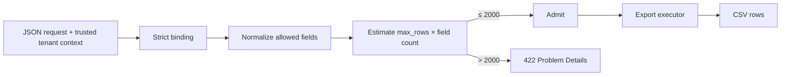

# Cost-bounded tenant Orders export

Клиент с валидной identity запрашивает `POST /orders/export`. Проверка tenant уже пройдена, но один запрос всё ещё может заставить сервис сериализовать слишком много данных: лимит только на число строк обходится добавлением полей. Этот slice учит вычислять стоимость одной операции по правилам сервиса и отклонять её до CSV-сериализации.

## Закреплённая история

- trusted `IdentityContext(subject_id, tenant_id)` приходит из принятой [границы S05](../tenant-scoped-orders-authorization/learn/trusted-context-object-authorization-boundary.md); body, query и headers не меняют tenant;
- strict JSON body содержит только `max_rows` и массив `fields`;
- разрешённый список полей (`allowlist`): `id`, `status`, `total_cents`, `currency`, `created_at`;
- стоимость (`estimated_cells`) равна `max_rows × число уникальных разрешённых fields`;
- максимум одной операции — `2000` CSV-ячеек;
- `2000` проходит, `2001+` получает `422 application/problem+json` до export executor;
- `export_execution_started` и `cells_serialized` доказывают placement решения;
- substrate — tenant-indexed fixture из 3000 Orders и синхронная CSV-сериализация на CPython 3.14.0.

Полная запись выбора, источников и локального эксперимента находится в [Gate 0](../../../../../governance/work-packages/M1.8.11-operation-cost-admission-s14-slice.md#gate-0--threatcost-readiness-record). Число `2000` — лабораторный предел этого workload, а не универсальная production-настройка.

## Как проходит запрос

Схема отвечает на вопрос, какая работа обязана завершиться до дорогой границы CSV-сериализации, а какая не должна начаться после отказа.

Схема намеренно не разворачивает отдельную ветку input-invalid при binding и audit path: она показывает placement cost admission, а не исчерпывающую модель всех отказов и наблюдений.

Практический вывод: status code сам по себе не доказывает ранний отказ. Для over-limit и shape-bypass запросов оба показателя работы должны остаться неизменными.

## Маршрут

1. [Server-owned cost admission boundary](learn/server-owned-cost-admission-boundary.md) — модель, нормализация, applicability matrix и измерения.
2. [Interview: valid tenant, expensive export](interview/valid-tenant-expensive-export.md) — рассуждение от заданного limit до L3-границы угроз и стоимости.
3. [Kata: block bulk-export cost bypass](kata/block-bulk-export-cost-bypass.md) — один обход row-only limit без готового scaffold.
4. [Project: cost-bounded Orders export API](project-spec/cost-bounded-orders-export-api.md) — самостоятельный milestone с пятью populations и раздельными подтверждениями L2/L3.

## Границы

Per-operation admission не считает запросы во времени и не заменяет distributed quota, общий capacity control или backpressure. В request contract нет callback URL или другого адреса назначения: отсутствие недоверенного адреса не доказывает защиту от SSRF. CSV создаётся в синхронном response; background workflow и production storage не входят в slice.

## Быстрая самопроверка

Почему `max_rows <= 500` недостаточно?

Ответ и объяснение

Число сериализуемых значений зависит и от ширины export. Запрос `500 × 5` создаёт 2500 ячеек и обходит row-only limit, хотя `max_rows` допустим. Нормализованная составная стоимость связывает оба cost-bearing измерения.

## Локальный словарь

- **Admission** — решение разрешить или отклонить одну операцию до дорогой работы.
- **Export cell** — одно значение одного публичного поля одной строки; локальная единица стоимости.
- **Shape-bypass** — изменение набора или представления request fields, обходящее неполный limit.
- **Execution boundary** — вход в CSV executor, после которого начинается учитываемая работа.
- **Residual risk** — риск, намеренно оставленный за пределами доказанного control.

## Первичные источники

Baseline — фактически проверенное локальное окружение, а не latest: на 2026-08-28 доступны CPython 3.14.7, FastAPI 0.141.1, Starlette 1.6.0 и Pydantic 2.13.4. Перед обновлением нужно повторить strict binding, error mapping и ASGI/counter cases; совместимость из номера версии не выводится.

- [OWASP API4:2023 — Unrestricted Resource Consumption](https://owasp.org/API-Security/editions/2023/en/0xa4-unrestricted-resource-consumption/)
- [FastAPI — Request Body](https://fastapi.tiangolo.com/tutorial/body/)
- [Pydantic 2.12 — Configuration](https://docs.pydantic.dev/2.12/api/config/)
- [Python 3.14 — `csv`](https://docs.python.org/3.14/library/csv.html)
- [RFC 9110 — 422 Unprocessable Content](https://www.rfc-editor.org/rfc/rfc9110.html#section-15.5.21)
- [RFC 9457 — Problem Details](https://www.rfc-editor.org/rfc/rfc9457.html)
- [PyPI release records: FastAPI](https://pypi.org/project/fastapi/), [Starlette](https://pypi.org/project/starlette/), [Pydantic](https://pypi.org/project/pydantic/)
