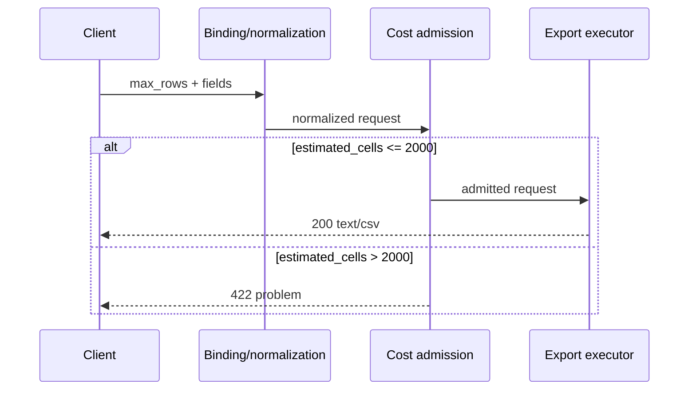

# Server-owned cost admission до Orders export

Tenant A законно вызывает bulk export. Старый handler разрешает не более 500 строк, но позволяет выбрать пять публичных полей. Запрос `500 × 5` проходит row limit и сериализует 2500 значений вместо ожидаемых 2000. Authentication и object authorization здесь исправны; сломана модель стоимости одной операции.

## Стоимость принадлежит сервису

Вычисляемая сервисом стоимость (`server-owned cost`) — не поле `cost` от клиента и не время, измеренное после ответа. Это воспроизводимая верхняя оценка работы, построенная из нормализованного request до дорогого действия.

Для закреплённого export единица — одна CSV-ячейка:

`estimated_cells = max_rows × count(unique_allowed_fields)`

Формула намеренно проста. Tenant-indexed fixture уже выбран, поэтому она моделирует сериализацию, но не SQL scan, компрессию или размер строк. Сервис принимает `estimated_cells <= 2000`. В normal population `400 × 4 = 1600`, на границе `500 × 4 = 2000`; `501 × 4` и `500 × 5` отклоняются.

Клиент управляет входами формулы, но не её смыслом, весами или threshold. Если production workload показывает, что `created_at` дороже `id`, формулу нужно перекалибровать по измерениям, а не разрешать клиенту прислать вес.

## Сначала связать форму, затем считать

Сначала FastAPI связывает и проверяет JSON body через Pydantic model; только полученная нормализованная форма участвует в расчёте стоимости. Pydantic по умолчанию работает в допускающем преобразования lax-режиме: на закреплённом стеке поле типа `int` может принять числовую строку, целое значение в форме `float` и `bool`. Поэтому слово `strict` само по себе не является настройкой: строгий контракт требует явной конфигурации модели или полей и negative checks опасных вариантов формы. Конкретный синтаксис конфигурации несущественен, если наблюдаемый контракт одинаков.

Закреплённый contract использует strict types и `extra="forbid"`: строка вместо массива, alias, неизвестный key и client-supplied `tenant_id` не становятся альтернативными путями. `fields` допускает только пять точных имён из разрешённого списка (`allowlist`); duplicates запрещены, после чего список превращается в tuple.

Это различает два отказа:

- неверная форма или forbidden field → безопасный `export-input-invalid`;
- допустимая форма, чья оценка выше 2000 → `export-cost-limit-exceeded`.

Оба имеют `422 application/problem+json`, но разные стабильные problem type. Дефолтный обработчик `RequestValidationError` в FastAPI возвращает `application/json`, а элементы Pydantic `errors()` могут содержать исходное значение в поле `input`. Поэтому закреплённые media type и запрет эха нельзя получить только декларацией request model: нужен собственный mapper/exception handler, который строит безопасный Problem Details, и проверка собранного ASGI/HTTP-приложения. Error body не возвращает внутренние weights, threshold, request body, запрещённые или чувствительные значения export.

## Placement решения

Вопрос схемы: почему оценка после выборки строк уже не является admission control?

Схема намеренно не разворачивает отдельную ветку input-invalid при binding и audit path: она объясняет placement cost admission, а не все виды отказов и наблюдений.

Если executor уже загружает Orders или пишет CSV, поздний limit лишь сообщает о потраченной работе. Поэтому наблюдаются два счётчика: `export_execution_started` меняется при пересечении boundary, `cells_serialized` — на каждую фактическую ячейку. Для over-limit и bypass оба delta равны нулю. Один правильный `422` этого не доказывает: handler мог сначала выполнить export, затем выбросить результат.

## Сохранить допустимое использование

Security control может причинить отказ законному клиенту. Поэтому normal и at-limit populations проверяют не только status, но и CSV header, число строк, tenant scope и точное число ячеек. Консервативная оценка может отвергнуть request, когда у tenant фактически меньше строк, чем `max_rows`; это осознанный false positive ради решения до выборки. Альтернатива — дешёвая server-side metadata estimate, но она допустима только если сама имеет bounded cost и freshness contract.

Локальный measurement envelope: tenant fixture 3000 Orders; по 20 последовательных ASGI requests на population; измерение от TestClient до response и server-side counters. Normal, at-limit, over-limit и bypass дали соответственно median 2.969, 3.225, 2.639 и 2.592 ms. Эти timings только описывают измерительный стенд (`harness`); acceptance основан на outcomes и counters. После 100 bypass requests normal export снова вернул `200`, записал 1600 cells, а rejected requests не пересекли executor.

## Четыре категории Abuse L2

| Категория | Решение и проверка | Честная граница |
|---|---|---|
| Request/cost bounds | Составная server-owned оценка; normal/limit/over/bypass и work counters | Не моделирует сумму запросов и production storage |
| Field exposure | Allowlist публичных полей; unknown, duplicate, `customer_email`, `payment_token` и client tenant отклоняются | Не является DLP или object authorization |
| Quota/rate | Неприменимо как control этого slice | Множество допустимых requests требует отдельного shared/time-window решения |
| Untrusted target | В contract нет callback/host/bucket; extra keys отклоняются | Отсутствие target не доказывает SSRF protection |

Такая `not applicable` диспозиция не игнорирует категорию: она называет причину, доказательство границы и остаточный риск.

## Audit и диагностика

Audit сохраняет `request_id`, trusted `tenant_id`, `action=orders.export`, решение, укрупнённую причину, число нормализованных полей и HTTP status. Token, Authorization header, полный body, field values, exported rows и forbidden value не записываются.

Частые слабые решения:

- **Limit только на строки.** Симптом — `500 × 5` пересекает executor; исправление — считать все cost-bearing dimensions.
- **Post-factum timeout или size check.** Response ограничен, но `cells_serialized` уже вырос; перенесите decision до executor.
- **Молчаливое удаление unknown fields.** Клиент не понимает фактический export, а bypass-family растёт; используйте явный contract.
- **Ответ с точной cost telemetry.** Упрощает probing и связывает публичный API с внутренней моделью; верните стабильную исправимую ошибку без weights.
- **Назвать ceiling quota.** Per-operation rule ничего не знает о времени и других workers; сформулируйте residual risk.

## Самопроверка

Почему фактическое число найденных строк нельзя использовать как единственный admission input в этом substrate?

Ответ и объяснение

Чтобы узнать его, executor уже должен пройти дорогую boundary. `max_rows` даёт консервативную оценку до выборки. Дешёвая metadata estimate была бы допустимой альтернативой только с отдельным bounded и проверенным contract.

Почему `422` плюс короткая latency не доказывают reject-before-work?

Ответ и объяснение

Сервис мог выполнить быструю локальную сериализацию и отбросить результат. Нужен причинный индикатор за boundary: нулевые `export_execution_started` и `cells_serialized` для каждого rejected request.

Когда текущая формула перестаёт быть честной?

Ответ и объяснение

Когда существенная работа больше не пропорциональна числу ячеек: появляется дорогой scan, вычисляемые поля, компрессия, remote storage или строки сильно различаются по размеру. Тогда Gate 0 и threshold нужно пересобрать по новому observable work indicator.

## Словарь

| Термин | Значение здесь |
|---|---|
| Server-owned cost | Нормализованная оценка работы, смысл и threshold которой задаёт сервис |
| Admission | Решение до export executor |
| Export cell | Одно публичное значение одной CSV-строки |
| Shape-bypass | Изменение request fields, обходящее неполный limit |
| Reject-before-work | Отказ с нулевым пересечением executor и нулём сериализованных cells |
| False positive | Законный request, отклонённый консервативной оценкой |
| Allowlist | Закрытый список точных имён полей, которые публичный export разрешает запросить |
| Harness | Измерительный стенд, задающий fixture, workload, точку измерения и собираемые counters |
| Measurement envelope | Population, workload, duration, measurement point и acceptance thresholds опыта |
| Residual risk | Неустранённый риск за явно названной границей решения |

## Источники и актуальность

Проверено 2026-08-28: [OWASP API4:2023](https://owasp.org/API-Security/editions/2023/en/0xa4-unrestricted-resource-consumption/), [FastAPI Request Body](https://fastapi.tiangolo.com/tutorial/body/), [FastAPI Handling Errors](https://fastapi.tiangolo.com/tutorial/handling-errors/), [Pydantic configuration](https://docs.pydantic.dev/2.12/api/config/), [Pydantic validators](https://docs.pydantic.dev/2.12/concepts/validators/), [Python `csv`](https://docs.python.org/3.14/library/csv.html), [RFC 9110 §15.5.21](https://www.rfc-editor.org/rfc/rfc9110.html#section-15.5.21) и [RFC 9457](https://www.rfc-editor.org/rfc/rfc9457.html). Baseline закреплён для воспроизводимости, но отстаёт от stable CPython 3.14.7, FastAPI 0.141.1, Starlette 1.6.0 и Pydantic 2.13.4. При обновлении нужно повторить strict binding, safe error mapping и ASGI/counter cases; совместимость не выводится из номера версии.
