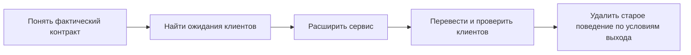

# Эволюционируемые API-контракты

Работающий API почти никогда не изменяется в пустоте. Им уже пользуются сервисы, мобильные приложения, сгенерированные SDK и забытые эксплуатационные скрипты. Даже небольшое изменение — новое поле, другое значение по умолчанию или единый формат ошибок — может нарушить их ожидания.

Этот слайс учит одному законченному инженерному действию: изменить HTTP API так, чтобы старые и новые клиенты безопасно сосуществовали во время перехода, а решение о завершении миграции опиралось на проверки и наблюдаемое использование.

## Сквозная ситуация

В Orders API нужно добавить доставку по временному окну. Старый запрос не содержит `delivery`; для новой доставки с `mode="scheduled"` обязательны `window.start` и `window.end`. Одновременно сервис переходит от исторического ответа `{"error": "..."}` к Problem Details — структурированному формату HTTP-ошибки.

Часть клиентов обновится быстро, часть — позднее, а полный список потребителей неизвестен. Поэтому нельзя безопасно заменить всё одним релизом и считать отсутствие ошибок доказательством совместимости.

Каждый документ раскрывает свою часть этой последовательности. Схема не означает, что миграция всегда линейна: при плохом сигнале команда возвращается к проверке или меняет переходное решение.

## Как проходить материалы

1. [Где в FastAPI возникает фактический HTTP-контракт](learn/http-contract-execution-boundary.md) — проследите путь запроса и разберитесь, почему Python-аннотация, OpenAPI и реальный ответ могут расходиться.
2. [Как изменить API и не сломать существующих клиентов](learn/compatible-api-change.md) — научитесь классифицировать риск, проводить расширение → перевод → удаление и выбирать достаточные подтверждения совместимости.
3. [Интервью: как изменить API, которым уже пользуются](interview/api-contract-evolution.md) — проверьте способность рассуждать на уровнях от самостоятельного изменения до межкомандной миграции. Ответы скрыты, поэтому материал подходит и для самостоятельной подготовки.
4. [Kata: добавить доставку и сохранить работу старого клиента](kata/compatible-delivery-contract-change.md) — выполните ограниченную реализацию без базы данных и платформенной инфраструктуры.
5. [Проектная спецификация: Evolvable Orders API](project-spec/evolvable-orders-api.md) — самостоятельно проведите полный проектный этап с несколькими клиентами, наблюдением и завершением миграции.

Рекомендуемый порядок важен для первого прохождения. При повторении можно открыть нужный brief, interview или kata напрямую: каждый документ содержит собственный контекст и локальный словарь.

## Что желательно знать заранее

Нужны базовая семантика HTTP и способность реализовать типовую операцию FastAPI/Pydantic. Знакомство с OpenAPI, JSON Schema и контрактными тестами полезно, но специальные понятия объясняются по месту.

Слайс не учит Python и FastAPI с нуля, не перечисляет все HTTP-статусы и не раскрывает платформу CI/CD. Здесь рассматривается логика изменения контракта. Механика развёртывания относится к Platform Engineering, а общая дисциплина безопасных изменений в рабочей среде — к Reliability Engineering.

## Что вы должны уметь после прохождения

- отличать внутренний Python-тип, проверку Pydantic, описание OpenAPI и фактический HTTP-ответ;
- находить ожидания конкретного клиента, которые не видны в схеме;
- различать структурную, смысловую и эксплуатационную совместимость;
- поддержать старое и новое поведение в ограниченный переходный период;
- проверить положительные и отрицательные сценарии старого и нового клиента;
- задать наблюдаемый сигнал, условие остановки и условие удаления старого пути;
- объяснить остаточный риск и границы отката.

Чтение само по себе не подтверждает навык. Interview помогает обнаружить пробелы, kata даёт ограниченную практику уровня L2, а самостоятельный проект позволяет показать владение миграцией сервиса уровня L3. Уровень L4 требует опыта реального согласования и внедрения между командами; хороший ответ на интервью его не заменяет.

## Как пользоваться терминами

В материалах предпочтены русские объяснения, а распространённый английский термин добавляется в скобках при первом употреблении. Например, «факты и результаты проверок, на которых основано решение (`evidence`)». Контекстно-зависимые слова вроде `target`, `shape`, `assumption` и `boundary` не используются без указания конкретного объекта.

У каждого большого документа есть локальный словарь. Он нужен для точного смысла в текущей задаче, а не для заучивания списка терминов.

## Актуальность технической базы

Чувствительные к версиям утверждения проверены 2026-08-15. Для возможностей линии OpenAPI 3.1 используется нормативный baseline OAS 3.1.2. На дату проверки опубликована OAS 3.2.0, но её новые возможности не предполагаются автоматически доступными во FastAPI и связанных инструментах. Документация FastAPI показывает создаваемый документ с `openapi: 3.1.0`; фактическую версию и поддержку генераторов нужно проверять на закреплённой версии конкретного проекта.

Основные нормативные источники — HTTP Semantics RFC 9110 и Problem Details RFC 9457. Прямые ссылки находятся в учебных brief.

## Границы слайса

Сценарий соответствует [`S03`](../../scenarios.md). Проверка запроса, преобразование ошибок, сравнение схем и стратегия выкладки здесь служат частями одного изменения, а не отдельными мини-курсами.

Готовая реализация проекта не включена. Участник пишет её сам, проводит ревью с коллегой или своей LLM и только затем может зарегистрировать ссылку на репозиторий как пример выполненной работы.
