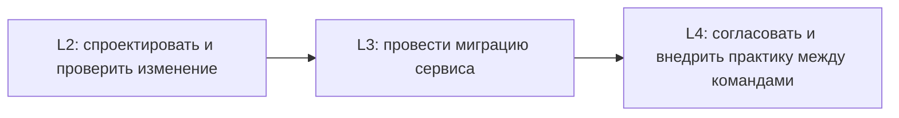

# Интервью: как изменить API, которым уже пользуются

Этот материал можно использовать в двух режимах:

- кандидат самостоятельно отвечает на вопрос, а затем раскрывает разбор;
- интервьюер ведёт беседу и использует подсказки для оценки глубины рассуждения.

Задача проверяет не знание синтаксиса FastAPI. Важно увидеть, умеет ли инженер обнаружить скрытые зависимости клиентов, провести ограниченно обратимое изменение и обосновать момент удаления старого поведения.

В этом интервью клиент API (`consumer`) — программа или команда, которая вызывает API, а сервис, предоставляющий API (`producer`/`provider`), принимает запрос и формирует ответ. В [engineering brief](../learn/compatible-api-change.md#какие-комбинации-версий-нужно-проверить) для этих ролей выбраны менее двусмысленные обозначения `API caller` и `API provider`; здесь распространённые термины используются в том же смысле.

## Рабочая ситуация

Orders API принимает запросы `POST /orders`. Сейчас клиент передаёт `customer_id` и `items`, а ошибки выглядят так:

```json
{"error": "invalid order"}
```

Нужно добавить доставку по временному окну:

- поле `delivery` остаётся необязательным для старых запросов;
- при `delivery.mode="scheduled"` обязательны `window.start` и `window.end`;
- сервис должен перейти на `application/problem+json` со стабильными машинными кодами ошибок.

Известно, что существуют старый сгенерированный SDK и несколько эксплуатационных скриптов. Полного списка клиентов нет, а обновить их одновременно невозможно.

## Основной вопрос

Как вы спроектируете изменение, проверите его совместимость и проведёте миграцию до удаления старого формата ошибок?

Перед ответом можно и нужно задавать уточняющие вопросы. Хорошее интервью оставляет часть условий неопределёнными: задача кандидата — понять, какие неизвестные действительно влияют на решение.

<details>
<summary>Пример хода сильного ответа</summary>

Сначала стоит выяснить, кто вызывает API, как клиенты разбирают успешные ответы и ошибки, можно ли отличить их версии по заголовкам или учётным данным и какие последствия имеет ошибка создания заказа. Затем нужно зафиксировать реальные примеры текущего запроса и ответа, а не опираться только на OpenAPI.

Новое поле нельзя сразу делать обязательным: старые клиенты его не отправляют. Для `scheduled` потребуется условная проверка полного окна и стабильная ошибка. Переход формата ошибок также является отдельным изменением контракта — старый клиент может искать поле `error`.

Миграцию разумно разделить на расширение, перевод клиентов и удаление старого поведения. Сначала сервис принимает старый и новый запрос, а формат ошибки выбирается по явному сигналу клиента. Затем обновляются известные клиенты, а использование старого пути измеряется. Удаление допустимо только после заданного периода без достоверного старого трафика либо после явного принятия риска владельцем.

Проверки должны включать реальные старые и новые клиентские сценарии, отрицательные случаи доставки и сравнение OpenAPI с фактическими ответами. Разница схем полезна, но не обнаружит изменение значения по умолчанию, реакции клиента на новый enum или его решение повторять запрос после конкретной ошибки. План также должен назвать условия остановки выкладки и учесть, что откат к старому сервису может быть небезопасен после появления новых запросов.

</details>

## Что полезно уточнить до проектирования

Список не является обязательным сценарием допроса. Он показывает классы неопределённости, которые инженер должен заметить.

- Какие клиенты известны и кто ими владеет?
- Есть ли строгая десериализация ответа или исчерпывающая обработка значений enum?
- Как клиенты сейчас распознают ошибки и решают, повторять ли запрос?
- Можно ли надёжно отличить новый клиент от старого?
- Кэшируются ли ответы или ошибки общим HTTP-кэшем?
- Как быстро можно обновить SDK, скрипты и сервер?
- Есть ли наблюдаемость использования старого формата?
- Что произойдёт, если создание заказа будет ошибочно принято дважды или отклонено?

Сильный кандидат не обязан задать все вопросы. Он должен объяснить, какое решение изменится в зависимости от ответа.

## Уточняющие вопросы интервьюера

### 1. В Pydantic объявлено `delivery: Delivery | None` без значения по умолчанию. Поле стало необязательным?

<details>
<summary>Ответ и сигнал глубины</summary>

Нет, не обязательно. Объединение с `None` разрешает значение `null`, но поле без default в Pydantic v2 остаётся обязательным для передачи. Кандидат должен различать отсутствие ключа и явный `null` и предложить проверить оба случая реальным запросом и схемой.

</details>

### 2. Мы только добавили поле в успешный ответ. Почему клиент может сломаться?

<details>
<summary>Ответ и сигнал глубины</summary>

Строгий декодер может запрещать неизвестные поля. Сгенерированный клиент также может иметь закрытую модель. Кроме того, новое значение enum способно сломать исчерпывающее ветвление, даже если само поле существовало раньше. Сильный ответ связывает риск с конкретным способом разбора ответа, а не повторяет правило «добавления безопасны».

</details>

### 3. Проверка различий OpenAPI не нашла проблем. Чего она не доказывает?

<details>
<summary>Ответ и сигнал глубины</summary>

Она не доказывает сохранение смысла операции и поведения клиента: могли измениться значение по умолчанию (`default`), сортировка, единицы измерения, повторяемость запроса или сопоставление ошибки следующему действию. Также сгенерированная схема может расходиться с фактическим ответом middleware или прямого `Response`. Нужны исполняемые клиентские сценарии и проверка ответа по сети.

</details>

### 4. Как временно поддержать старый и новый формат ошибок?

<details>
<summary>Ответ и сигнал глубины</summary>

Подходы включают версию endpoint, согласование типа содержимого через `Accept`, специальный заголовок или временный адаптер. Важен не любимый вариант кандидата, а однозначный сигнал, ограниченный срок сосуществования и способ измерить использование старого формата. Если ответ зависит от заголовка, нужно обсудить `Content-Type` и поведение общего кэша — например, `Vary: Accept`.

</details>

### 5. Что измерять во время миграции?

<details>
<summary>Ответ и сигнал глубины</summary>

Полезны доля запросов со старым и новым сигналом, ошибки по стабильному типу, версии известных клиентов и результат проверок ключевых операций. Нельзя бездумно писать полные тела запросов или создавать метки с неограниченным числом значений. Метрика должна позволять принять решение, а не просто демонстрировать наличие телеметрии.

</details>

### 6. Когда можно удалить старое поведение?

<details>
<summary>Ответ и сигнал глубины</summary>

После обновления известных владельцев, истечения объявленного периода, выполнения клиентских проверок и достижения заранее заданного критерия использования старого пути. Если неизвестных клиентов невозможно исключить, нужен явный владелец остаточного риска и план реакции. Нулевое значение метрики недостаточно, если сама метрика не видит часть трафика.

</details>

### 7. Мы откатили версию сервиса, но инцидент продолжается. Почему?

<details>
<summary>Ответ и сигнал глубины</summary>

Новые клиенты уже могли начать отправлять запросы, которые старая версия не понимает, либо в системе появилось новое состояние. Откат кода не откатывает внешний мир. Может понадобиться совместимый адаптер, компенсация или исправление вперёд (`roll-forward`). Сильный кандидат заранее классифицирует, какая часть изменения действительно обратима.

</details>

### 8. Когда локальное решение стоит превращать в стандарт для нескольких команд?

<details>
<summary>Ответ и сигнал глубины</summary>

Когда проблема повторяется, цена разных решений стала заметной, а предлагаемое соглашение проверено хотя бы одной миграцией. Нужны область применения, допустимые исключения, способ внедрения и обратная связь от команд. Один удачный endpoint ещё не доказывает необходимость организационного стандарта.

</details>

## Как различать уровни ответа

### L2 — самостоятельная работа с типовым изменением

Инженер корректно задаёт вход, выход и ошибки операции; замечает основные ломающие изменения; предлагает совместимую форму и пишет положительные и отрицательные проверки. Он может не иметь опыта длительной миграции нескольких владельцев.

### L3 — владение миграцией сервиса

Инженер начинает с клиентов и неоднозначных требований, а не с синтаксиса модели. Он связывает решение с фактическим HTTP-поведением, планирует период сосуществования, наблюдение, условия остановки и удаления старого пути. Он способен назвать остаточный риск и границы отката.

### L4 — межкомандное влияние

Инженер рассуждает о последовательности изменений нескольких поставщиков и клиентов, владельцах, исключениях, внедрении общего соглашения и проверке его эффекта. Ответ на интервью показывает способность рассуждать на этом масштабе, но сам по себе не доказывает, что кандидат уже провёл такую миграцию.



Схема показывает рост не количества терминов, а масштаба ответственности: от одной операции к полному жизненному циклу изменения и затем к нескольким командам.

## Правдоподобные, но слабые ответы

- **«Любое добавление обратно совместимо».** Игнорируются строгие клиенты, enum, значения по умолчанию и смысл ответа.
- **«Сразу сделаем `/v2`».** Новая версия не обновит потребителей и не определит срок жизни старой.
- **«У нас есть contract tests».** Не объяснено, чьи реальные ожидания они представляют и какие риски не покрывают.
- **«При проблеме откатимся».** Не учтены новые запросы, состояние и уже обновившиеся клиенты.
- **«Сделаем единый стандарт для всех API».** Не названы повторяющаяся проблема, область применения и путь внедрения.
- **«Клиент прочитает `detail`».** Человеческий текст ошибочно превращён в стабильный программный код.

## Дополнительные вопросы для самопроверки

### Чем схема API отличается от контракта API?

<details>
<summary>Ответ</summary>

Схема формально описывает структуру части запросов и ответов. Контракт шире: он включает фактические статусы и заголовки, смысл полей и ошибок, значения по умолчанию, допустимую последовательность действий и другие наблюдаемые ожидания клиента.

</details>

### Может ли изменение значения по умолчанию сломать клиента без изменения JSON Schema?

<details>
<summary>Ответ</summary>

Да. Клиент мог не передавать поле и рассчитывать на прежний результат. Если новое значение по умолчанию меняет бизнес-поведение, контракт изменился семантически, даже когда структура данных осталась прежней.

</details>

### Когда выбирать `400`, а когда `422`?

<details>
<summary>Ответ</summary>

Нужно следовать согласованному контракту сервиса и смыслу ошибки, а не случайному значению по умолчанию во фреймворке. `400` широко используется для некорректного запроса; `422` позволяет отдельно обозначить синтаксически понятное, но неприемлемое содержимое. Для клиента важнее стабильность выбранного различия и следующего действия, чем спор о единственно верном числе.

</details>

### Какие свойства Problem Details должны быть стабильны?

<details>
<summary>Ответ</summary>

В первую очередь — значение `type`, его смысл и ожидаемый статус. Стабильными должны быть и документированные машинные расширения. `title` кратко описывает класс проблемы, а `detail` может содержать конкретное человеческое сообщение и не подходит для ветвления программы.

</details>

### Каковы ограничения контрактных тестов, публикуемых клиентом (`consumer-driven contract tests`)?

<details>
<summary>Ответ</summary>

Они отражают только опубликованные ожидания известных клиентов и могут устареть. Такие тесты не находят неизвестного потребителя, не заменяют проверку производительности и не доказывают корректность всего бизнес-процесса. Их ценность зависит от владельцев, актуальности и связи с реальными версиями клиента.

</details>

## Правило оценки

Не оценивайте ответ по числу английских терминов. Смотрите, способен ли кандидат:

- превратить неизвестные условия в конкретные вопросы и явно проверяемые предположения;
- выбрать проверки и наблюдаемые факты, соответствующие риску изменения;
- объяснить компромиссы решения и назвать случаи, которые оно не покрывает;
- определить, кто и по какому сигналу принимает решение продолжить, остановить или завершить миграцию.

## Словарь интервьюера

- **Клиент API (`consumer`, в brief — `API caller`)** — программа или команда, использующая API.
- **Сервис, предоставляющий API (`producer`/`provider`, в brief — `API provider`)** — сервис, принимающий запрос и формирующий ответ.
- **Предположение клиента** — ожидаемое им поведение, которое может быть не записано в схеме.
- **Проверяемое подтверждение (`evidence`)** — тест, наблюдение или факт, на котором основано решение.
- **Период сосуществования (`coexistence window`)** — время, когда сервис намеренно поддерживает старое и новое поведение.
- **Условия выхода (`exit criteria`)** — заранее определённые признаки, позволяющие удалить переходное поведение.
- **Остановка выкладки (`stop condition`)** — измеримый сигнал, после которого изменение дальше не распространяют.
- **Остаточный риск** — известная неопределённость или возможный ущерб, который остаётся после принятых мер.
