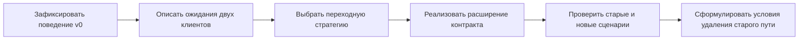

# Kata: добавить доставку и сохранить работу старого клиента

Эта kata — небольшая инженерная задача, а не заготовка production-сервиса. Вы реализуете одно изменение API, столкнётесь с несовместимыми ожиданиями двух клиентов и покажете, чем подтверждается безопасность выбранного решения.

Готового исходного проекта и эталонного кода нет намеренно. Минимальное приложение можно написать самостоятельно или попросить свою LLM создать только исходную версию, описанную ниже.

## История системы

Небольшой Orders API принимает `POST /orders`. Его вызывает старый скрипт оформления заказа. Скрипт отправляет:

```json
{
  "customer_id": "c-42",
  "items": [{"product_id": "p-7", "quantity": 1}]
}
```

Успешный ответ имеет статус `201`. При некорректном запросе скрипт ожидает тело вида:

```json
{"error": "invalid order"}
```

Теперь продукту нужна доставка двух видов:

- `pickup` — клиент заберёт заказ сам, временное окно не требуется;
- `scheduled` — курьер приедет между `window.start` и `window.end`.

Новый клиент должен получать ошибки в формате Problem Details (`application/problem+json`) и различать их по стабильному типу, а не по тексту сообщения. Старый скрипт обновится позднее и пока не должен перестать работать.

## В чём инженерный конфликт

Если просто добавить обязательное поле `delivery`, старый запрос перестанет проходить. Если сразу заменить форму ошибки, старый скрипт не найдёт поле `error`. Если объявить новую схему только в OpenAPI, фактический ответ встроенной проверки FastAPI всё ещё может иметь другую форму.

Ваша задача — не спрятать конфликт, а выбрать ограниченную стратегию сосуществования и подтвердить её исполняемыми сценариями.

## Что нужно сделать

Реализуйте изменение так, чтобы:

1. запрос без `delivery` сохранял прежнее поведение;
2. `delivery.mode="pickup"` не требовал временного окна;
3. для `delivery.mode="scheduled"` были обязательны `window.start` и `window.end`, причём `start < end`;
4. новый клиент получал стабильный `application/problem+json` при ошибке доставки;
5. старый способ разбора ошибок продолжал работать в выбранный период сосуществования;
6. OpenAPI описывал фактические успешные ответы и ошибки.

Способ сосуществования выберите сами: версия endpoint, согласование через `Accept`, специальный заголовок или временный адаптер. Важна не универсально правильная техника, а соответствие условиям задачи и ясная граница её применения.

## Ожидаемый ход работы



Схема задаёт порядок рассуждения. Не начинайте с новой Pydantic-модели: без зафиксированного поведения v0 легко написать тесты только для новой реализации и потерять ожидания старого клиента.

### Шаг 1. Зафиксируйте исходный контракт

Сохраните примеры старого успешного запроса и хотя бы одной ошибки. Создайте небольшой клиентский тест, который разбирает поле `error` так же, как старый скрипт. Это ваша наблюдаемая опора для совместимости.

### Шаг 2. Запишите решение до реализации

В короткой заметке укажите:

- какие два клиента вы моделируете;
- чего каждый ожидает от запроса и ошибки;
- как клиент сообщает, какой формат ответа он понимает;
- сколько существует переходное поведение;
- какой риск вы принимаете, особенно для неизвестных клиентов.

### Шаг 3. Реализуйте новую семантику доставки

Отдельно проверьте отсутствие `delivery`, `pickup`, корректный `scheduled`, неполное окно и обратный порядок времени. Различайте отсутствие поля и явный `null`; не считайте их одинаковыми автоматически.

### Шаг 4. Согласуйте документацию и реальный ответ

Проверьте не только Pydantic-модель, но и HTTP-статус, `Content-Type` и стабильные поля тела. Если Problem Details формирует обработчик исключения или прямой `JSONResponse`, убедитесь, что OpenAPI описывает именно этот ответ.

### Шаг 5. Опишите завершение миграции

Назовите сигнал использования старого формата, условие остановки изменения и условие удаления переходного кода. Укажите, безопасен ли откат сервиса после того, как новый клиент начал отправлять `delivery`.

## Что должно остаться после выполнения

- небольшой FastAPI-сервис без базы данных и внешней инфраструктуры;
- два клиентских набора проверок: старый и новый;
- тесты положительных и отрицательных сценариев доставки;
- точечная проверка важных частей OpenAPI против фактических ответов;
- короткая заметка о решении и план миграции;
- итоговый саморазбор: что схема не смогла проверить и какой риск остался.

Минимальный набор исполняемых сценариев:

- старый корректный запрос без `delivery`;
- новый запрос с `pickup`;
- корректный `scheduled`;
- `scheduled` без начала или конца окна;
- `scheduled`, где `start >= end`;
- ошибка, разбираемая старым клиентом;
- Problem Details, разбираемый новым клиентом;
- соответствие заявленного и фактического типа содержимого ошибки.

## Ограничения

Не добавляйте базу данных, брокер сообщений, авторизацию, Docker, Kubernetes и полноценный SDK. Они не помогают проверить центральное умение и увеличивают время выполнения.

Не делайте `/v2` единственным объяснением совместимости. Если выбрали версию endpoint, всё равно опишите срок жизни старой версии, наблюдение и удаление.

Не сравнивайте снимком весь OpenAPI JSON: такой тест шумит при безвредных изменениях. Проверяйте элементы, от которых зависит клиент: обязательность полей, статусы, типы содержимого и формы значимых ответов.

Не используйте `detail` как программный код ошибки. Для автоматики нужен стабильный `type` или документированное расширение.

## Как проверить собственное решение

### Контракт

- Понятны ли метод, статус, тип содержимого и формы успешного ответа и ошибки?
- Отдельно ли представлены входная, выходная и внутренняя модели?
- Совпадают ли OpenAPI и фактический ответ в ключевых сценариях?

### Совместимость

- Работает ли реальный старый запрос без нового поля?
- Есть ли исполняемый старый клиент, а не только утверждение «должно работать»?
- Проверены ли строгий разбор ответа и различия между отсутствующим ключом, `null` и значением по умолчанию?

### Ошибки

- Имеет ли каждый новый Problem Details стабильный абсолютный `type`, `title` и ожидаемый статус?
- Совпадает ли `status` в теле с HTTP-статусом?
- Не попали ли наружу stack trace, секреты или внутренние детали?

### Переходный период

- Однозначно ли клиент выбирает формат?
- Если выбор зависит от заголовка, согласованы ли `Content-Type` и кэширование (`Vary` либо обоснованный запрет общего кэша)?
- Названы ли измеримый сигнал использования, условие остановки и условие удаления старого пути?

## Критерии оценки

| Область | Решение пока поверхностно | Достаточно для kata |
|---|---|---|
| Контракт | Реализован только успешный запрос | Описаны и проверены вход, успех и ошибки на HTTP-границе |
| Совместимость | Новое поле названо «необязательным» | Зафиксированы ожидания старого и нового клиента, включая отсутствие ключа |
| Проверка данных | Оставлено поведение фреймворка по умолчанию | Намеренно обработаны `pickup`, `scheduled`, `null` и некорректное окно |
| Подтверждение | Есть только unit-тест валидатора | Есть исполняемые клиентские сценарии и проверка фактического HTTP-ответа |
| Миграция | «Выкатим постепенно» | Определены порядок, сигнал использования, остановка, выход и остаточный риск |

Kata даёт ограниченное подтверждение самостоятельной работы на L2. Она не доказывает владение production-миграцией L3: здесь нет реальных владельцев, трафика и последствий.

## Подсказки

<details>
<summary>Подсказка 1 — с чего начать</summary>

Сначала напишите маленький старый клиент и сохраните примеры HTTP-обмена v0. После этого разделите входную модель, внутреннее решение о доставке и публичную форму ошибки. Так фреймворк будет подстраиваться под контракт, а не наоборот.

</details>

<details>
<summary>Подсказка 2 — где разместить проверку</summary>

Условие `scheduled` удобно проверять на границе целого объекта доставки, потому что оно связывает несколько полей. Ошибку фреймворка можно преобразовать в публичный формат централизованным обработчиком. Дополнительный ответ нужно и описать в OpenAPI, и проверить через HTTP.

</details>

<details>
<summary>Подсказка 3 — как поддержать две формы ошибки</summary>

Выберите один явный сигнал клиента. Например, новый клиент запрашивает `application/problem+json`, а старый продолжает получать прежнюю форму. Затем задайте срок и способ измерить исчезновение старого использования. Не пытайтесь угадать возможности неизвестного клиента автоматически.

</details>

<details>
<summary>Подсказка 4 — как найти ложную уверенность</summary>

Внесите изменение, которое проходит сравнение схем, но меняет поведение: например, другое значение по умолчанию или решение клиента повторять запрос после ошибки. Если клиентская проверка ловит его, вы наглядно увидите границу проверки OpenAPI.

</details>

## Вопросы после выполнения

### Какое изменение оказалось невидимым для сравнения схем?

<details>
<summary>Ориентир для ответа</summary>

Подойдёт любой воспроизводимый семантический контрпример: изменение значения по умолчанию, трактовки временной границы, выбора кода ошибки или реакции на повтор. Важно показать клиентский тест, который падает при неизменной либо формально совместимой схеме.

</details>

### Почему выбранный способ сосуществования подходит именно здесь?

<details>
<summary>Ориентир для ответа</summary>

Ответ должен опираться на условия: возможность изменить заголовки клиента, наличие общего кэша, число владельцев, длительность перехода. Простое «так принято» не раскрывает компромисс. Также стоит назвать случай, в котором выбранный способ перестал бы подходить.

</details>

### Что мешает удалить старый формат ошибки сегодня?

<details>
<summary>Ориентир для ответа</summary>

Конкретное ожидание старого клиента и недостаток подтверждения его исчезновения. После обновления известных клиентов остаётся вопрос неизвестных вызовов и достоверности наблюдения. Удаление — решение о принятии остаточного риска, а не механический последний commit.

</details>

## Словарь

- **Kata** — короткая ограниченная практика одного инженерного умения.
- **Старый клиент (`legacy client`)** — существующая программа, которую нельзя обновить одновременно с API.
- **Стратегия сосуществования** — способ временно поддерживать старое и новое поведение.
- **Problem Details** — стандартная форма HTTP-ошибки по RFC 9457.
- **Исполняемый сценарий** — тест или небольшой клиент, который действительно вызывает API и проверяет результат.
- **Разница схем (`schema diff`)** — сравнение двух формальных описаний API; полезно, но не покрывает весь смысл поведения.
- **Условие остановки** — сигнал, при котором распространение изменения прекращают.
- **Условие выхода** — факт, после которого переходное поведение можно удалить.
