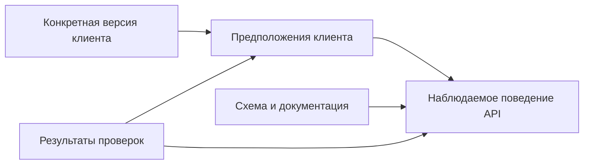
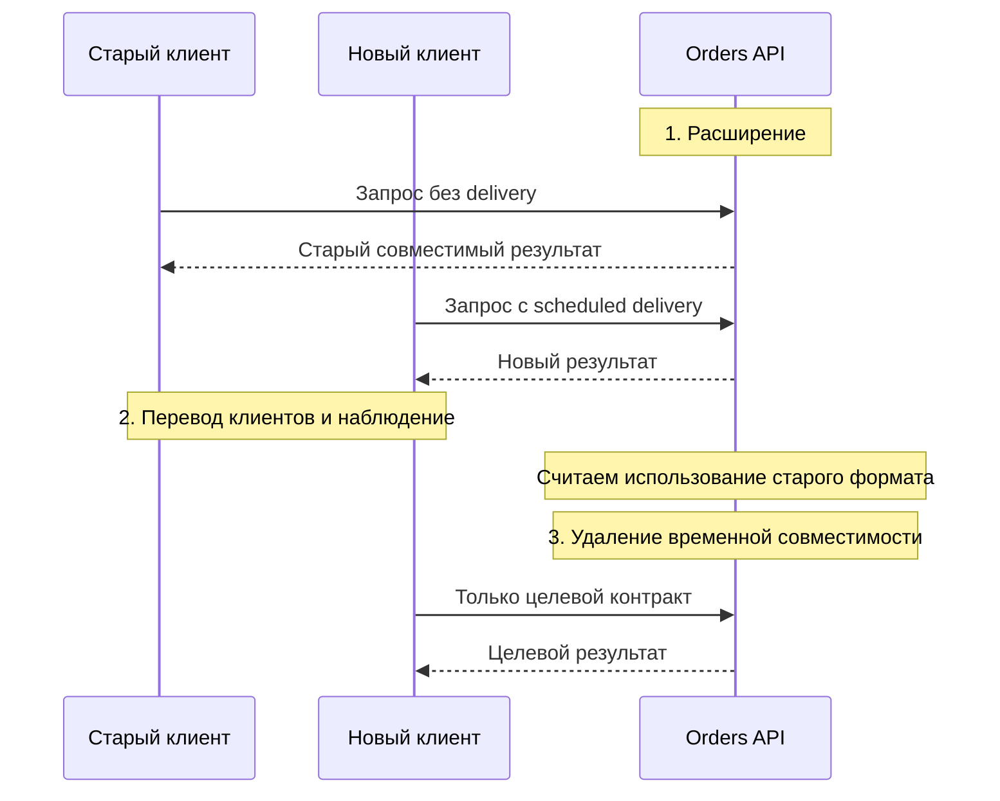

# Как изменить API и не сломать существующих клиентов

Представим внутренний сервис заказов. Несколько приложений вызывают `POST /orders`, чтобы создать заказ. Мобильный backend обновляется регулярно, checkout-service использует сгенерированный клиент, а у операционной команды есть старый Python-скрипт, о котором разработчики сервиса вспоминают не всегда.

Сейчас запрос выглядит так:

```json
{
  "customer_id": "c-42",
  "items": [
    {"product_id": "p-7", "quantity": 2}
  ]
}
```

Бизнес просит добавить доставку к выбранному времени. Для этого в запросе появится объект `delivery`. Если клиент выбирает режим `scheduled`, он обязан передать начало и конец временного окна. Одновременно команда хочет заменить старые ответы об ошибках вида `{"error": "..."}` на единый машиночитаемый формат Problem Details.

На первый взгляд изменение выглядит простым: добавить необязательное поле и новую модель ошибки. Но именно здесь часто ломаются работающие интеграции. Старый клиент может не понимать новые поля ответа, новый клиент — оказаться несовместимым с предыдущей версией сервиса после отката, а изменившийся код ошибки — заставить вызывающую систему повторять запрос, который повторять нельзя.

Задача инженера поэтому состоит не только в том, чтобы реализовать новую модель. Нужно провести период, в течение которого старые и новые клиенты безопасно работают одновременно, а затем доказать, что временную поддержку старого поведения действительно можно удалить.

## Что в этом материале называется API-контрактом

API-контракт — это наблюдаемое соглашение между вызывающей стороной и сервисом. «Наблюдаемое» означает, что речь идёт не о внутренних классах Python, а о том, что реально можно отправить и получить по сети.

В контракт входят:

- HTTP-метод и адрес ресурса (`request target`), например `POST /orders`;
- заголовки, влияющие на обработку запроса или формат ответа;
- допустимая структура запроса: поля, их типы, обязательность и ограничения;
- HTTP-коды и форматы ответов;
- набор полей ответа, их типы и вложенность — это часто называют формой ответа (`response shape`);
- правила обработки ошибок (`error semantics`): какие ошибки клиент может различить и что ему следует делать — исправить запрос, повторить его позднее или прекратить операцию;
- свойства, которые могут быть важны для клиента, хотя не всегда полностью выражены в OpenAPI: например, безопасно ли повторить запрос и какой максимальный размер ответа ожидается.

Pydantic-модель и сгенерированная схема OpenAPI описывают значительную часть контракта, но не весь контракт. Они не доказывают, что фактический ответ совпадает с документацией, и обычно не описывают бизнес-смысл значения или ожидаемую реакцию клиента.

## Совместимость существует только относительно конкретного клиента

Фраза «изменение обратно совместимо» неполна. Нужно уточнить: совместимо с каким клиентом и с каким его предположением о поведении API?

Например, добавление поля в ответ обычно называют расширяющим изменением (`additive change`). Клиент, который игнорирует неизвестные поля, продолжит работать. Но клиент со строгой десериализацией может отклонить весь ответ. Одно и то же изменение совместимо с первым клиентом и несовместимо со вторым.

Это удобно представить как связь трёх элементов:



Схема показывает, почему одного сравнения OpenAPI-файлов недостаточно. Оно сообщает, как изменилась формальная схема, но не знает всех предположений клиента и не проверяет фактическое поведение сервиса.

## Три способа незаметно нарушить контракт

Перед изменением полезно проверить три разные стороны совместимости.

### 1. Изменилась структура данных

Это наиболее заметные изменения: обязательное поле стало отсутствовать, изменился тип, добавилось значение перечисления (`enum`), поменялся HTTP-код или формат ошибки. Такие различия частично обнаруживаются автоматическим сравнением схем (`schema diff`).

Но даже здесь нет универсального правила «добавление безопасно, удаление опасно». Новое значение `enum` может сломать клиентский `switch`, в котором перечислены все известные варианты. Дополнительное поле ответа может быть отвергнуто строгим JSON-десериализатором.

### 2. Структура прежняя, но изменился смысл

Предположим, поле `delivery_mode` раньше по умолчанию означало `pickup`, а теперь означает `courier`. Схема при этом может остаться прежней, но старый запрос начнёт создавать другой заказ.

К этой категории относятся изменение единиц измерения, округления, сортировки, правил авторизации, значения по умолчанию и момента, когда операция считается завершённой. Формальный контракт выглядит прежним, а рабочий сценарий клиента уже нарушен.

### 3. Изменились эксплуатационные свойства

Клиент получает те же поля, но ответ стал в десять раз больше или медленнее. Его timeout, лимит памяти или политика повторов больше не подходят. Это эксплуатационная совместимость (`operational compatibility`).

OpenAPI обычно не обнаружит такой регресс. Нужны измерения на характерной нагрузке и понимание ограничений вызывающей стороны.

## Разбираем изменение Orders API

Новый клиент хочет отправлять:

```json
{
  "customer_id": "c-42",
  "items": [
    {"product_id": "p-7", "quantity": 2}
  ],
  "delivery": {
    "mode": "scheduled",
    "window": {
      "start": "2026-08-18T10:00:00Z",
      "end": "2026-08-18T12:00:00Z"
    }
  }
}
```

Поле `delivery` можно добавить как необязательное: отсутствие поля сохраняет прежнее поведение. Однако этого решения недостаточно. Нужно явно ответить ещё на несколько вопросов:

- Отличается ли отсутствующее `delivery` от `"delivery": null`?
- Какое поведение используется по умолчанию и может ли оно измениться в будущем?
- Что получит клиент, если передаст `mode=scheduled`, но забудет `window.end`?
- Может ли старая версия сервиса принять запрос нового клиента после отката?
- Как новый формат ошибки будет сосуществовать со скриптом, который ищет поле `error`?

Ответы становятся частью контракта и должны быть подтверждены примерами запросов и автоматическими проверками.

## Безопасная миграция: расширить, перевести клиентов, удалить старое

Для изменений с периодом сосуществования полезна последовательность `expand → migrate → contract`. По-русски: сначала расширить допустимое поведение сервиса, затем перевести клиентов и только после этого удалить временную совместимость.



Схема намеренно не показывает deployment-инфраструктуру. Здесь важен порядок изменения контракта.

### Шаг 1. Найти клиентов и их ожидания

Составьте перечень известных вызывающих систем, владельцев и используемых версий. Проверьте не только основные сервисы, но и фоновые задания, ручные скрипты, тестовые окружения и внешние интеграции.

Неизвестный клиент не означает, что клиента нет. Это означает, что риск пока не измерен.

Для каждого известного клиента зафиксируйте важные ожидания. Например: игнорирует ли он новые поля, какие HTTP-коды повторяет, по какому полю различает ошибки и может ли быстро обновиться.

### Шаг 2. Сформулировать неизменяемые правила

До реализации полезно записать несколько инвариантов — правил, которые должны оставаться истинными на всех этапах миграции:

- запрос без `delivery` создаёт заказ с прежним поведением;
- полный `scheduled`-запрос принимается новой версией сервиса;
- неполное временное окно приводит к одной и той же машиночитаемой ошибке;
- старый клиент не получает формат ответа, который не умеет разобрать;
- новый запрос не попадёт в старую версию сервиса, если она его не понимает.

Последний пункт особенно важен для отката: иногда откатить код можно, а вернуть систему в прежнее состояние уже нельзя.

### Шаг 3. Расширить сервис

Новая версия сначала принимает и старую, и новую формы запроса. Если формат ошибки меняется, требуется явный способ определить, какой ответ ожидает клиент: версия endpoint, media type в `Accept`, отдельный заголовок или временный адаптер.

Выбор должен учитывать HTTP-кэши. RFC 9110 §12.5.5 определяет смысл `Vary`: ответ перечисляет заголовки запроса, которые повлияли на выбор представления. RFC 9111 §4.1 задаёт поведение кэша: сохранённый ответ с `Vary` нельзя использовать без перепроверки, пока значения перечисленных заголовков не совпадут с исходным запросом. Поэтому при выборе формата по `Accept` нужен, например, `Vary: Accept`. Альтернатива — явно запретить совместное кэширование таких ответов. Иначе правильный новый ответ может быть отдан старому клиенту из кэша.

### Шаг 4. Перевести клиентов и наблюдать результат

Обновляйте клиентов по очереди. Для каждого проверяйте не только успешный запрос, но и ошибки: неполное окно, неизвестный режим доставки, конфликт состояния заказа.

Параллельно собирайте факты и результаты проверок (`evidence`), на которых можно основывать решение:

- какие версии клиентов действительно обращаются к API;
- сколько запросов всё ещё используют старую форму;
- какие типы ошибок возникают после обновления;
- проходят ли сохранённые сценарии старого и нового клиента;
- появились ли изменения задержки, размера ответа или числа повторов.

Не следует записывать в метрики полное тело запроса или персональные данные. Для наблюдения обычно достаточно версии клиента, типа контракта и стабильного кода ошибки.

### Шаг 5. Удалить временную поддержку

Старое поведение удаляется не потому, что прошёл месяц, а потому, что выполнены заранее определённые условия завершения (`exit criteria`). Например: все известные клиенты обновлены, старый формат не наблюдался две недели, владелец неизвестных интеграций принял остаточный риск, а процедура восстановления проверена.

Если условия не выполнены, инженер должен либо продолжить миграцию, либо явно принять решение сохранить старый контракт. Бессрочная временная ветка без владельца — это не совместимость, а накопленный технический долг.

## Какие комбинации версий нужно проверить

Термины producer и consumer в HTTP легко запутывают: клиент создаёт запрос, но потребляет ответ. Поэтому ниже используются более конкретные слова — вызывающий клиент (`API caller`) и предоставляющий API сервис (`API provider`).

| Клиент | Сервис | Что проверяем |
|---|---|---|
| Старый | Старый | Исходное поведение, относительно которого ищем регрессию |
| Старый | Новый | Новый сервис принимает старый запрос и возвращает понятный старому клиенту ответ |
| Новый | Новый | Новый рабочий сценарий и новые ошибки |
| Новый | Старый | Нужна ли эта комбинация при откате сервиса; если она запрещена, чем это обеспечивается |

Поддерживать все четыре комбинации необязательно. Важно осознанно определить допустимые состояния и не обнаружить несовместимость уже во время аварийного отката.

## Почему проверки схемы недостаточно

Автоматическое сравнение старой и новой OpenAPI-схемы полезно: оно быстро обнаруживает удалённое поле, новый обязательный параметр или изменение типа. Но оно не знает, как клиент использует данные.

Для Orders API разумный набор проверок может включать:

1. сравнение схем для очевидных структурных изменений;
2. сохранённые запросы и ответы старого клиента;
3. сценарии нового клиента, включая ошибки;
4. отдельную проверку изменения смысла — например, значения доставки по умолчанию;
5. наблюдение за реальными версиями клиентов во время поэтапного включения.

Чем выше стоимость ошибки и больше независимых клиентов, тем больше требуется подтверждений. Маленькому внутреннему API не обязательно строить сложную платформу контрактного тестирования, но отсутствие платформы не отменяет необходимости проверить реальные ожидания клиентов.

## Почему rollback может не помочь

Представим, что новый клиент уже начал отправлять `delivery`, после чего новая версия сервиса показала высокий процент ошибок. Команда откатывает deployment на прежнюю версию. Если старая версия не понимает поле `delivery` или новый режим, ошибки продолжаются уже после успешного технического отката.

Поэтому план восстановления должен различать:

- **rollback** — возврат предыдущей версии кода;
- **адаптер совместимости** — временное преобразование нового запроса в старую форму;
- **компенсацию** — отдельное действие, исправляющее уже созданные данные или последствия;
- **roll-forward** — быстрое исправление новой версии, когда возврат старой уже небезопасен.

Хороший план заранее говорит, какой вариант применим и какой сигнал останавливает дальнейшее включение новой версии.

## Частые ошибки

### «Поле необязательное, значит изменение безопасно»

Необязательность описывает только наличие поля. Она ничего не говорит о новом значении по умолчанию, строгом клиентском декодере и изменении смысла операции.

### «Создадим `/v2`, и проблема решена»

Новая версия изолирует несовместимый контракт, но не обновляет клиентов автоматически. Без владельцев, срока поддержки и правил отключения появляются две бессрочные версии API.

### «OpenAPI diff зелёный — можно выпускать»

Сравнение схем не обнаруживает изменение бизнес-смысла, времени ответа или поведения повторных запросов.

### «Если что, откатимся»

После обновления клиентов или записи данных предыдущая версия сервиса может перестать быть безопасной точкой возврата.

### «Мы пометили поле deprecated»

Пометка помогает документации, но не показывает, кто продолжает использовать поле. Для удаления нужны наблюдение, владелец решения и условия завершения.

## Вопросы для самопроверки

### 1. Почему добавление нового поля в JSON-ответ может сломать старого клиента?

<details>
<summary>Ответ и объяснение</summary>

Некоторые клиенты настроены строго: они отвергают объект с неизвестными полями. Кроме того, сгенерированная модель или проверка подписи сообщения может ожидать точную форму ответа. Поэтому нужно проверить поведение конкретного клиента, а не полагаться на общее правило об «расширяющем» изменении.

</details>

### 2. Какое изменение может пройти сравнение OpenAPI-схем, но нарушить контракт?

<details>
<summary>Ответ и объяснение</summary>

Например, изменение значения доставки по умолчанию с `pickup` на `courier`. Тип поля и список значений остаются прежними, поэтому схема может не измениться. Однако старый запрос без явного режима начнёт создавать заказ с другим поведением. Это нарушение смысловой совместимости.

</details>

### 3. Когда можно удалить поддержку старого формата ошибки?

<details>
<summary>Ответ и объяснение</summary>

Когда выполнены заранее согласованные условия: известные клиенты обновлены, старый формат не наблюдается установленный период, неизвестные клиенты исследованы либо их риск принят ответственным владельцем, а способ восстановления проверен. Одной даты в календаре недостаточно.

</details>

### 4. Почему новый клиент и старая версия сервиса — важная комбинация для проверки?

<details>
<summary>Ответ и объяснение</summary>

Она возникает при откате сервиса после того, как клиент уже обновился. Если старый сервис не понимает новый запрос, технически успешный rollback не восстановит работу. Комбинацию можно не поддерживать, но тогда rollout должен не допустить её или иметь адаптер/roll-forward план.

</details>

### 5. Какие факты нужны, чтобы назвать миграцию завершённой?

<details>
<summary>Ответ и объяснение</summary>

Нужны сведения о версиях и владельцах клиентов, отсутствие или допустимый остаток старого трафика, результаты сценариев старого и нового контракта, статистика новых ошибок и выполненные условия завершения. Конкретный набор зависит от риска, но утверждение «вроде все обновились» проверяемым основанием не является.

</details>

## Словарь

| Термин | Значение в этом материале |
|---|---|
| API-контракт | Наблюдаемое соглашение о запросах, ответах, ошибках и значимом для клиента поведении сервиса |
| Вызывающий клиент (`API caller`) | Приложение или скрипт, который обращается к API |
| Сервис, предоставляющий API (`API provider`) | Система, которая принимает запрос и формирует ответ |
| Обратная совместимость | Способность новой версии сервиса продолжать обслуживать существующих клиентов с их прежними ожиданиями |
| Расширяющее изменение (`additive change`) | Добавление возможности или элемента контракта без намеренного удаления старого поведения; не является автоматической гарантией совместимости |
| Форма ответа (`response shape`) | Набор полей ответа, их типы, обязательность и вложенность |
| Правила обработки ошибок (`error semantics`) | Значение ошибок для клиента и ожидаемое действие после каждой ошибки |
| Сравнение схем (`schema diff`) | Автоматическое сопоставление двух версий OpenAPI/JSON Schema для поиска структурных изменений |
| Предположение клиента (`consumer assumption`) | Ожидание клиента о поведении API, например «неизвестные поля игнорируются» |
| Результаты проверки (`evidence`) | Факты, тесты и измерения, на которых основывается инженерное решение |
| Период сосуществования | Время, когда сервис поддерживает старое и новое поведение одновременно |
| Условия завершения (`exit criteria`) | Наблюдаемые условия, после выполнения которых временную совместимость можно удалить |
| Откат (`rollback`) | Возврат предыдущей версии; не гарантирует возврат данных, трафика и клиентов в прежнее состояние |
| Движение вперёд (`roll-forward`) | Исправление новой версии вместо возврата к старой, когда откат небезопасен |

## Первичные источники

- [RFC 9110 — HTTP Semantics](https://www.rfc-editor.org/rfc/rfc9110.html)
- [RFC 9111 — HTTP Caching](https://www.rfc-editor.org/rfc/rfc9111.html)
- [RFC 9457 — Problem Details for HTTP APIs](https://www.rfc-editor.org/rfc/rfc9457.html)
- [OpenAPI Specification 3.1.2](https://spec.openapis.org/oas/v3.1.2.html)
- [OpenAPI versions registry](https://spec.openapis.org/oas/)
- [JSON Schema: object properties and required fields](https://json-schema.org/understanding-json-schema/reference/object)
- [Pydantic: serialization](https://pydantic.dev/docs/validation/latest/concepts/serialization/)
