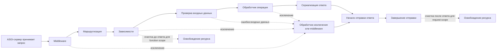

# Где в FastAPI возникает фактический HTTP-контракт

Представим Orders API. В OpenAPI для ошибки создания заказа описан JSON с полями `type`, `title` и `status`. Интеграционный тест модели проходит. Но реальный клиент получает другой ответ. Ниже показан сокращённый вариант с полями, важными для разбора расхождения:

```json
{
  "detail": [
    {
      "loc": ["body", "delivery", "window"],
      "msg": "Field required",
      "type": "missing"
    }
  ]
}
```

Причина не обязательно в OpenAPI или Pydantic-модели. Запрос мог завершиться на встроенной проверке входных данных FastAPI и вообще не дойти до обработчика. Другой ответ мог сформировать middleware или зарегистрированный обработчик исключений. А прямой `JSONResponse` мог обойти выходную модель.

Чтобы исправлять такие расхождения уверенно, недостаточно знать декларации фреймворка. Нужно проследить путь одного запроса и найти место, где создаётся фактический HTTP-ответ: статус, заголовки, тип содержимого и байты тела.

## Что именно обещает API

API-контракт — это наблюдаемое соглашение между сервисом и вызывающим его клиентом. Для HTTP-операции в него обычно входят:

- метод и адрес назначения запроса (`POST /orders`);
- значимые заголовки, например `Content-Type` и `Accept`;
- допустимое тело запроса и правила проверки его полей;
- возможные HTTP-статусы;
- тип содержимого ответа (`application/json`, `application/problem+json`);
- набор, типы и вложенность полей ответа;
- смысл ошибок: как клиент отличает исправимый запрос от конфликта или временного сбоя;
- иногда — заметные для клиента ограничения по времени, размеру или повторному вызову.

Pydantic-модель и документ OpenAPI описывают части этого соглашения, но клиент взаимодействует не с ними. Он отправляет и получает данные по сети. Поэтому окончательной проверкой контракта остаётся фактическое поведение сервиса на границе HTTP.

## Четыре представления одного ответа

Один и тот же endpoint существует сразу в четырёх представлениях.

1. **Python-код.** Аннотации параметров обработчика и внутренние классы помогают разработчику и анализаторам кода.
2. **Проверка и преобразование данных.** Pydantic решает, какие входные значения допустимы, применяет ограничения и значения по умолчанию, а также преобразует выходные объекты.
3. **Описание API.** FastAPI строит OpenAPI и JSON Schema для документации, генераторов клиентов и проверок изменений схемы.
4. **Ответ по сети.** Клиент видит фактический HTTP-статус, заголовки и тело. Именно это далее будем называть поведением на проводе (`wire behavior`).

В штатном сценарии эти представления согласованы. Расхождение появляется, когда часть пути исполнения обходит объявленную модель или меняет ответ после неё.

Например, `response_model=OrderResponse` помогает отфильтровать внутренние поля и проверить результат обработчика. Но если код возвращает готовый `JSONResponse`, автор сам отвечает за его тело и за соответствие документации. Параметр `responses={...}` добавляет описание дополнительных ответов в OpenAPI, однако не проверяет автоматически, что фактический `JSONResponse` имеет такую форму.

## Как запрос проходит через FastAPI-приложение

Упрощённая схема показывает три исхода: нормальный ответ, обработанную ошибку и финальную очистку ресурсов.



Это диагностическая карта, а не точная реализация внутренностей FastAPI. Реальный порядок зависит от состава middleware, зависимостей с `yield`, их области жизни (`scope`), обработчиков исключений и способа возврата ответа. Для зависимости с `yield` область по умолчанию — `request`: её завершающий код выполняется после отправки ответа. Явно выбранная область `scope="function"` переносит завершение зависимости на момент после возврата операции, но до отправки ответа. Практический вывод важнее деталей: ошибка может завершить запрос до вызова вашей функции, а готовый ответ может сформироваться в нескольких местах.

Есть ещё одна принципиальная граница — начало отправки ответа (`response start`). После того как сервер отправил клиенту статус и заголовки, поздний сбой очистки уже нельзя надёжно превратить в новый публичный ответ. Такой сбой нужно диагностировать и наблюдать, но обещать клиенту другой HTTP-статус поздно.

## Как искать расхождение между документацией и реальностью

Допустим, OpenAPI обещает `application/problem+json`, а тест получает стандартную ошибку FastAPI. Не начинайте с хаотичного изменения декораторов. Проследите один конкретный запрос.

1. Зафиксируйте вход: метод, путь, заголовки и точное тело.
2. Запишите фактический статус, `Content-Type` и тело ответа.
3. Определите, дошёл ли запрос до обработчика операции.
4. Если нет — найдите более раннюю границу: маршрутизация, зависимость или проверка входной модели.
5. Если да — проверьте, вернул обработчик объект для сериализации или готовый `Response`.
6. Установите, какой обработчик исключений либо middleware последним изменил ответ.
7. Сравните найденное поведение с конкретным разделом OpenAPI и с проверкой клиентского сценария.

Минимальная диагностика может состоять из одного интеграционного теста и нескольких временных записей в журнале на границах. Не требуется сразу подключать полноценную распределённую трассировку. Цель — получить проверяемый факт о пути запроса, а не угадать виновника по структуре проекта.

## Почему `nullable` не означает «поле можно не передавать»

При добавлении доставки часто возникает модель вроде этой:

```python
class Delivery(BaseModel):
    mode: Literal["pickup", "scheduled"]
    window: Window | None
```

Тип `Window | None` означает, что полю разрешено значение `null`. Но без значения по умолчанию Pydantic v2 всё равно требует присутствия ключа `window`. Эти состояния различаются:

- ключ отсутствует;
- ключ присутствует со значением `null`;
- ключ отсутствует, и применяется значение по умолчанию;
- ключ обязателен только при определённом значении другого поля.

Для Orders API бизнес-правило условное: при `mode="pickup"` окно не нужно, а при `mode="scheduled"` нужны `start` и `end`, причём начало должно быть раньше конца. Такое правило нельзя корректно выразить одной заменой типа на `Optional`. Оно требует проверки согласованности объекта.

Сгенерированная JSON Schema должна по возможности объяснять это правило инструментам. Но даже корректная условная схема не гарантирует, что конкретный генератор клиента её понимает. Поэтому критические комбинации подтверждаются исполняемыми проверками: старый запрос без `delivery`, новый `pickup`, корректный и некорректный `scheduled`.

## Публичная ошибка — инструкция для клиента

HTTP-статус сообщает общий класс результата. Тело ошибки помогает программе решить, что делать дальше: исправить запрос, повторить его позже, показать конфликт пользователю или прекратить операцию.

RFC 9457 описывает формат Problem Details с типом содержимого `application/problem+json`. Для ошибки окна доставки ответ может выглядеть так:

```json
{
  "type": "https://api.example.test/problems/invalid-delivery-window",
  "title": "Invalid delivery window",
  "status": 422,
  "detail": "The delivery window is incomplete",
  "errors": [
    {"pointer": "#/delivery/window/end", "code": "required"}
  ]
}
```

Здесь автоматике нужны стабильные `type` и расширение `errors[].code`. Поле `detail` предназначено человеку: его текст можно уточнить или локализовать, поэтому клиент не должен строить логику на сравнении этой строки.

Для каждого публичного типа проблемы следует зафиксировать:

- абсолютный и стабильный URI в `type`;
- короткий `title`;
- ожидаемый HTTP-статус;
- совпадение поля `status` в теле с реальным статусом ответа;
- стабильные машинно-читаемые расширения;
- решение, должна ли ссылка из `type` открывать документацию для человека.

Внешний ответ не должен содержать stack trace, SQL, секреты и внутренние имена классов. Идентификатор корреляции можно вернуть как ссылку для поиска диагностики, но он не заменяет стабильный тип ошибки.

## Как сосуществуют старый и новый форматы ошибок

FastAPI по умолчанию возвращает собственную форму ошибок проверки данных. Если сервис переходит к Problem Details, нужен один явный участок кода, который преобразует внутреннюю ошибку во внешний формат. Обычно это обработчик исключения на уровне приложения.

Во время миграции старый клиент всё ещё может ожидать `{"error": "..."}`. Формат можно выбирать по версии endpoint, специальному заголовку или `Accept`. У каждого подхода свои компромиссы, но сигнал должен быть однозначным и проверяемым.

Если вариант ответа зависит от заголовка запроса, нужно учесть HTTP-кэш. RFC 9110 §12.5.5 определяет, что `Vary` перечисляет заголовки запроса, повлиявшие на выбор представления. RFC 9111 §4.1 требует от кэша учитывать значения этих заголовков при выборе сохранённого ответа. Поэтому при выборе по `Accept` ответ обычно сообщает `Vary: Accept`, чтобы общий кэш не выдал новому клиенту представление, сохранённое для старого. Альтернатива — обоснованно запретить совместное кэширование таких ответов. Правильная логика обработчика без правильной политики кэша всё равно может нарушить контракт.

## Частые ошибки и их причины

**Считать OpenAPI единственным источником истины.** Схема не исполняет middleware и не проверяет прямой `Response`. Нужен тест фактического ответа.

**Использовать одну модель для базы, домена, входа и выхода API.** Внутреннее поле может случайно попасть клиенту, а изменение хранения превращается во внешнее изменение.

**Путать отсутствие поля и `null`.** Старый клиент не отправляет новый ключ вообще; модель, принимающая только явный `null`, остаётся несовместимой с ним.

**Включить новый формат ошибок одним релизом.** Старый клиент может искать поле `error` и перестать распознавать даже ожидаемую ошибку.

**Возвращать `200 OK` и `success=false`.** Клиентские библиотеки, прокси и метрики теряют стандартный сигнал результата HTTP.

**Использовать текст `detail` как код ошибки.** Редакционная правка сообщения неожиданно становится ломающим изменением.

**Скрывать поля только через `response_model_include/exclude`.** Фактический ответ фильтруется, а сгенерированная JSON Schema продолжает описывать полную модель. Документация и поведение на проводе расходятся; для стабильного публичного ответа понятнее отдельная выходная модель.

## Практическое правило

Для каждого значимого ответа ответьте на три вопроса:

1. Какой участок кода фактически формирует статус, заголовки и тело?
2. Где это поведение описано для клиента?
3. Какая исполняемая проверка подтверждает их совпадение?

Если на один из вопросов нет конкретного ответа, контракт держится на предположении.

## Самопроверка

### 1. Почему `str | None` может оставаться обязательным полем?

<details>
<summary>Ответ и объяснение</summary>

Такой тип разрешает значение `null`, но сам по себе не задаёт значения по умолчанию (`default`). В Pydantic v2 поле без значения по умолчанию требуется передать. Поэтому отсутствующий ключ и ключ со значением `null` могут дать разные результаты. Совместимость со старым клиентом нужно проверять именно запросом без нового ключа.

</details>

### 2. Где может возникнуть тело ошибки, отличающееся от OpenAPI?

<details>
<summary>Ответ и объяснение</summary>

Запрос может завершиться на проверке входных данных, в зависимости, middleware, обработчике исключения или внутри самой операции. Прямой `Response` также может не соответствовать объявленной модели. Нужно найти фактическую ветвь исполнения и проверить ответ интеграционным тестом.

</details>

### 3. Почему новое поле ответа иногда ломает старого клиента?

<details>
<summary>Ответ и объяснение</summary>

Некоторые клиенты разрешают только известный набор полей или генерируют строгую модель. Для них дополнительное поле является ошибкой десериализации. Поэтому слово «добавили» описывает изменение схемы сервера, но ещё не доказывает совместимость конкретного клиента.

</details>

### 4. Когда оправдан прямой возврат `Response`?

<details>
<summary>Ответ и объяснение</summary>

Например, для потоковой передачи, нестандартного типа содержимого или полного контроля над заголовками. Цена решения — явная ответственность за сериализацию, безопасность данных и соответствие OpenAPI. Полезное подтверждение включает тест фактического статуса, заголовков и тела, а не только unit-тест функции.

</details>

### 5. Какие поля ошибки подходят для программной логики?

<details>
<summary>Ответ и объяснение</summary>

Стабильный `type` и заранее определённые коды расширений подходят, если их семантика документирована. `detail` и тексты отдельных сообщений предназначены человеку и могут меняться. HTTP-статус остаётся общим классификатором результата, но часто недостаточен для конкретного следующего действия клиента.

</details>

## Словарь

- **ASGI** — интерфейс между асинхронным Python-приложением и сервером; FastAPI работает поверх него.
- **Граница исполнения** — участок пути запроса, на котором компонент принимает решение или преобразует данные.
- **Поведение на проводе (`wire behavior`)** — фактические статус, заголовки и тело, которыми обмениваются клиент и сервис.
- **Сериализация** — преобразование внутреннего объекта в данные ответа, например JSON.
- **Проверка входных данных (`validation`)** — проверка структуры и ограничений запроса с возможным преобразованием типов.
- **Допускающий `null` (`nullable`)** — поле может иметь значение `null`; это не означает, что ключ можно не передавать.
- **Тип содержимого (`media type`)** — формат тела сообщения из `Content-Type`, например `application/problem+json`.
- **Обработчик исключения (`exception handler`)** — код, преобразующий определённый сбой в HTTP-ответ.
- **Middleware** — компонент вокруг обработки запроса, который может читать или менять запрос, ответ и исключения.
- **Problem Details** — стандартизированная RFC 9457 форма описания HTTP-ошибки.

## Первичные источники

- [RFC 9110 — HTTP Semantics](https://www.rfc-editor.org/rfc/rfc9110.html)
- [RFC 9111 — HTTP Caching](https://www.rfc-editor.org/rfc/rfc9111.html)
- [RFC 9457 — Problem Details for HTTP APIs](https://www.rfc-editor.org/rfc/rfc9457.html)
- [OpenAPI Specification 3.1.2](https://spec.openapis.org/oas/v3.1.2.html)
- [OpenAPI versions registry](https://spec.openapis.org/oas/)
- [FastAPI: Response Model](https://fastapi.tiangolo.com/tutorial/response-model/)
- [FastAPI: Additional Responses in OpenAPI](https://fastapi.tiangolo.com/advanced/additional-responses/)
- [FastAPI: generated OpenAPI document](https://fastapi.tiangolo.com/tutorial/first-steps/#openapi-and-json-schema)
- [FastAPI: dependencies with `yield`](https://fastapi.tiangolo.com/tutorial/dependencies/dependencies-with-yield/)
- [Pydantic: Fields](https://pydantic.dev/docs/validation/latest/concepts/fields/)
