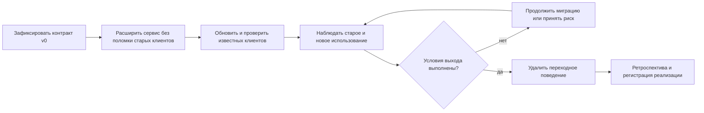

# Проектная спецификация: Evolvable Orders API

В этом проекте вы построите небольшой Orders API и проведёте через него полную миграцию внешнего контракта. Центральный результат — не число endpoint и не красота структуры каталогов. Нужно показать, что вы способны:

- обнаружить ожидания нескольких клиентов;
- спроектировать ограниченно обратимое изменение;
- поддержать старое и новое поведение во время перехода;
- собрать факты, достаточные для удаления старого пути;
- объяснить остаточный риск и принятые решения другому инженеру.

Проект выполняется самостоятельно в отдельном репозитории. Эта спецификация не содержит эталонной реализации: выбор архитектуры и столкновение с её последствиями являются частью обучения. После завершения и ревью в основном репозитории может появиться ссылка на вашу реализацию (`ImplementationReference`).

## Чем проект отличается от kata

В kata достаточно изменить одну операцию и проверить два клиента. Здесь нужно владеть жизненным циклом изменения как небольшой системой: связать несколько операций, единый формат ошибок, версии клиентов, наблюдение за переходом, откат или исправление вперёд и итоговое удаление переходного кода.

Не нужно имитировать большую компанию. Но решение должно оставлять следы, по которым другой инженер восстановит ход миграции: исходные примеры, заметки о решениях, исполняемые проверки, сигналы наблюдения и финальную ретроспективу.

## Исходная система

Orders API используется тремя потребителями. Здесь потребитель API (`consumer`) — клиентская программа или команда, а сервис, предоставляющий API (`producer`/`provider`), принимает запрос и формирует ответ. В [engineering brief](../learn/compatible-api-change.md#какие-комбинации-версий-нужно-проверить) те же роли названы `API caller` и `API provider`, чтобы не путать отправителя запроса с потребителем ответа.

1. **Checkout service** создаёт заказы через сгенерированный клиент. Его команда выпускает обновления регулярно.
2. **Operations script** создаёт и читает заказы обычным HTTP-клиентом. Скрипт обновляется нерегулярно и разбирает старую форму ошибки `{"error": "..."}`.
3. **Mobile backend** читает заказ и строго преобразует ответ в локальную модель. Неизвестное поле или значение enum может привести к ошибке.

Текущий API умеет создать заказ, прочитать его и выполнить одну простую смену состояния, например `created → confirmed`. Этого достаточно, чтобы возникали ошибки проверки данных, отсутствия заказа и конфликта состояния.

Команда должна добавить доставку по временному окну и привести публичные ошибки к единому соглашению. Клиенты нельзя обновить одним релизом. Кроме известных потребителей могут существовать старые скрипты, которые не идентифицируют версию.

## Изменение, которое нужно провести

В целевой версии создание заказа принимает необязательный объект `delivery`:

```json
{
  "customer_id": "c-42",
  "items": [{"product_id": "p-7", "quantity": 1}],
  "delivery": {
    "mode": "scheduled",
    "window": {
      "start": "2026-08-20T10:00:00Z",
      "end": "2026-08-20T12:00:00Z"
    }
  }
}
```

Правила:

- старый запрос без `delivery` продолжает работать;
- для `pickup` окно не требуется;
- для `scheduled` нужны обе границы окна, и начало должно быть раньше конца;
- ошибки проверки, отсутствия заказа и конфликта состояния имеют согласованное публичное представление;
- новый клиент способен программно различить эти ошибки;
- старый клиент продолжает работать в явно ограниченный переходный период.

Вы можете изменить детали предметной области, но обязаны сохранить не менее двух клиентов с разными ожиданиями и скоростью обновления.

## Как выглядит полный жизненный цикл



Схема не задаёт количество развёртываний. Она показывает точки принятия решений. В частности, переход от наблюдения к удалению старого пути требует подтверждения, а не календарной даты самой по себе.

## Обязательные результаты проекта

### 1. Работающий сервис

Достаточно следующих операций:

- создать заказ;
- прочитать заказ;
- выполнить одну смену состояния с возможным конфликтом.

Используйте отдельные модели входа, выхода и публичных ошибок. Внутреннее представление можно сделать простым. In-memory хранилище допустимо: проект изучает границу API, а не базу данных.

### 2. Модели клиентов

Создайте не менее двух небольших клиентских программ или наборов тестов с разными ожиданиями. Один должен воспроизводить старое поведение, другой — использовать новый контракт. Если моделируете mobile backend, сделайте его разбор ответа намеренно строгим, чтобы увидеть риск дополнительного поля или enum.

Клиентская проверка ценнее комментария «старый клиент совместим»: она делает предположение воспроизводимым.

### 3. Единая граница публичных ошибок

Ошибки проверки запроса, отсутствия сущности и конфликта состояния должны либо использовать одно соглашение, либо иметь явно обоснованные исключения. Внешний ответ не должен раскрывать stack trace, SQL, секреты и внутренние классы.

Если выбран Problem Details, для каждого нового типа зафиксируйте абсолютный URI `type`, `title`, ожидаемый HTTP-статус и машинно-читаемые расширения. Поле `status` в теле, если оно присутствует, должно совпадать со статусом HTTP.

### 4. Подтверждения совместимости

Нужны два дополняющих вида проверки:

- сравнение значимых элементов OpenAPI между версиями;
- исполняемые сценарии реальных клиентов.

Намеренно добавьте один семантический дефект, который формальная разница схем не находит, но клиентский сценарий обнаруживает. Затем исправьте его и опишите вывод.

### 5. Миграционный отчёт

Это короткий живой документ, а не формальная презентация. Он связывает:

- исходные ожидания клиентов;
- выбранную стратегию сосуществования;
- фактические результаты проверок;
- сигнал использования старого и нового поведения;
- отклонения и инциденты в симуляции;
- условия остановки и удаления переходного кода;
- остаточный риск и его владельца.

### 6. Заметки об архитектурных решениях

Для решений с реальными альтернативами используйте короткие ADR. Не нужно писать ADR на каждый класс. Минимально объясните:

- что является стабильным внешним контрактом;
- как клиент выбирает старый или новый формат ошибки;
- почему выбран именно такой переходный механизм;
- что означает откат после начала нового трафика;
- когда и кем удаляется временный код.

## Обязательные сценарии отказа

Для каждого сценария запишите: какое поведение должно сохраняться, как сбой обнаруживается и какое действие следует после обнаружения.

1. Старый запрос без `delivery` приходит в новую версию сервиса.
2. Новый запрос с `scheduled` попадает в старую версию после частичного отката.
3. Строгий клиент получает новое поле или значение enum.
4. Старый клиент получает новую форму ошибки.
5. Новый клиент должен различить ошибку исправления запроса, конфликт и временный сбой.
6. Выкладка откатывается после появления нового типа запроса или состояния.
7. Метрика не видит неизвестного либо неправильно идентифицированного клиента.
8. По заголовку запроса сервис выбирает один из двух форматов ответа; оба формата явно разрешены кэшированию, но общий HTTP-кэш смешивает их между клиентами.

Последний сценарий обязателен только при выборе представления по заголовку запроса. Если проверяется ответ на `POST /orders`, он должен быть явно разрешён кэшированию на условиях [RFC 9110 §9.3.3](https://www.rfc-editor.org/rfc/rfc9110.html#section-9.3.3); общий кэш не сохраняет произвольный ответ POST по умолчанию. Более простой вариант — проверить смешение представлений на `GET /orders/{id}`. В обоих случаях проверьте `Vary` по [RFC 9110 §12.5.5](https://www.rfc-editor.org/rfc/rfc9110.html#section-12.5.5) и выбор сохранённого ответа по [RFC 9111 §4.1](https://www.rfc-editor.org/rfc/rfc9111.html#section-4.1) либо обоснуйте запрет общего кэширования.

## Что намеренно не входит в проект

- production-grade IAM, платежи, склад и уведомления;
- Kubernetes, облачное развёртывание и service mesh;
- полноценная система наблюдаемости;
- saga и распределённые транзакции;
- нагрузочное тестирование;
- пользовательский интерфейс;
- автоматическая учебная платформа или grader.

Локальных журналов и метрик достаточно, если по ним действительно можно принять решение о миграции. Не имитируйте инфраструктуру ради внешнего сходства с production.

## Этапы выполнения

### Этап 1. Воспроизвести v0

- [ ] Реализовать минимальный API до изменения.
- [ ] Сохранить примеры HTTP-запросов и ответов.
- [ ] Реализовать старых клиентов и зафиксировать их ожидания тестами.
- [ ] Записать неизвестные условия и принятые исходные предположения.

### Этап 2. Спроектировать переход

- [ ] Описать целевой контракт.
- [ ] Разделить структурные, смысловые и эксплуатационные риски.
- [ ] Выбрать стратегию сосуществования и альтернативу, от которой отказались.
- [ ] Определить сигнал использования, условия остановки и выхода.

### Этап 3. Расширить контракт

- [ ] Принять старые и новые запросы одновременно.
- [ ] Реализовать условные правила доставки.
- [ ] Согласовать публичные ошибки на всех выбранных границах.
- [ ] Добавить совместные проверки старых и новых клиентов.

### Этап 4. Смоделировать миграцию

- [ ] Обновлять клиентов в разной последовательности.
- [ ] Воспроизвести хотя бы два сценария отказа из списка.
- [ ] Проверить условие остановки и один путь восстановления.
- [ ] Показать ограничение сравнения OpenAPI на семантическом дефекте.

### Этап 5. Завершить или обоснованно не завершить переход

- [ ] Проверить условия выхода по собранным фактам.
- [ ] Удалить старый путь либо документированно оставить его из-за недостатка подтверждений.
- [ ] Провести ревью с коллегой или LLM и обработать замечания.
- [ ] Написать ретроспективу по фактическим решениям.

Правильным результатом может быть отказ удалить старое поведение, если ваша модель наблюдения не даёт достаточной уверенности. Важна честность решения и план закрытия пробела.

## Как проводить ревью

### Безопасность публичной границы

- В ошибках нет секретов, внутренних идентификаторов и диагностических подробностей.
- Выходная модель не возвращает внутренние поля случайно.
- Журналы не сохраняют полные тела запросов без необходимости.
- Метки метрик имеют ограниченное число значений.

### Совместимость

- Проверены отсутствие поля, `null`, значение по умолчанию и условная обязательность.
- Рассмотрены новая версия сервиса со старым клиентом и, где применимо, старый сервис с новым клиентом.
- Формальная проверка схемы дополнена клиентскими сценариями.
- Падение теста объясняет влияние на клиента, а не только текст разницы.

### Выкладка и наблюдение

- Сигнал использования связан с достоверной версией или поведением клиента.
- Для численных порогов указаны период наблюдения, объём трафика и допустимое значение.
- Назван человек или роль, принимающие решение продолжить или остановить миграцию.
- Разделены откат, адаптер, компенсация и исправление вперёд.
- Переходный код имеет владельца и условие удаления.

## Вопросы для защиты проекта

### Какое ломающее изменение не обнаружила разница OpenAPI?

<details>
<summary>Что должен раскрыть ответ</summary>

Конкретный воспроизводимый пример: изменение значения по умолчанию, смысла enum, порядка, временной границы или реакции клиента на ошибку. Покажите, почему схема осталась прежней или формально совместимой и какой клиентский тест обнаружил дефект.

</details>

### Чем подтверждено ожидание каждого клиента?

<details>
<summary>Что должен раскрыть ответ</summary>

Нужны исполняемые клиентские проверки либо наблюдаемое реальное поведение, а не только таблица предположений. Хороший ответ также называет ожидания, которые остались неподтверждёнными.

</details>

### Почему выбранная стратегия сосуществования лучше альтернативы?

<details>
<summary>Что должен раскрыть ответ</summary>

Сравнение должно опираться на ограничения проекта: возможность обновить заголовки, наличие кэша, длительность перехода, число владельцев и стоимость поддержки. Назовите как минимум одну отвергнутую альтернативу и её цену.

</details>

### Какое событие остановит распространение изменения?

<details>
<summary>Что должен раскрыть ответ</summary>

Измеримый сигнал с областью наблюдения и ответственным за решение: например, рост определённой ошибки у старого клиента в заданном окне. Фраза «если что-то пойдёт не так» не позволяет выполнить решение последовательно.

</details>

### На каких фактах можно удалить старое поведение?

<details>
<summary>Что должен раскрыть ответ</summary>

Обновление известных клиентов, выполнение их проверок, достаточный период наблюдения без старого использования и оценка слепых зон. Если неизвестный клиент не исключён, должен быть назван владелец остаточного риска.

</details>

### Какой риск остаётся после завершения?

<details>
<summary>Что должен раскрыть ответ</summary>

Любая честно ограниченная неопределённость: неизвестный скрипт, неполная идентификация версии, поведение внешнего кэша или невозможность воспроизвести редкий путь. Важно объяснить возможный ущерб, способ обнаружения и владельца реакции.

</details>

## Готовность проекта

Проект готов к защите, если другой инженер может:

1. запустить исходное и целевое поведение;
2. воспроизвести ожидания старого и нового клиента;
3. увидеть, какой дефект ловит схема, а какой — только клиентская проверка;
4. проследить решение от исходного риска до сигнала миграции;
5. проверить основание для удаления или сохранения переходного кода.

Зелёных unit-тестов сервиса недостаточно: они могут доказать внутреннюю корректность и ничего не сказать о старом клиенте.

## Ретроспектива

После завершения ответьте письменно:

- Какое исходное предположение оказалось неверным?
- Какой результат проверки изменил ваше решение?
- Какую сложность создал переходный период?
- Что вы стандартизировали бы для следующей команды?
- Что намеренно оставили бы локальным решением и почему?

## Словарь

- **Проектная спецификация (`project spec`)** — описание задачи, границ и ожидаемых результатов без готового решения.
- **Потребитель API (`consumer`, в brief — `API caller`)** — клиентская программа или команда, использующая API.
- **Контракт v0/v1** — условные обозначения исходного и целевого поведения; они не требуют URL-версий.
- **ADR** — короткая запись архитектурного решения, его контекста, альтернатив и последствий.
- **Переходный код** — временная логика, поддерживающая старое и новое поведение одновременно.
- **Сигнал использования (`adoption signal`)** — наблюдаемый признак перехода клиента на новое поведение.
- **Исправление вперёд (`roll-forward`)** — выпуск следующего совместимого исправления вместо возврата к старой версии.
- **Компенсация** — отдельное действие, уменьшающее последствия уже выполненного изменения.
- **ImplementationReference** — зарегистрированная ссылка на самостоятельно выполненный и проверенный проект.
