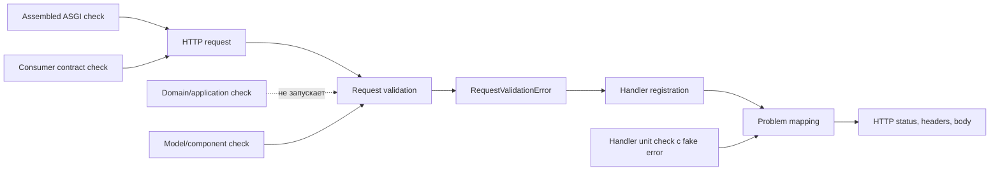

# Правдивые границы проверки сервиса

Команда Orders service уверена в изменении: domain/application tests зелёные, Pydantic-модель отклоняет неполное окно доставки, unit-тест обработчика операции тоже проходит. После сборки приложения новый клиент всё равно получает не тот HTTP-ответ. Он не видит стабильный тип проблемы и не может подсветить `delivery.window.end`.

Проблема не в недостаточном количестве тестов. Имеющиеся проверки не запускали механизм, который превратил внутреннюю ошибку во внешний ответ. Чтобы осознанно выбрать следующую проверку, нужно сначала назвать риск и механизм, а не тип теста.

## Один контракт, один дефект

Клиент отправляет `POST /orders` с `Accept: application/problem+json`. Для `delivery.mode="scheduled"` отсутствует `window.end`.

Точный некорректный запрос:

```json
{
  "customer_id": "c-42",
  "items": [{"product_id": "p-7", "quantity": 1}],
  "delivery": {
    "mode": "scheduled",
    "window": {"start": "2026-08-21T10:00:00Z"}
  }
}
```

Обещанный ответ:

```http
HTTP/1.1 422 Unprocessable Content
Content-Type: application/problem+json
```

```json
{
  "type": "https://api.example.test/problems/invalid-delivery-window",
  "title": "Invalid delivery window",
  "status": 422,
  "detail": "The delivery window is incomplete",
  "errors": [
    {"pointer": "#/delivery/window/end", "code": "required"}
  ]
}
```

В этом примере `Accept` фиксирует ожидание клиента как часть контракта приложения. Сам по себе заголовок не включает автоматический выбор формата ответа в FastAPI/Starlette: media type определяется тем, какой обработчик исключения сработал. В дефектной сборке exception handler для `RequestValidationError` не зарегистрирован, поэтому FastAPI использует default error path и возвращает `422 application/json` с `detail`. Проверка модели правильно доказывает, что данные отвергнуты, но ничего не говорит о регистрации обработчика и поведении на HTTP-границе.

## Ментальная модель: шесть вопросов вместо пирамиды

Полезная последовательность решения:

> риск для клиента → механизм нарушения → самая дешёвая граница, где механизм присутствует → сигнал падения и локализация → стоимость → остаточный риск

- **Риск:** клиент не распознаёт исправимую ошибку и не подсвечивает поле.
- **Механизм:** validation exception проходит через точку сборки приложения (`composition root`), таблицу exception handlers, сериализацию и ASGI response.
- **Правдивая граница:** собранное приложение, вызванное через реальный ASGI/HTTP path без подмены exception mapping.
- **Сигнал:** status, media type и семантические поля тела расходятся с обещанием.
- **Локализация:** отдельная быстрая проверка validation component остаётся зелёной, а HTTP check падает; область поиска сужается до assembly/mapping/serialization.
- **Остаточный риск:** in-process ASGI path не включает proxy, сетевую конфигурацию, настоящий deployment и код реального клиента.

Уровни `unit`, `integration`, `component` и `E2E` описывают объём запущенной системы (`test scope`) лишь приблизительно. Они не сообщают, какой механизм остался настоящим. Два теста с названием `integration` могут давать противоположную уверенность, если один собирает приложение, а второй вызывает serializer напрямую.

## Scope, boundary и mechanism coverage

**Объём проверки (`test scope`)** — какие части системы запущены. **Граница проверки (`test boundary`)** — через какой наблюдаемый интерфейс подаётся воздействие и снимается результат. **Покрытие механизма (`mechanism coverage`)** — присутствует ли реальная причинная цепочка, способная породить исследуемый отказ.

Эти понятия нельзя заменять друг другом. Большой scope может вырезать нужный механизм моками. Маленький component check может быть лучшим доказательством, если именно компонент содержит механизм риска.

Уверенность (`confidence`) здесь означает обоснованную степень доверия конкретному утверждению. Ложная уверенность (`false confidence`) возникает, когда зелёный сигнал интерпретируют шире, чем позволяет граница: «модель отвергает запрос» превращают в «клиент получает правильный Problem Details».

## Где исчезает механизм

Схема отвечает на вопрос: какая граница действительно проходит через дефектную регистрацию обработчика?



Схема намеренно не показывает proxy и сеть: assembled ASGI check работает внутри процесса. Она показывает главное различие: прямой вызов mapper может подтвердить mapping, но обходит `Handler registration`; только запрос к собранному приложению воспроизводит seeded defect. Consumer check может использовать ту же HTTP-границу, но формулирует assertions через реально используемые ожидания клиента.

## Четыре границы на одном substrate

| Граница | Что действительно проверяет | Что ловит здесь | Чего не доказывает | Типичная стоимость |
|---|---|---|---|---|
| Чистая domain/application | Бизнес-правило и координацию без I/O | Неверное правило обязательности окна, если оно принадлежит domain/application | Pydantic mapping, handler registration, HTTP response | Очень быстрая, хорошо локализует |
| Validation/serialization component | Pydantic validation либо mapper как компонент | Модель пропустила неполное окно; mapper сформировал неверные поля | Сборку приложения и фактический exception route | Быстрая, но требует точного контракта компонента |
| Собранное приложение через ASGI/HTTP | Routing, validation exception, зарегистрированные handlers, serialization и response | Отсутствующий handler или handler, зарегистрированный для другого типа исключения; media type и wire body | Proxy, TLS, deployment и реальную сеть | Дороже локальной, но дёшева для одного endpoint |
| Consumer-facing contract check | Используемое клиентом поведение: status, `type`, pointer | Несовместимость с ожиданием конкретного клиента | Неиспользуемые части схемы и все внутренние причины | Стоимость зависит от того, запускается ли проверка на стороне клиента или сервиса-поставщика |

Нет универсально лучшей границы. Если риск — арифметика окна, HTTP-тест избыточен. Если риск — wiring обработчика, model test недостаточен. Самая дешёвая правдивая граница — минимальная граница, на которой причинный механизм ещё не удалён.

## Минимальный набор для seeded defect

Для данного отказа достаточно двух различающихся сигналов:

1. Сохранить быструю проверку validation component: точный invalid request должен породить ошибку, связанную с отсутствующим `window.end`. Она локализует правило.
2. Добавить один HTTP/ASGI check собранного приложения: отправить тот же запрос с `Accept`, проверить реальный status, нормализованный media type и семантические поля Problem Details.

HTTP check должен проверять не байтовое равенство всего JSON, а обещание клиента:

- status равен `422`;
- media type без несущественных параметров равен `application/problem+json`;
- `type`, `title` и `status` согласованы;
- список `errors` содержит `pointer="#/delivery/window/end"` и `code="required"`.

Текст `detail` полезно проверить в одном каноническом примере документации, но клиентская логика не должна ветвиться по нему. Порядок JSON-полей и внутренние `loc/msg/type` Pydantic — implementation details публичного контракта не являются.

Такой набор ловит дефект и локализует его: если component check зелёный, а assembled HTTP check красный, сначала исследуются composition root, exception type/registration и response mapping. Один широкий E2E дал бы сигнал, но хуже указал бы область причины.

## Когда mock и fake полезны

Подмена (`test double`) полезна, если убирает дорогую зависимость, не удаляя исследуемый механизм. Fake repository в application test может сохранить координацию заказа. Fake validation exception в прямом mapper test помогает проверить все коды ошибок быстро.

Подмена вредна, когда подменяет сам предмет проверки. Router unit test, который напрямую вызывает mapper или заранее подготовленный handler, не запускает выбор обработчика собранным приложением. Зелёный результат нельзя расширять до утверждения о wire behavior.

Практический вопрос: «Может ли посеянный реальный дефект возникнуть внутри этой проверки?» Если нет, проверка может быть полезна для другого риска, но не подтверждает текущий.

## Contract check, schema snapshot и полный E2E

**Проверка контракта (`contract check`)** исполняет конкретное ожидание вызывающей стороны против предоставляющего API сервиса либо согласованного представителя. Здесь новый клиент использует status, `type` и pointer. Проверять весь JSON или весь OpenAPI не нужно.

Снимок схемы (`schema snapshot`) обнаруживает структурный diff, но не запускает exception handler и не доказывает media type фактического ответа. Полный E2E через deployment добавляет сеть, proxy и конфигурацию, но становится медленнее и нестабильнее. Он оправдан только для риска, который появляется там; дублировать им каждое validation rule не нужно.

## Стоимость — часть решения

Для каждой проверки оцените:

- время запуска и частоту выполнения;
- стабильность и вероятность ложного падения (`false positive`);
- диагностичность: насколько красный сигнал сужает область поиска;
- обслуживание данных, doubles и окружения;
- вероятность ложной уверенности;
- уникальный механизм, которого нет в более дешёвой проверке.

Удаление проверки оправдано не потому, что она «медленная», а когда другой набор сохраняет то же значимое подтверждение дешевле. Повторять одинаковую assertion на model, handler, HTTP и E2E уровнях бессмысленно, если более широкая граница не добавляет нового механизма.

## От одной регрессии к стратегии сервиса

Verification portfolio — управляемый набор проверок одного сервиса, связанный с критическими путями и способами их нарушения. Его проектируют не процентами типов тестов, а таблицей:

| Риск | Механизм | Правдивая граница | Сигнал/локализация | Стоимость | Остаточный риск |
|---|---|---|---|---|---|
| Клиент не разбирает validation error | Handler registration + HTTP mapping | Assembled ASGI + consumer assertions | Component green / HTTP red | Один негативный HTTP case | Deployment path не проверен |

На уровне сервиса добавляются другие критические пути: успешное создание, domain rejection, persistence mapping, authorization или dependency failure — только если они действительно входят в сервис. Затем измеряется длительность выбранного набора, повторяемость flaky failures, дублирование assertions или время локализации посеянных отказов. Универсального процента unit/E2E нет.

## Частые ошибки

- **Тестировать implementation detail.** Assertions на внутренний вызов handler не подтверждают response.
- **Дублировать одну assertion везде.** Количество зелёных тестов растёт, различающее evidence — нет.
- **Заменить всё E2E.** Получается дорогой сигнал с плохой локализацией.
- **Считать snapshot семантической проверкой.** Снимок замечает шум и пропускает исполняемый mapping.
- **Замокать реальную boundary.** Дефект wiring становится невозможен внутри теста.
- **Проверять только happy path.** Error mapping остаётся самым слабым участком внешнего обещания.
- **Не называть остаточный риск.** ASGI check начинает ошибочно считаться production network proof.

## Самопроверка

### Почему прямой тест Pydantic-модели не ловит seeded defect?

<details>
<summary>Ответ и объяснение</summary>

Он подтверждает, что неполное окно отклоняется, но не собирает FastAPI application и не выбирает exception handler. Регистрация обработчика, media type и HTTP serialization находятся за пределами его границы. Поэтому зелёный model test полезен для локализации, но не подтверждает публичный ответ.

</details>

### Какая минимальная следующая проверка даст правдивый сигнал?

<details>
<summary>Ответ и объяснение</summary>

Один запрос к собранному приложению через ASGI/HTTP path с точным invalid body и `Accept: application/problem+json`. Assertions должны наблюдать status, media type и используемые клиентом поля тела. Прямой вызов mapper снова обошёл бы дефект регистрации.

</details>

### Зачем сохранять component check после добавления HTTP check?

<details>
<summary>Ответ и объяснение</summary>

Он дешевле и разделяет причины. Если оба теста падают, вероятна проблема validation rule; если component зелёный, а HTTP красный, поиск сужается до assembly/mapping/serialization. Удаление component check ухудшит локализацию ради небольшой экономии.

</details>

### Когда schema snapshot всё же полезен?

<details>
<summary>Ответ и объяснение</summary>

Для быстрого обнаружения неожиданных структурных изменений документа. Но snapshot не заменяет semantic assertions и фактический HTTP request. Его граница должна быть названа, а шумные неиспользуемые части схемы лучше не закреплять.

</details>

### Как доказать, что медленную проверку можно удалить?

<details>
<summary>Ответ и объяснение</summary>

Нужно показать, какой уникальный риск и механизм она подтверждала, и воспроизвести те же seeded failures оставшимся набором. Затем сравнить заранее выбранную метрику стоимости и локализации до/после. Простое совпадение assertions или зелёный прогон без fault injection слишком слабы.

</details>

## Словарь

| Термин | Значение здесь |
|---|---|
| Test scope | Части системы и инфраструктуры, запущенные проверкой |
| Test boundary | Интерфейс, через который проверка воздействует на систему и наблюдает результат |
| Mechanism coverage | Присутствие реальной причинной цепочки, способной породить исследуемый отказ |
| Confidence | Обоснованное доверие конкретному утверждению в пределах выбранной границы |
| False confidence | Зелёный сигнал, интерпретированный шире, чем позволяет граница |
| Contract check | Исполняемая проверка реально используемого ожидания клиента |
| Critical path | Путь сервиса, нарушение которого создаёт существенный пользовательский или системный ущерб |
| Residual risk | Риск, который остаётся за пределами выбранных проверок |
| Test double | Общий термин для подмены реального collaborator в проверке |
| Mock | Подмена, часто проверяющая ожидаемые взаимодействия |
| Fake | Упрощённая работающая реализация, например in-memory repository |
| Verification portfolio | Набор проверок сервиса, связанный с рисками, механизмами, стоимостью и остаточными рисками |

## Связанные материалы и первичные источники

- [Фактическая HTTP boundary Orders API](../../evolvable-api-contracts/learn/http-contract-execution-boundary.md)
- [Совместимость относительно ожиданий клиента](../../evolvable-api-contracts/learn/compatible-api-change.md)
- [Business и adapter evidence](../../service-architecture-boundaries/learn/change-isolation-service-boundaries.md)
- [Risk-based verification failure paths](../../runtime-concurrency-lifecycle/project-spec/resilient-fanout-service.md)
- [RFC 9457 — Problem Details for HTTP APIs](https://www.rfc-editor.org/rfc/rfc9457.html)
- [FastAPI — Handling Errors](https://fastapi.tiangolo.com/tutorial/handling-errors/)
- [FastAPI — Testing](https://fastapi.tiangolo.com/tutorial/testing/)
- [Starlette — Test Client](https://www.starlette.io/testclient/)
- [Pydantic — Validators](https://docs.pydantic.dev/latest/concepts/validators/)
