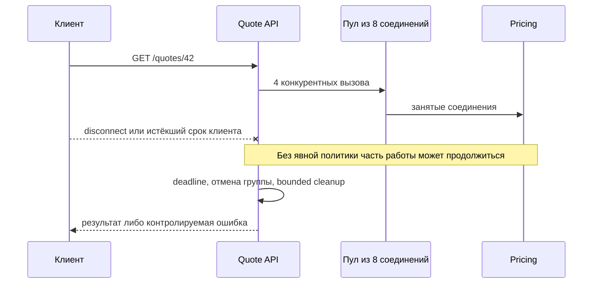

# Concurrency, cancellation и lifecycle ресурсов backend-сервиса

Сервис `Quote API` принимает запрос на расчёт предложения и параллельно обращается к четырём операциям медленной зависимости `Pricing`. Пока трафик мал, всё выглядит исправным. Под нагрузкой клиенты закрывают соединение или исчерпывают свой срок ожидания, а уже запущенные обращения продолжают занимать соединения. Новые запросы ждут пул, p99 растёт, и один медленный компонент ухудшает работу всего сервиса.

Этот слайс учит одному законченному действию: восстановить путь отказа, ограничить усиление работы, провести общий срок выполнения и отмену через локальные границы, обеспечить ограниченную по времени очистку управляемых ресурсов и доказать восстановление тестами и telemetry.

## Сквозная ситуация и наблюдаемое действие

Во всех материалах используются два контролируемых 60-секундных прогона `GET /quotes/{item_id}` при 12 конкурентных запросах. Каждый входящий запрос создаёт четыре вызова `Pricing`, HTTPX-пул допускает не более восьми соединений, а общий срок запроса равен 600 мс.

- В здоровом профиле все вызовы `Pricing` занимают около 80 мс. По серверной (`service-side`) метрике `Quote API`, от приёма запроса до выбранного исхода обработки на уровне приложения (`application outcome`), p95 по всем входящим запросам прогона должен быть не более 450 мс.
- В деградированном профиле 25% вызовов `Pricing` занимают около 700 мс, остальные — около 80 мс. Каждый входящий запрос прогона должен достичь выбранного исхода — полного ответа, явно неполного/деградированного ответа (`partial/degraded`) либо контролируемой ошибки — не позднее 650 мс по той же серверной точке измерения.
- В исправленной конфигурации ожидание соединения измеряется от запроса соединения из пула до его получения или `PoolTimeout` и для каждой попытки не превышает 100 мс. Число открытых соединений остаётся не выше восьми.
- После 60 секунд нагрузки сервис наблюдают ещё 10 секунд: `in_flight` и `waiting` должны вернуться к нулю не позднее чем через одну секунду после снятия нагрузки, а отдельная проверка shutdown должна завершиться не позднее двух секунд.

Это acceptance criteria воспроизводимого эксперимента, а не универсальная production-гарантия. Иные workload, длительность или поведение зависимости требуют нового измерения.

Центральное наблюдаемое действие — не «добавить semaphore». Инженер должен показать причинную цепочку от fan-out и ожидания пула до истёкшего deadline, оставшейся работы и восстановления после нагрузки.

Схема показывает границы решения, но намеренно не обещает, что disconnect сам отменит обработчик. Конкретный сервер и framework могут сообщить о разрыве, однако приложение должно явно определить, где этот сигнал проверяется, какая работа отменяется и сколько времени допускается на cleanup.

## Маршрут по материалам

1. [Cancellation, deadlines и lifecycle ресурсов](learn/cancellation-deadlines-resource-lifecycle.md) — различите события, проведите cancellation через группу задач и выберите request/application scope.
2. [Ограниченная конкурентность и насыщение пула](learn/bounded-concurrency-pool-saturation.md) — свяжите fan-out, очередь, deadline budget, backpressure и измерения.
3. [Интервью: runtime-отказ fan-out сервиса](interview/runtime-resource-failure.md) — восстановите failure path и последовательно расширьте решение от одного endpoint до политики нескольких сервисов.
4. [Kata: остановить orphan work и pool exhaustion](kata/stop-orphan-work-and-pool-exhaustion.md) — воспроизведите дефект, исправьте его без готового рецепта и докажите регрессионными проверками.
5. [Проект: устойчивый fan-out сервис](project-spec/resilient-fanout-service.md) — самостоятельно пройдите шесть milestone от baseline до engineering decision.

Каждый файл содержит собственную рабочую ситуацию, критерии и словарь. Для первого прохождения полезен указанный порядок; для повторения можно открыть любой материал напрямую.

## Что желательно знать заранее

Нужны базовое владение Python `async`/`await`, FastAPI endpoint и HTTP-клиентом. Сначала разберитесь, кто создаёт и закрывает общие ресурсы; затем связывайте lifecycle клиента с cancellation, пулом соединений и очередью. В диагностике сначала восстановите путь одного запроса, а уже затем объясняйте показатели производительности. Полный порядок зависимостей собран в [каталоге prerequisites](../../prerequisites.md), но знать терминологию его графа для прохождения слайса не требуется.

Границы соседних треков:

- B1 объясняет общую семантику Python runtime и `asyncio`; здесь она применяется к request/service/dependency boundary;
- B7 владеет общей методикой SLI, capacity и incident response; здесь используются только сигналы конкретного `Quote API`;
- B6 владеет контейнерами, orchestration и autoscaling; pod и platform limits здесь лишь внешний контекст;
- B5 владеет общей теорией цепочек timeout/retry и partial failure; здесь одна service-level fan-out операция, а retry не используется как универсальное лечение медленной зависимости.

## Ожидаемый результат

После прохождения инженер может:

- отличить disconnect, timeout, deadline и cancellation;
- объяснить, почему запрос на отмену не гарантирует мгновенного прекращения blocking, remote или подавившего отмену кода;
- выбрать lifecycle HTTP-клиента и пула на уровне приложения, а временных задач — на уровне запроса;
- связать три разных ограничения: admission входящих запросов, конкурентность исходящей работы и физическую ёмкость пула;
- отличить причину pool saturation от симптома высокой p99 контролируемым экспериментом;
- задать измеримый overload path и подтвердить cleanup, shutdown и recovery.

Чтение объясняет L1–L3 модель. Interview только исследует reasoning, kata даёт практику уровня L2, а проект интегрирует результаты уровня L3. Рассуждение L4 в интервью не заменяет факта внедрения политики несколькими командами.

## Актуальность технической базы

Утверждения проверены 2026-08-15. Python 3.14.6 документирует кооперативную отмену `Task`, `try/finally`, `TaskGroup` и `asyncio.timeout()`. FastAPI 0.136.3 рекомендует `lifespan` для общих application-ресурсов. Starlette 1.3.1 предоставляет `Request.is_disconnected()` как способ проверить сигнал разрыва; это не универсальная гарантия автоматической отмены downstream work. Для HTTPX 0.28.1 различаются connect/read/write/pool timeouts, а `Limits` ограничивает соединения.

Перед переносом решения в проект закрепите версии и повторите failure-тест: server integration, cancellation и pool behavior чувствительны к версиям и конфигурации.

## Словарь

| Термин | Значение в этом слайсе |
|---|---|
| Fan-out | Несколько исходящих операций, порождённых одним входящим запросом |
| Deadline | Момент, после которого результат операции уже не должен ожидаться |
| Cancellation | Кооперативный запрос прекратить работу и пройти cleanup path |
| Orphan work | Работа, утратившая полезного ожидающего владельца, но продолжающая потреблять ресурс |
| Pool saturation | Состояние, когда заняты все соединения пула и новые операции ждут либо получают pool timeout |
| Backpressure | Передача сигнала насыщения к источнику новой работы через ограниченное ожидание, деградацию или отказ, когда нижележащая зависимость (downstream) уже насыщена |
| Controlled lifecycle boundary | Участок кода, где приложение владеет acquire, использованием и release ресурса |
| Telemetry | Сигналы конкретного сервиса: измерения, события и traces, позволяющие проверить гипотезу |
