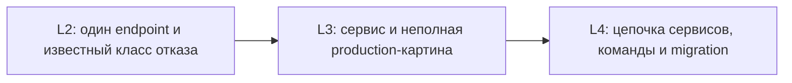

# Интервью: runtime-отказ fan-out сервиса

Материал подходит для интервьюера и для самостоятельной подготовки. Он проверяет не знание названий `asyncio` API, а способность восстановить путь отказа, отделить наблюдение от гипотезы и выбрать проверяемое поведение при перегрузке.

## Рабочая история

Эта история реализует [сценарий отказа S08](../../../scenarios.md), но для разбора достаточно приведённого ниже контекста. `Quote API` обрабатывает `GET /quotes/{item_id}`. Для ответа он параллельно вызывает четыре операции `Pricing`. Используется общий HTTPX-клиент с пулом восьми соединений. Клиентский gateway ждёт 600 мс.

После изменения `Pricing` у 25% вызовов задержка выросла с 80 до 700 мс. При 12 конкурентных запросах наблюдаются:

- по серверным (`service-side`) метрикам `Quote API` p50 около 180 мс, а p99 выше 4 секунд, хотя gateway прекращает клиентское ожидание примерно через 600 мс;
- пул почти постоянно занят полностью;
- растёт число операций, ожидающих соединение;
- gateway фиксирует timeout и закрывает клиентские соединения;
- после снятия нагрузки `Quote API` ещё несколько секунд вызывает `Pricing`;
- graceful shutdown иногда превышает 10 секунд.

Код создаёт четыре задачи через `asyncio.create_task()`, а затем ждёт результаты. Полной telemetry и достоверного знания о реакции ASGI server на disconnect нет.

## Основной вопрос

Как вы восстановите failure path, локализуете причину и переработаете сервис так, чтобы deadline, cancellation, ограничения нагрузки и cleanup образовали согласованную политику? Какие тесты и наблюдения докажут исправление?

Ориентир сильного рассуждения

Сначала инженер отделяет факты от предположений. p99, pool utilization и продолжающиеся вызовы — факты; «disconnect не отменяет handler» и «пул слишком мал» пока гипотезы. Нужен correlation ID через входящий запрос, четыре дочерних вызова и причины их завершения; счётчики active/waiting/in-flight; отдельно pool, connect/read timeouts, общий deadline и disconnect.

Затем кандидат фиксирует воспроизводимый envelope: 12 конкурентных запросов в течение 60 секунд, fan-out 4, 80/700 мс у dependency, pool 8, deadline 600 мс и конкретные thresholds. Контролируемый эксперимент меняет только задержку или fan-out и проверяет корреляцию pool wait с p99.

Исправление должно задать владение задачами. Запрос создаёт структурированную группу, общий application client живёт в lifespan, а остаток end-to-end deadline ограничивает ожидание admission, пула и ответа. Disconnect может быть дополнительным сигналом только после проверки выбранной server/framework конфигурации. Cancellation проходит к дочерним задачам, `finally` возвращает управляемые ресурсы, но remote side effect и blocking work названы пределами.

Ограничения различаются: admission управляет новой входящей работой, global outbound concurrency — полезной нагрузкой на `Pricing`, pool — transport-соединениями. При насыщении сервис быстро возвращает явную ошибку или документированный partial result. Значения выбираются по dependency capacity и проверяются нагрузкой, а не копируются друг из друга.

Доказательство включает integration-тест deadline/cancellation, disconnect-тест с реальным ASGI transport, load/failure experiment, balance дочерних задач, ограничение соединений и recovery после снятия нагрузки. Успех — не отсутствие исключений, а завершение каждого исхода к 650 мс и нулевые waiting/in-flight за одну секунду в заданном envelope.

## Уточняющие вопросы

### 1. Что вы проверите в первые 30 минут, прежде чем менять размеры пула?

Ответ и сигнал глубины

Нужно восстановить request path и временную шкалу: сколько запросов вошло, сколько исходящих вызовов создано, где они ждут, когда gateway завершил ожидание и когда задачи реально закончились. Полезны pool wait, in-flight/waiting, причины завершения и одна трассировка с четырьмя дочерними участками (`spans`). Сильный ответ формулирует две-три конкурирующие гипотезы — медленная dependency, утраченная cancellation или blocking участок — и план их фальсификации.

### 2. Чем в этой истории различаются disconnect, timeout, deadline и cancellation?

Ответ и сигнал глубины

Disconnect — сигнал разрыва клиентского соединения. Gateway timeout — прекращение ожидания gateway. Deadline 600 мс — общий момент окончания полезности операции в `Quote API`. Cancellation — кооперативный механизм остановки принадлежащих задач. Ни один из первых двух сигналов не доказывает автоматическую отмену handler во всех ASGI конфигурациях; это нужно явно связать и проверить.

### 3. Почему `create_task()` может оставить orphan work и чем заменить модель владения?

Ответ и сигнал глубины

Проблема не в функции сама по себе, а в потере структурного владельца: задача переживает полезный запрос или одна ошибка не завершает siblings. Нужна область, которая хранит задачи, распространяет failure/cancellation и ждёт cleanup, например `TaskGroup` либо эквивалент выбранной async abstraction. Сильный кандидат отдельно говорит, что кооперативный дочерний код всё равно может задержать выход.

### 4. Как выбрать concurrency limit и overload response?

Ответ и сигнал глубины

Начать с безопасной concurrent capacity `Pricing`, fan-out, допустимой очереди и deadline. Затем задать workload, длительность, degraded behavior и threshold. Admission, outbound limit и pool size получают разные обязанности. При исчерпании короткого ожидания сервис возвращает контролируемый `503`/`429` либо явный partial result, если это допустимо контрактом. Случайное число без load/failure test — не решение.

### 5. Почему увеличение пула с 8 до 48 может ухудшить систему?

Ответ и сигнал глубины

Оно переносит до 48 одновременных операций в `Pricing`, который уже деградирует. Latency локального ожидания может временно уменьшиться, но dependency saturation и общий recovery ухудшатся. Нужно измерить safe capacity и shifting bottleneck, а не максимизировать открытые соединения.

### 6. Какие тесты выбрать, а какие утверждения они не доказывают?

Ответ и сигнал глубины

Unit-тест budget arithmetic полезен, но не доказывает transport cancellation. Integration-тест с управляемой dependency доказывает pool/deadline path в процессе. Disconnect требует теста выбранной ASGI server/transport конфигурации. Load test показывает поведение в заданном envelope, но не любую production-нагрузку. Shutdown-тест проверяет локальный graceful boundary, но не process kill и remote side effects.

### 7. Что означает bounded cleanup и где его пределы?

Ответ и сигнал глубины

Приложение может обещать, что принадлежащие запросу задачи и streams завершаются, а application client закрывается по success/error/cancellation/shutdown в заданное время. Нельзя обещать cleanup после kill/crash, остановку blocking/uncancellable кода или отмену уже начатого удалённого side effect. Эти пределы должны быть в проверке и операционной инструкции (`runbook`).

### 8. После снятия нагрузки p99 нормализовался, но `outbound_in_flight` остаётся ненулевым. Исправление доказано?

Ответ и сигнал глубины

Нет. Нормальная latency новых запросов может скрывать orphan tasks. Acceptance требует recovery state: waiting и in-flight возвращаются к нулю, баланс started/finished/cancelled сходится, соединения освобождаются и shutdown остаётся bounded. Нужно исследовать, какие задачи остались и кому они принадлежат.

### 9. Как retry влияет на эту аварию?

Ответ и сигнал глубины

Повтор медленного или timeout-вызова создаёт дополнительную работу и расходует тот же deadline/pool. Массовые retries усиливают fan-out. Они допустимы только для выбранных transient failures, с ограниченными попытками и budget, jitter и безопасной семантикой операции. Для этой причины retry не является обязательным исправлением.

### 10. Что изменится на L4, если пять сервисов вызывают друг друга?

Ответ и сигнал глубины

Локальные timeouts нужно заменить согласованными end-to-end deadline budgets и ownership каждой границы. Limits не должны одновременно пропускать больше, чем выдерживает downstream, или создавать каскад быстрых повторов. Понадобятся defaults, исключения, migration plan, staged rollout и общая measurement model. Документ политики без применения минимум в двух контекстах не доказывает L4 outcome.

## Как различать уровни

### L2 — типовой локальный отказ

Инженер самостоятельно воспроизводит saturation, различает pool timeout и общий deadline, выбирает lifecycle клиента, ограничивает локальную конкурентность и пишет failure-тест. Неопределённость невелика, решение относится к одному endpoint.

### L3 — нетипичная деградация сервиса

Инженер при неполной telemetry восстанавливает production path, строит и фальсифицирует гипотезы, выбирает согласованные admission/concurrency/pool boundaries, задаёт degradation и доказывает recovery. Он владеет остаточным риском и меняет verification strategy по фактическому отказу.

### L4 — политика нескольких сервисов

Инженер согласует deadline и capacity boundaries между командами, планирует migration и исключения, следит за shifting bottleneck и меняет policy по production feedback. Хороший ответ на интервью лишь показывает способность рассуждать; L4 подтверждается применением несколькими командами.

Схема показывает рост автономности, неопределённости и масштаба. Число названных терминов на уровень не влияет.

## Правдоподобные, но слабые ответы

- **«Semaphore всё исправит».** Не названы место очереди, deadline, overload path и recovery evidence.
- **«Disconnect автоматически отменит запрос».** Framework/server configuration не проверена, downstream work не прослежена.
- **«Сделаем pool больше».** Capacity зависимости и shifting bottleneck проигнорированы.
- **«Поставим timeout 600 мс на каждый вызов».** Последовательные стадии получают новый budget и нарушают end-to-end deadline.
- **«У нас зелёный unit-тест».** Он не проверяет transport, pool, disconnect и нагрузочное восстановление.
- **«Добавим retry».** Усиление и remaining budget не рассмотрены.
- **«Все задачи закрываются в `finally`».** Не названы владелец, измеримый срок и пределы process kill/remote effects.

## Словарь

| Термин | Значение в этом интервью |
|---|---|
| Failure path | Последовательность от входящего запроса до наблюдаемого отказа и cleanup |
| Orphan work | Работа без полезного ожидающего владельца |
| Admission | Решение допустить новую дорогую операцию при текущей загрузке |
| Saturation | Полная занятость ограниченного ресурса и появление ожидания/отказов |
| Degradation | Явно спроектированный более дешёвый ответ при насыщении |
| Recovery evidence | Измерения возврата waiting/in-flight к нулю, освобождения ресурсов и latency в явно заданный контрольный диапазон |
| Runtime policy | Согласованные deadline/cancellation/concurrency defaults, ownership и исключения |

## Первичные источники

- [Python 3.14 — Coroutines and Tasks](https://docs.python.org/3.14/library/asyncio-task.html)
- [FastAPI — Lifespan Events](https://fastapi.tiangolo.com/advanced/events/)
- [Starlette — Requests](https://www.starlette.io/requests/)
- [HTTPX — Resource Limits](https://www.python-httpx.org/advanced/resource-limits/)
- [HTTPX — Timeouts](https://www.python-httpx.org/advanced/timeouts/)
