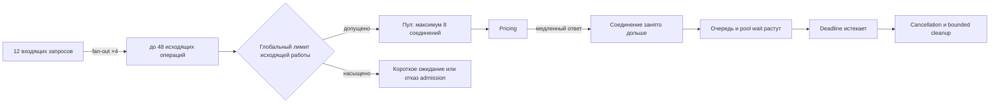

# Ограниченная конкурентность и насыщение пула

Один запрос `Quote API` создаёт четыре обращения к `Pricing`. При 12 конкурентных запросах сервис пытается вести до 48 исходящих операций. Пул допускает восемь соединений, поэтому остальные ждут. Если зависимость замедлилась, время ожидания попадает внутрь клиентского deadline, а завершившиеся клиенты освобождают место не сразу. Медиана может выглядеть приемлемо, пока p99 и очередь растут нелинейно.

Слабое исправление — увеличить пул до 48. Это перемещает очередь в зависимость и может ускорить её падение. Сначала нужно понять, где возникает усиление и какое поведение сервис обещает при насыщении.

## Причинная цепочка

Для входящей интенсивности `R` и fan-out `F` сервис инициирует примерно `R × F` исходящих операций. Это не формула capacity planning: длительность вызова, кэш, early completion и распределение трафика меняют результат. Но она быстро выявляет усиление.

Схема различает лимит допущенной работы и физическую ёмкость пула. Они могут иметь разные значения и цели. Если оба просто равны восьми без объяснения, это, вероятно, один случайный лимит под двумя именами.

Схема намеренно не моделирует планировщик задач, транспортные детали и все возможные варианты очередей. Она показывает только причинные границы, необходимые для выбора лимитов; фактический путь нужно подтвердить измерениями выбранной реализации.

## Три ограничения с разными обязанностями

### Admission входящих запросов

Решает, принимать ли новую дорогую операцию сейчас. При насыщении сервис может быстро вернуть `503` с ограниченным `Retry-After`, выбрать дешёвую деградацию или обслужить приоритетный класс. Бесконечное ожидание внутри endpoint скрывает перегрузку и съедает deadline.

### Concurrency исходящей работы

Ограничивает число полезных вызовов к dependency независимо от числа входящих запросов. Лимит защищает собственный event loop, pool и downstream capacity. Очередь перед ним должна быть ограничена временем и, при необходимости, размером.

### Connection pool

Ограничивает физические соединения и их переиспользование. В HTTPX `Limits` задаёт, например, `max_connections`, а pool timeout — сколько операция ждёт свободное соединение. Пул не знает, какая работа ещё полезна и какой запрос приоритетнее; это ответственность application boundary.

Практический вариант может оставить резерв: глобально допускать шесть исходящих операций при пуле восемь, чтобы служебный/приоритетный путь не голодал. Это локальная гипотеза, которую проверяют нагрузкой, а не универсальная пропорция.

## Deadline budget включает очередь

Пусть общий deadline равен 600 мс. Нельзя потратить 500 мс на ожидание semaphore, а затем дать HTTP-вызову ещё 600 мс. Время в очереди — часть пользовательского ожидания.

Для каждой стадии полезно записать:

- абсолютный deadline запроса;
- время постановки в очередь и допуска;
- остаток budget перед HTTP-вызовом;
- connect/read/write/pool timeout, не превышающие остаток;
- небольшой budget на обработку результата и cleanup.

Если остатка недостаточно для осмысленного вызова, сервис должен отказать до обращения к dependency. Это и есть backpressure на сервисной границе: перегрузка становится ранним, ограниченным и измеримым исходом.

## Профиль воспроизведения отказа (failure envelope)

Лабораторный профиль фиксирует population, точки измерения и условия, без которых thresholds нельзя воспроизвести:

| Параметр | Значение |
|---|---|
| Набор измеряемых запросов и нагрузка | Все входящие запросы `Quote API`: 12 конкурентных запросов, каждый с fan-out 4 |
| Duration | Два контролируемых прогона по 60 секунд; после каждого — 10 секунд наблюдения recovery |
| Здоровый профиль зависимости | Все вызовы `Pricing` занимают около 80 мс |
| Деградированный профиль зависимости | 25% вызовов `Pricing` занимают около 700 мс, остальные — около 80 мс |
| Resource configuration | Пул максимум 8 соединений; общий deadline 600 мс; в исправленной конфигурации каждая попытка ждёт соединение не более 100 мс |
| Acceptance здорового профиля | p95 по серверной (`service-side`) метрике `Quote API` для всех запросов 60-секундного прогона, от приёма запроса до исхода обработки на уровне приложения (`application outcome`), ≤ 450 мс |
| Acceptance деградированного профиля | 100% запросов 60-секундного прогона достигают полного ответа, явно неполного/деградированного ответа (`partial/degraded`) либо контролируемой ошибки по той же серверной точке не позднее 650 мс |
| Resource/recovery acceptance | Открытых соединений ≤ 8; `in_flight=waiting=0` не позднее 1 с после снятия нагрузки; отдельный shutdown ≤ 2 с |

Pool wait измеряется от запроса соединения из пула до его получения или `PoolTimeout`. Эти числа — acceptance criteria лабораторного эксперимента, а не универсальная production-гарантия. Если меняется workload, длительность или задержка зависимости, вывод требуется перепроверить.

## Какие сигналы различают причину и симптом

### Latency

`p50` показывает типичный путь, `p95` и `p99` — хвост. Рост p99 при стабильной p50 часто указывает на ограниченный ресурс или редкую медленную ветвь, но сам по себе не называет её.

### Work state

- `active_requests` — входящие запросы, которые сервис ещё обслуживает;
- `outbound_in_flight` — начатые вызовы dependency;
- `outbound_waiting` — операции перед application limit или pool;
- `pool_utilization` — занятые соединения относительно восьми;
- `tasks_started/finished/cancelled` — баланс жизни дочерних задач.

### Outcomes

- pool timeout, connect timeout и read timeout различаются;
- deadline exceeded отмечается отдельно от client disconnect;
- admission rejection и выбранная деградация имеют стабильные коды причин;
- recovery измеряет, вернулись ли state signals в состояние покоя после снятия нагрузки.

Не помещайте `request_id` в label метрики: число значений станет неограниченным. Correlation ID уместен в trace/log, а метрики группируются по ограниченным причинам, route и dependency.

## Эксперимент, отличающий причину от симптома

Гипотеза: p99 растёт из-за pool wait, вызванного усилением fan-out при медленных вызовах.

1. Снимите контрольный замер (baseline) при том же workload: все вызовы dependency занимают около 80 мс.
2. Включите 700 мс только у 25% вызовов, не меняя клиентскую конкурентность.
3. Наблюдайте одновременно p99, `outbound_waiting`, pool utilization и баланс задач.
4. Повторите опыт с fan-out 1 вместо 4. Если очередь и p99 резко уменьшаются, fan-out — часть причины.
5. Повторите с тем же fan-out, но ранним admission/global outbound limit. Проверьте, что нагрузка превращается в быстрый контролируемый исход, а не переносится в скрытую очередь.
6. Снимите нагрузку и подтвердите recovery.

Увеличение пула может быть дополнительным экспериментом, но не финальным решением по умолчанию. Если p99 улучшается ценой превышения безопасной concurrent capacity `Pricing`, bottleneck лишь сдвинулся.

## Выбор overload behavior

Доступны разные локальные решения:

- **короткое ожидание** — если burst краток и остаток deadline достаточен;
- **ранний отказ** — если работа после ожидания уже бесполезна или dependency защищается от перегрузки;
- **частичный результат** — если бизнес допускает предложение по двум регионам вместо четырёх;
- **дешёвый fallback** — только если его свежесть и смысл приемлемы клиенту;
- **приоритетный admission** — если классы запросов имеют обоснованно разную ценность.

Нельзя молча возвращать неполный результат как полный. Degradation является частью публичного поведения и тестируется.

Retry медленной dependency обычно усиливает проблему: один неуспешный вызов создаёт новый вызов, расходует deadline и увеличивает очередь. Retry допустим только для выбранных временных отказов, с ограничением попыток, jitter/budget и пониманием idempotency. В этой лаборатории retry не нужен для доказательства исправления.

## Частые ошибки

### «Пул — это и есть backpressure»

Пул ограничивает соединения, но может накопить длинную очередь ожидающих операций. Backpressure требует наблюдаемого решения до бесполезной работы: ограничить ожидание, размер очереди или admission.

### «Semaphore равен размеру пула»

Иногда это разумно, но без модели это дублирование. Application limit управляет полезной работой и приоритетами; pool управляет transport-ресурсом. Значения выводятся из dependency capacity, fan-out и recovery, затем проверяются.

### «Средняя задержка не изменилась»

Среднее и p50 могут скрыть небольшую группу запросов, застрявших за медленными вызовами. Нужны хвостовые перцентили и state signals.

### «Поднимем timeout»

Больший timeout удерживает ресурс дольше и может увеличить очередь. Сначала выясните, полезен ли поздний результат и укладывается ли он в end-to-end deadline.

### «После теста ошибок нет — recovery доказан»

Нужно наблюдать, что очередь и in-flight задачи возвращаются к нулю, а соединения освобождаются в заданный срок. Завершение генератора нагрузки не означает очистку сервиса.

## Вопросы для самопроверки

### 1. Почему пул из восьми соединений не ограничивает входящую очередь?

Ответ и объяснение

Он ограничивает число активных соединений, но новые операции могут продолжать создаваться и ждать. Без ограничения ожидания или admission очередь растёт в памяти и расходует deadline. Поэтому pool timeout и application-level overload path нужны отдельно.

### 2. Как понять, что p99 растёт именно из-за pool saturation?

Ответ и объяснение

Нужно связать p99 с pool utilization и временем ожидания, затем изменить один причинный фактор: fan-out или задержку dependency. Если при неизменном workload уменьшение fan-out устраняет очередь и хвост, а увеличение задержки воспроизводит их, причинная гипотеза сильнее. Один график p99 недостаточен.

### 3. Чем global concurrency limit отличается от `max_connections`?

Ответ и объяснение

Global limit допускает полезную application-работу и может учитывать deadline, приоритет или тип операции. `max_connections` ограничивает transport-ресурс. Они связаны, но не обязаны совпадать; расхождение должно иметь цель и проверку.

### 4. Какие четыре свойства должен назвать любой численный bound?

Ответ и объяснение

Workload, длительность опыта, поведение dependency/failure и измеримый acceptance threshold. Без них число нельзя воспроизвести и перенести в решение.

### 5. Почему retry может ухудшить pool exhaustion?

Ответ и объяснение

Каждая повторная попытка создаёт дополнительную работу, ждёт то же ограниченное соединение и расходует deadline. При массовой деградации повторы синхронизируются и усиливают нагрузку. Retry требует отдельного budget, ограничений и подходящих ошибок; медленный ответ сам по себе не является достаточным основанием.

## Словарь

| Термин | Значение в этом материале |
|---|---|
| Fan-out amplification | Умножение исходящих операций одним входящим запросом |
| Connection pool | Ограниченный набор переиспользуемых transport-соединений |
| Pool wait | Время ожидания свободного соединения |
| Admission | Решение принять, отложить, деградировать или отвергнуть новую работу |
| Backpressure | Передача сигнала насыщения к источнику новой работы через ограниченный исход |
| Degradation | Явно определённое более дешёвое поведение при нехватке ресурса |
| In-flight | Уже начатая, но не завершённая работа |
| Recovery | Возврат очередей, задач и ресурсов в состояние покоя после снятия нагрузки |
| p95/p99 | Порог, быстрее которого завершились 95%/99% наблюдений в выбранном окне |
| Failure envelope | Зафиксированные workload, duration, dependency behavior и acceptance threshold |

## Первичные источники

- [HTTPX — Resource Limits](https://www.python-httpx.org/advanced/resource-limits/)
- [HTTPX — Timeouts](https://www.python-httpx.org/advanced/timeouts/)
- [HTTPX — Async Support and client reuse](https://www.python-httpx.org/async/)
- [Python 3.14 — `asyncio.Semaphore`](https://docs.python.org/3.14/library/asyncio-sync.html#asyncio.Semaphore)
- [Python 3.14 — Task cancellation and task groups](https://docs.python.org/3.14/library/asyncio-task.html)
