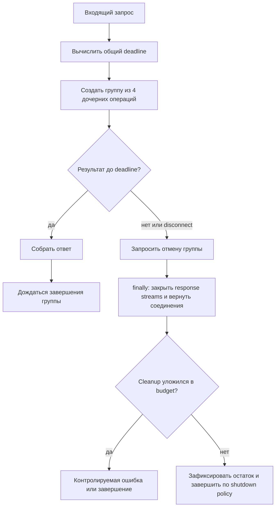

# Cancellation, deadlines и lifecycle ресурсов

Клиент `Quote API` готов ждать 600 мс. Он закрывает соединение, но четыре обращения к `Pricing` продолжают выполняться. Два из них получили соединения, два ждут пул. Endpoint уже не может вернуть полезный ответ, однако сервис всё ещё расходует время, задачи и соединения. При повторении под нагрузкой появляется orphan work и shutdown перестаёт укладываться в бюджет.

Проблема возникает из слабой модели «клиент ушёл — запрос остановился». На самом деле здесь участвуют разные события и разные владельцы.

## Четыре разных понятия

**Разрыв соединения (`disconnect`)** — наблюдаемое сетевое событие: клиент больше не поддерживает соединение. Framework может позволять проверить этот сигнал, но из этого не следует универсальная автоматическая отмена handler и всех downstream-вызовов.

**Ограничение ожидания (`timeout`)** — настройка конкретной операции: например, HTTPX может отдельно ограничить установление соединения, ожидание байта, запись и ожидание свободного соединения из пула. Локальный timeout отвечает на вопрос «сколько эта операция ждёт?», но не знает, сколько времени осталось всей пользовательской операции.

**Крайний срок (`deadline`)** — момент времени для всей операции. Каждый следующий шаг получает остаток общего бюджета. Если первый вызов потратил 450 мс из 600, второй не должен заново получить полный timeout 600 мс.

**Отмена (`cancellation`)** — кооперативный запрос прекратить работу. В `asyncio` отменяемая задача получает `CancelledError` при следующей возможности исполнения. Код проходит `finally`, освобождает принадлежащие ему ресурсы и обычно снова возбуждает исключение. CPU-bound участок без `await`, blocking-вызов в другом потоке, удалённый side effect или код, подавивший отмену, могут продолжаться.

Практический вывод: disconnect может стать одним из поводов отмены; deadline — другим. Ни одно событие не заменяет явную границу владения задачами и ресурсами.

## Одна причинная модель

Ниже показана нормальная и ошибочная ветвь одного запроса.



Схема предполагает, что приложение владеет дочерними задачами и может дождаться их выхода. Она не показывает kill процесса и не доказывает отмену удалённой операции: удалённый сервис мог уже выполнить side effect. Поэтому cleanup evidence распространяется только на локальную контролируемую границу.

## Владение задачами: propagation вместо «fire and forget»

Если endpoint создаёт задачи и теряет ссылки на них, его завершение не означает завершение работы. Безопаснее, когда время жизни дочерних операций вложено во время жизни родительской операции: родитель знает все задачи, распространяет failure/cancellation и ждёт их cleanup.

`asyncio.TaskGroup` в Python 3.14 даёт такую структурированную границу: при ошибке одной дочерней задачи остальные отменяются, а выход из контекстного менеджера ждёт их завершения. Это не магия мгновенной остановки. Дочерний код всё равно должен достигнуть точки отмены и корректно пройти `finally`.

Сокращённый пример иллюстрирует форму решения, а не готовый production-рецепт:

```python
async def collect_quotes(client, item_id, deadline):
    remaining = deadline - asyncio.get_running_loop().time()
    if remaining <= 0:
        raise DeadlineExpired

    async with asyncio.timeout(remaining):
        async with asyncio.TaskGroup() as group:
            tasks = [
                group.create_task(fetch_quote(client, item_id, region))
                for region in REGIONS
            ]
    return [task.result() for task in tasks]
```

Ключевой элемент — не выбор API, а единая область: deadline охватывает группу, группа владеет дочерними задачами, а используемый клиент живёт дольше одного запроса. Реальный код ещё должен сопоставить `TimeoutError`, ошибки зависимости и cancellation с публичным ответом, не скрывая исходную причину.

Не следует перехватывать `CancelledError` общим `except BaseException` и продолжать работу. Если исключение поймано ради cleanup, после cleanup его обычно нужно снова возбудить. Документация Python прямо предупреждает: проглатывание отмены нарушает работу `TaskGroup` и `asyncio.timeout()`.

## Три области жизни

### Application scope

Общий `httpx.AsyncClient` и его connection pool обычно принадлежат приложению: создаются до приёма запросов, переиспользуются и закрываются при shutdown. FastAPI рекомендует `lifespan` как связанную пару startup/shutdown. Создание клиента в «горячем цикле» каждого запроса уничтожает пользу pooling и усложняет доказательство закрытия.

### Request scope

Группа fan-out задач, остаток deadline и per-request state принадлежат одному запросу. Они не должны переживать запрос без отдельного, явно спроектированного background workflow.

### Call/response scope

Потоковый HTTP-ответ, временный файл или lock может принадлежать одному вызову. Его release должен быть в `async with` или `finally`, ближайшем к acquire. Закрытие общего клиента здесь было бы ошибкой: один запрос разрушил бы ресурс других запросов.

Правильный scope определяется владельцем и полезным временем жизни, а не удобством размещения кода.

## Ограниченный cleanup

«Всегда корректно очищаем ресурсы» — слишком сильное обещание. Проверяемое утверждение должно называть:

- чем приложение владеет: локальными задачами, response streams, клиентом и pool;
- по каким путям проходит release: success, handled error, cancellation и graceful shutdown;
- сколько времени допускается: в лаборатории одна секунда после нагрузки и две секунды на shutdown;
- какие пределы остаются: kill процесса, crash интерпретатора, blocking/uncancellable участок и уже начатый remote side effect.

Иногда cleanup нужно защитить коротким отдельным budget, чтобы он не был прерван той же отменой. Такая защита не должна превращаться в бесконечное `shield`: она ограничена временем, охватывает только release принадлежащего ресурса и оставляет наблюдаемый сигнал при превышении.

## Disconnect не является переносимой cancellation policy

Starlette предоставляет `await request.is_disconnected()`. Это способ спросить, получен ли сигнал разрыва, а не контракт «все дочерние задачи автоматически отменены». Проверка может происходить между существенными шагами или в координирующей задаче. Конкретную реакцию нужно проверить интеграционным тестом с выбранными ASGI server и transport.

Для долгой операции может быть разумно объединить причины остановки: истечение deadline, явный shutdown и подтверждённый disconnect. Но слишком частая периодическая проверка сигнала (`polling`) создаёт лишнюю работу, а слишком редкая запаздывает. Если результат имеет обязательный side effect, disconnect вообще может не означать, что операцию следует бросить; тогда нужен отдельный workflow с явным владельцем результата. Это уже другое проектное решение, а не исключение, которое стоит скрывать.

## Как диагностировать утечку или shutdown race

1. Воспроизведите один путь: success, deadline, disconnect или shutdown. Не смешивайте причины сразу.
2. Присвойте запросу стабильный correlation ID и посчитайте `tasks_started`, `tasks_finished`, `tasks_cancelled`.
3. Наблюдайте `in_flight`, ожидание пула и открытые соединения до нагрузки, во время неё и после.
4. Снимите список незавершённых задач на контролируемой тестовой границе.
5. Введите один эксперимент: отмените родительскую операцию и проверьте, исчезают ли дочерние задачи и возвращаются ли соединения.
6. Только после локализации меняйте структуру владения или lifecycle.

Рост p99 сам по себе не доказывает cancellation leak. Сильнее совпадение: клиент завершился, дочерние операции продолжаются, `in_flight` не падает, а после исправления propagation тот же эксперимент возвращает `in_flight` к нулю и освобождает управляемые ресурсы.

## Частые ошибки

### «Timeout остановил удалённый side effect»

Timeout прекратил локальное ожидание. Удалённый сервис мог получить запрос и продолжить выполнение. Для side effect нужны idempotency/reconciliation решения владельца распределённой семантики; этот brief их не подменяет.

### «Закроем общий клиент в `finally` endpoint»

Endpoint не владеет application-ресурсом. Он сломает конкурентные запросы. Закрытие должно происходить в том же lifespan, где клиент создан.

### «Поймаем все исключения, чтобы cleanup не падал»

Так легко проглотить `CancelledError` и продолжить работу. Обрабатывайте ожидаемые ошибки узко; cleanup выполняйте в `finally`; отмену после cleanup распространяйте дальше.

### «Shield гарантирует завершение»

Shield отделяет участок от внешней отмены, но не отменяет process kill, внутреннюю ошибку и бесконечный блок. Защищённый cleanup должен иметь собственный короткий budget.

### «Disconnect всегда означает бросить запрос»

Для чистого чтения это часто полезный сигнал. Для уже начатой команды с side effect результат может потребовать завершения или переноса в recoverable workflow. Решение зависит от владельца результата, а не только от TCP-соединения.

## Вопросы для самопроверки

### 1. Чем deadline отличается от timeout отдельного HTTP-вызова?

<details>
<summary>Ответ и объяснение</summary>

Deadline ограничивает всю пользовательскую операцию одним моментом окончания. Локальный timeout ограничивает один этап. Если каждому последовательному этапу выдавать полный timeout, суммарное время превысит обещание клиенту. Поэтому этап получает остаток общего budget и может завершиться до своего обычного timeout.

</details>

### 2. Почему `task.cancel()` не доказывает остановку работы?

<details>
<summary>Ответ и объяснение</summary>

Это запрос на кооперативную отмену. `CancelledError` доставляется при следующей возможности исполнения. Код без `await`, blocking-вызов, подавление исключения и удалённая операция могут продолжаться. Доказательством служат наблюдаемые завершение задач и release ресурсов в заданное время.

</details>

### 3. Где должен жить общий HTTPX-клиент?

<details>
<summary>Ответ и объяснение</summary>

Обычно на уровне приложения: создать в `lifespan`, переиспользовать между запросами и закрыть на shutdown. Это соответствует владельцу connection pool. Для иного scope нужно отдельно объяснить, почему ресурс нельзя переиспользовать и кто его закрывает.

</details>

### 4. Что можно честно обещать о cleanup?

<details>
<summary>Ответ и объяснение</summary>

Только поведение внутри названной контролируемой границы и budget: например, локальные задачи и response streams освобождаются на success/error/cancellation, а application client закрывается за две секунды при graceful shutdown. Crash, kill, uncancellable работа и remote side effects перечисляются как ограничения.

</details>

### 5. Когда disconnect не должен напрямую отменять полезную работу?

<details>
<summary>Ответ и объяснение</summary>

Когда работа представляет уже принятую команду с результатом, который обязан иметь владельца независимо от соединения клиента. Тогда запрос может лишь запустить устойчивый workflow, а статус читается отдельно. Нельзя просто потерять задачу: нужны identity, сохранённое состояние и recovery — это выходит за локальную request cancellation.

</details>

## Словарь

| Термин | Значение в этом материале |
|---|---|
| Disconnect | Сигнал прекращения клиентского соединения; не автоматическая гарантия остановки handler |
| Timeout | Максимальное ожидание конкретной операции или фазы |
| Deadline | Абсолютный конец бюджета всей операции |
| Cancellation | Кооперативный запрос задаче завершиться через cancellation path |
| Propagation | Передача причины остановки от родительской операции к принадлежащим ей дочерним операциям |
| Task group | Область владения набором связанных конкурентных задач |
| Application scope | Время жизни общего ресурса от startup до shutdown приложения |
| Request scope | Время жизни состояния и задач одного входящего запроса |
| Bounded cleanup | Освобождение принадлежащих ресурсов по заданным путям в измеримый budget |
| Orphan work | Работа без полезного ожидающего владельца |

## Первичные источники

- [Python 3.14 — Coroutines and Tasks](https://docs.python.org/3.14/library/asyncio-task.html)
- [FastAPI — Lifespan Events](https://fastapi.tiangolo.com/advanced/events/)
- [Starlette — Requests and `is_disconnected()`](https://www.starlette.io/requests/)
- [HTTPX — Async Support](https://www.python-httpx.org/async/)
