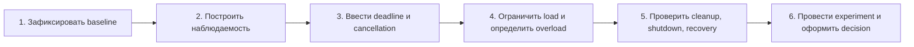

# Проектная спецификация: устойчивый fan-out сервис

Вы владеете небольшим `Quote API`, который собирает предложения из четырёх региональных операций `Pricing`. В рабочей среде одна операция иногда замедляется, gateway прекращает ожидание, а сервис продолжает удерживать задачи и соединения. При burst-трафике p99 растёт нелинейно, pool насыщается и shutdown становится непредсказуемым.

Нужно самостоятельно спроектировать и провести один engineering milestone: превратить этот отказ в воспроизводимый failure envelope, выбрать lifecycle/deadline/concurrency/overload policy и доказать восстановление. Спецификация определяет результаты и вопросы ревью, но не диктует архитектуру и не содержит эталонной реализации.

## Контекст продукта

Клиент запрашивает котировку для товара. Полный ответ полезен, если получен до 600 мс. Бизнес допускает один из двух вариантов деградации, который вы должны выбрать и явно описать:

- быстрый контролируемый отказ без скрытой очереди;
- частичный ответ с явным признаком неполноты и правилами выбора регионов.

Молчаливое превращение частичного результата в полный запрещено. Повтор запроса не считается универсальным исправлением и требует отдельного обоснования budget и безопасной семантики.

## Минимальный substrate

- FastAPI `Quote API` с одним публичным endpoint;
- управляемая HTTP dependency `Pricing` с normal, slow, error и hanging modes; исходные операции только читают данные и не создают удалённых побочных эффектов (`side effects`);
- четыре исходящих вызова на запрос;
- HTTPX async client и ограниченный connection pool;
- генератор постоянной и burst-нагрузки;
- локальные metrics/logs/traces либо эквивалентные наблюдаемые записи;
- автоматические unit, integration, failure/load и shutdown checks.

Persistence, auth и deployment platform не нужны. Реализация выполняется в отдельном репозитории участника.

## Исходный failure envelope

Сначала воспроизведите общий baseline, затем можете добавить собственный:

| Параметр | Значение |
|---|---|
| Набор измеряемых запросов и нагрузка | Все входящие запросы `Quote API`: 12 конкурентных запросов, каждый с fan-out 4 |
| Duration | Два контролируемых прогона по 60 секунд; после каждого — 10 секунд recovery observation |
| Здоровый профиль зависимости | Все вызовы `Pricing` занимают около 80 мс |
| Деградированный профиль зависимости | 25% вызовов `Pricing` занимают около 700 мс, остальные — около 80 мс; hanging mode проверяется отдельно |
| Pool и deadline | Максимум 8 соединений; end-to-end deadline 600 мс; в исправленной конфигурации каждая попытка ждёт соединение не более 100 мс |
| Acceptance здорового профиля | p95 по серверной (`service-side`) метрике `Quote API` для всех запросов 60-секундного прогона, от приёма запроса до исхода обработки на уровне приложения (`application outcome`), ≤ 450 мс |
| Acceptance деградированного профиля | 100% запросов 60-секундного прогона достигают полного ответа, явно неполного/деградированного ответа (`partial/degraded`) либо контролируемой ошибки по той же серверной точке не позднее 650 мс |
| Resource/recovery acceptance | Открытых соединений ≤ 8; waiting/in-flight = 0 не позднее 1 с после снятия нагрузки; отдельный shutdown ≤ 2 с |

Pool wait измеряется от запроса соединения из пула до его получения или `PoolTimeout`. Это acceptance criteria эксперимента, а не production-гарантия для иной нагрузки. Если выбранный partial response требует иных thresholds, объясните отличие до реализации и сохраните исходный опыт для сравнения.

## Карта milestone

Схема отвечает на вопрос, в каком порядке должны появляться проверяемые результаты, чтобы tuning опирался на наблюдения, а не предшествовал им.

Схема показывает зависимость результатов: численный tuning до baseline и telemetry не принимается как диагностика. Она не предписывает число коммитов или внутреннюю архитектуру.

## Milestone 1. Исходное поведение и failure envelope

### Зачем

Без воспроизводимого baseline невозможно отличить исправление от случайного изменения нагрузки.

### TODO

- [ ] Реализовать минимальный normal path и четыре downstream-вызова.
- [ ] Ввести управляемую normal/slow/error/hanging dependency.
- [ ] Зафиксировать версии runtime/framework/client.
- [ ] Запустить указанный workload и сохранить p50/p95/p99, outcomes и resource state.
- [ ] Показать хотя бы один orphan-work или pool-saturation failure.
- [ ] Записать факты, гипотезы и неизвестные отдельно.

### Deliverables

- команда полного воспроизведения;
- baseline report с raw/aggregated measurements;
- временная шкала одного деградировавшего запроса;
- список конкурирующих причинных гипотез.

## Milestone 2. Наблюдаемость service path, pool и задач

### Зачем

Latency без состояния очереди и задач не локализует bottleneck.

### TODO

- [ ] Провести correlation ID через входящий запрос и дочерние вызовы.
- [ ] Измерить active requests, outbound waiting/in-flight и pool utilization.
- [ ] Различить success, dependency error, pool/connect/read timeout, deadline, cancellation, disconnect и admission rejection.
- [ ] Добавить баланс task started/finished/cancelled.
- [ ] Ограничить cardinality меток; request ID хранить в trace/log, не в metric label.
- [ ] Описать слепые зоны наблюдения.

### Deliverables

- схема signal → вопрос → решение;
- один trace normal path и один trace failure path;
- снимки before/during/after load;
- объяснение, где именно возник фактический response/failure.

## Milestone 3. End-to-end deadline и cancellation policy

### Зачем

Независимые локальные timeouts суммируются и позволяют бесполезной работе пережить клиента.

### TODO

- [ ] Вычислять один абсолютный deadline на входе.
- [ ] Передавать остаток budget через admission, pool wait и HTTP-вызовы.
- [ ] Определить владельца и время жизни дочерних задач.
- [ ] Проверить propagation failure/cancellation.
- [ ] Отдельно определить реакцию на disconnect и проверить выбранную server/transport конфигурацию.
- [ ] Сопоставить internal outcomes с понятным публичным ответом.

### Deliverables

- короткая запись deadline/cancellation decision;
- executable checks deadline, cancellation и disconnect;
- таблица «событие → локальная реакция → внешний результат → остаточный риск».

## Milestone 4. Concurrency, queue и overload response

### Зачем

Connection pool ограничивает transport, но не выбирает, какую новую работу ещё стоит начинать.

### TODO

- [ ] Разделить admission, global outbound concurrency и pool capacity.
- [ ] Выбрать bounded queue либо отсутствие внутренней очереди.
- [ ] Определить быстрый отказ или явную деградацию.
- [ ] Связать значения с capacity `Pricing`, fan-out и deadline.
- [ ] Проверить постоянную и burst-нагрузку.
- [ ] Проверить, что retry, если он выбран, не усиливает saturation и укладывается в budget.

### Deliverables

- таблица limits с workload, duration, dependency behavior и threshold;
- тест overload path;
- сравнение минимум двух альтернатив и причина отказа от одной;
- публичное описание partial/error behavior.

## Milestone 5. Cleanup, shutdown и recovery

### Зачем

Нормальная latency новых запросов не доказывает, что старая работа и ресурсы завершились.

### TODO

- [ ] Разместить общий HTTP client в явном application lifecycle.
- [ ] Разместить request tasks/streams в ближайшей контролируемой boundary.
- [ ] Проверить success, error, cancellation и graceful shutdown paths.
- [ ] Задать отдельный bounded cleanup budget, если он нужен.
- [ ] Проверить recovery после снятия нагрузки.
- [ ] Назвать process kill, crash, blocking/uncancellable work и remote side effects как пределы.

### Deliverables

- lifecycle map acquire → owner → release;
- shutdown test;
- recovery report с time-to-zero для waiting/in-flight;
- заметка для операционной инструкции (`runbook`) о превышении cleanup budget.

## Milestone 6. Controlled experiment и engineering decision

### Зачем

Результат должен связывать механизм с наблюдаемым эффектом, а не перечислять внесённые настройки.

### TODO

- [ ] Выбрать одну причинную гипотезу и один изменяемый фактор.
- [ ] Повторить идентичный workload до и после изменения.
- [ ] Показать improvement и возможный shifting bottleneck.
- [ ] Провести review с другим инженером или LLM и обработать findings.
- [ ] Оформить decision с alternatives, consequences и trigger пересмотра.
- [ ] Написать ретроспективу о неверном исходном предположении.

### Deliverables

- воспроизводимый experiment report;
- ADR/engineering decision;
- обработанные review findings;
- краткая ретроспектива.

## Обязательные failure scenarios

Для каждого укажите ожидаемый invariant, способ обнаружения, действие и предел доказательства.

1. Один из четырёх вызовов отвечает 700 мс.
2. Dependency не отвечает до локального timeout.
3. Весь pool занят, новая операция ждёт соединение.
4. Gateway/client прекращает ожидание на 600 мс.
5. Один дочерний вызов падает, siblings ещё выполняются.
6. Burst превышает выбранный admission/concurrency limit.
7. Shutdown начинается при активных и ожидающих задачах.
8. Нагрузка снята, но один state counter не возвращается к нулю.
9. Удалённый сервис принял side effect до локальной отмены — если при самостоятельном расширении вы добавили side effect вопреки исходному read-only substrate.

Девятый сценарий не требует distributed solution, но запрещает утверждать, что локальная отмена откатила удалённый мир.

## Verification strategy

Набор проверок должен быть risk-based:

- unit: расчёт остатка deadline, error mapping и локальные policy decisions;
- integration: общий client lifecycle, pool wait, task propagation и dependency modes;
- transport: disconnect в выбранной ASGI server/configuration;
- load/failure: saturation, overload thresholds и p95/p99;
- lifecycle: startup/shutdown и recovery;
- manual review: согласованность публичной деградации и остаточных рисков.

Один E2E-тест не обязан проверять всё. Но каждая критическая failure path должна иметь проверку на самой дешёвой границе, которая действительно воспроизводит механизм.

## Review checklist

### Причинность

- [ ] Baseline создан до tuning.
- [ ] Факты отделены от гипотез.
- [ ] Эксперимент меняет один существенный фактор.
- [ ] Improvement не скрывает shifting bottleneck.

### Deadline и cancellation

- [ ] Disconnect, timeout, deadline и cancellation различены.
- [ ] Очередь расходует общий budget.
- [ ] Дочерние задачи имеют владельца.
- [ ] Cancellation test проверяет state/resource outcome, а не только исключение.

### Ресурсы и перегрузка

- [ ] Application client создан и закрыт в одной boundary.
- [ ] Admission, concurrency и pool responsibilities не дублируются.
- [ ] Bounds имеют измеримый envelope.
- [ ] Overload/degradation видимы клиенту и тестируются.

### Cleanup и evidence

- [ ] Success/error/cancellation/shutdown paths проверены.
- [ ] Recovery измерен после нагрузки.
- [ ] Version-sensitive claims снабжены primary sources.
- [ ] Ограничения kill/crash/blocking/remote effects названы.

## Вопросы для защиты

### Какая причинная гипотеза была фальсифицирована?

Что должен раскрыть ответ

Нужна реальная альтернативная причина и результат эксперимента. Например, увеличение pool size не устранило orphan tasks, поэтому «маленький pool» был симптомом; propagation cancellation изменила recovery. Ответ должен опираться на сохранённые измерения.

### Почему выбранные limits согласованы, а не дублируют друг друга?

Что должен раскрыть ответ

Объясните разные обязанности admission, outbound concurrency и physical pool, их значения относительно fan-out/capacity и overload path. Покажите нагрузочный результат и trigger пересмотра.

### Как доказано, что deadline проходит end-to-end?

Что должен раскрыть ответ

Покажите абсолютный deadline или его эквивалент, уменьшение remaining budget после очереди, исход HTTP-вызова и верхнюю границу всего ответа. Набор одинаковых 600-мс timeout на стадиях доказательством не является.

### Какие cleanup claims вы намеренно не делаете?

Что должен раскрыть ответ

Process kill/crash, blocking или подавившая отмену работа и уже начатые remote side effects. Сильный ответ говорит, что именно проверено внутри процесса и каким тестом, а не обещает «always cleanup».

### Почему выбранная verification strategy лучше одного E2E-теста?

Что должен раскрыть ответ

Каждая граница воспроизводит свой риск дешевле и локализует отказ: unit для arithmetic, integration для pool/tasks, transport для disconnect, load для saturation, shutdown для lifecycle. E2E остаётся полезным сквозным сигналом, но не объясняет причину и часто медленнее.

### Что потребуется для политики нескольких сервисов?

Что должен раскрыть ответ

Согласованные end-to-end budgets, ownership capacity boundaries, defaults и exceptions, staged migration и feedback loop. Этот проект даёт локальные факты, но сам по себе не доказывает L4 adoption несколькими командами.

## Non-goals

- production-grade observability platform;
- Kubernetes/autoscaling/service mesh;
- общая теория очередей или event loop internals;
- distributed transaction и универсальная retry policy;
- эталонная архитектура;
- готовый код решения;
- регистрация ImplementationReference до самостоятельного выполнения и review.

## Готовность к защите

Другой инженер должен суметь одной документированной командой:

1. запустить normal и degraded dependency;
2. воспроизвести исходный failure envelope;
3. увидеть причинную связь в signals;
4. проверить deadline/cancellation/overload outcomes;
5. подтвердить bounded cleanup и recovery;
6. понять альтернативы, остаточный риск и trigger пересмотра.

Зелёные тесты без baseline, raw observations и engineering decision не завершают проект.

## Словарь

| Термин | Значение в проекте |
|---|---|
| Milestone | Законченный инженерный этап с наблюдаемым результатом |
| Failure envelope | Workload, duration, dependency behavior и thresholds опыта |
| Service path | Существенные application, task, pool и dependency границы запроса |
| Degradation | Явное более дешёвое поведение при saturation |
| Shifting bottleneck | Перемещение ограничения в другой компонент после локального изменения |
| Recovery evidence | Измерения возврата waiting/in-flight к нулю, освобождения ресурсов и latency в явно заданный контрольный диапазон |
| Engineering decision | Запись контекста, выбора, альтернатив, последствий и trigger пересмотра |
| ImplementationReference | Ссылка на самостоятельно выполненный и проверенный проект; не эталонное решение |

## Первичные источники

- [Python 3.14 — Coroutines and Tasks](https://docs.python.org/3.14/library/asyncio-task.html)
- [Python 3.14 — Synchronization Primitives](https://docs.python.org/3.14/library/asyncio-sync.html)
- [FastAPI — Lifespan Events](https://fastapi.tiangolo.com/advanced/events/)
- [Starlette — Requests](https://www.starlette.io/requests/)
- [HTTPX — Async Support](https://www.python-httpx.org/async/)
- [HTTPX — Resource Limits](https://www.python-httpx.org/advanced/resource-limits/)
- [HTTPX — Timeouts](https://www.python-httpx.org/advanced/timeouts/)
