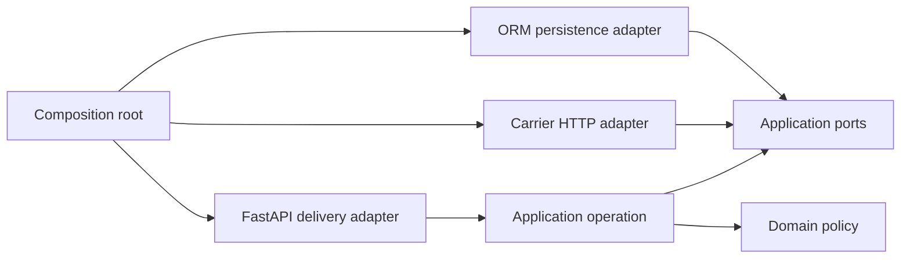

# Изоляция изменения через границы сервиса

Orders service имеет read-only endpoint `GET /orders/{order_id}/cancellation-eligibility`. Router загружает ORM-модель, проверяет статус и уровень клиента, вызывает Carrier API и собирает ответ. Первое правило просто: отмена разрешена только для `CREATED`. Затем появляется требование: клиент `PREMIUM` может отменить `PACKED`, пока перевозчик не начал передачу.

Изменение выглядит локальным, но требует согласованных правок router, ORM-запроса, HTTP client и моков деталей фреймворка. Это наблюдаемая связанность (`coupling`): один смысловой повод заставляет менять несколько обязанностей, которые могли бы развиваться независимо. Дерево папок может выглядеть «слоистым» и всё равно иметь ту же проблему.

## Ищите путь изменения, а не названия каталогов

Запишите изменение как цепочку вопросов:

1. Какие бизнес-факты нужны для решения: status, customer tier, handoff started?
2. Кто получает факты из БД и Carrier API?
3. Кто решает eligibility?
4. Кто переводит решение в HTTP?
5. Какие тесты должны измениться только из-за нового правила?

Поверхность изменения (`change surface`) — конкретный набор обязанностей и проверок, затрагиваемых одной причиной. До рефакторинга S06 меняет условие router, форму загруженной ORM-модели, вызов HTTP client и моки всего пути. После полезного разделения меняются policy и её тесты; orchestration меняется лишь если появился новый вход или порядок координации; adapters — только если изменилась их внешняя граница.

## Четыре разные обязанности

- **Бизнес-правило (`domain policy`)** принимает бизнес-факты и возвращает решение без I/O. Например: `CREATED` разрешён; `PACKED` разрешён только для `PREMIUM` и до handoff.
- **Прикладная операция (`application operation`)** координирует use case: получает order, при необходимости узнаёт handoff state, вызывает policy и возвращает прикладной результат.
- **Адаптер (`adapter`)** преобразует внешнее представление: HTTP request/response, ORM row или Carrier response.
- **Сборка приложения (`composition root`)** создаёт реальные реализации и соединяет их. Wiring сообщает, что с чем работает в этом deployment, но не является бизнес-правилом.

Граница (`boundary`) полезна, когда по разные стороны находятся разные причины изменения. Порт (`port`) — минимальный контракт, нужный внутреннему коду для работы с внешней возможностью. Он может быть protocol, callable или маленьким объектом; отдельный класс не обязателен.

## В какую сторону должны смотреть зависимости

Вопрос схемы: может ли policy исполняться, не импортируя FastAPI, ORM и HTTP client, а application operation — работать с заменяемыми реализациями внешних возможностей?

Стрелка означает зависимость кода, а не направление сетевого вызова. Внешние adapters зависят от внутренних контрактов; policy не импортирует их. Схема упрощает обработку ошибок и типы данных: на практике adapters ещё переводят внешние ошибки в прикладные исходы. Вывод: поток исполнения может идти к БД и Carrier, но направление исходных зависимостей остаётся внутрь.

## Почему ORM и HTTP schema не обязаны быть domain model

ORM-модель выражает хранение: nullable columns, relationships, lazy loading и состояние сессии. HTTP schema выражает публичное представление и validation. Policy нужны только бизнес-факты. Передача ORM-объекта прямо в policy незаметно приносит I/O и persistence semantics; использование response schema как domain object связывает правило с публичным контрактом.

Не всегда нужны три отдельных класса. Достаточно преобразовать внешние данные в маленькие значения на границе, если это уменьшает число причин изменения. Дублирование нескольких полей дешевле, чем общий объект с тремя владельцами и конфликтующими обязанностями.

## Минимальный разрез для S06

Хороший разрез можно описать поведением, не структурой файлов:

- delivery adapter получает `order_id`, вызывает operation и переводит `eligible/reason` в прежний HTTP response;
- operation запрашивает order через порт хранения;
- для `PACKED` и `PREMIUM` operation запрашивает у Carrier факт handoff; для очевидного `CREATED` или запрещённого случая лишний сетевой вызов не нужен;
- policy получает значения и принимает чистое решение;
- реальные adapters переводят ORM row/Carrier response во внутренние значения;
- composition root подставляет production adapters, тест — fake/in-memory реализации.

Это не эталонный порядок вызовов. Допустимо, например, загрузить handoff state заранее, если простота важнее лишнего запроса и это подтверждено ограничениями системы. Важны причины изменения и доказательства.

## Граница должна окупать стоимость

Абстракция добавляет indirection, контракт и тесты. Вводите её, когда есть хотя бы один конкретный сигнал:

- правило должно проверяться без дорогого или нестабильного I/O;
- внешняя система имеет другое представление и ошибки;
- одна причина уже требует согласованных правок в нескольких обязанностях;
- нужна реальная альтернативная реализация — fake, in-memory или другой provider;
- изменение должно мигрировать постепенно.

Если код — однострочный стабильный CRUD и альтернативы нет, прямой вызов может быть дешевле. Зафиксируйте trigger пересмотра вместо protocol «на будущее».

## Постепенный рефакторинг

1. **Зафиксировать поведение.** Добавьте targeted regression tests старых исходов: `CREATED` разрешён, остальные запрещены, not-found/error mapping сохранены.
2. **Выделить решение.** Извлеките чистую policy из router, пока реальные ORM и HTTP вызовы остаются на месте.
3. **Выделить operation.** Перенесите координацию из delivery boundary; router становится преобразователем входа и результата.
4. **Ввести порт в месте давления.** Сначала оберните только capability, которую требуется заменить в тесте, например чтение handoff state. Не создавайте универсальный repository.
5. **Подключить реальные adapters.** Перенесите mapping и внешние ошибки на их границы, оставив wiring в composition root.
6. **Провести S06 и сравнить поверхность.** Повторите одно и то же policy change до/после: перечислите затронутые обязанности и тесты, а не количество файлов.

Каждый шаг сохраняет внешний HTTP behavior и может быть проверен отдельно. Big-bang rewrite смешивает изменение структуры, правила и интеграций, поэтому затрудняет локализацию регрессии.

## Два разных класса доказательств

**Business evidence:** таблица решений проходит без FastAPI, DB и сети; тест падает при возврате старого правила. Application test с fake/in-memory adapters подтверждает координацию и заменяемость без изменения application/domain code.

**Adapter evidence:** отдельные integration checks подтверждают ORM-to-business mapping, Carrier response/error mapping и фактический HTTP response. Fake не подтверждает реальный mapping. Одна сквозная проверка полезна как smoke signal, но хуже локализует причину.

Для S06 воспроизводимое уменьшение риска формулируется так: повторное изменение, например разрешить `STANDARD + PACKED` до handoff, требует правки policy и её таблицы тестов; router, ORM mapping и Carrier client остаются неизменными. Если всё снова меняется совместно, граница не решила исходную боль.

## Частые ложные решения

- **Тонкие wrappers без новой причины изменения.** Переименование вызова в `OrderService` не отделяет policy от ORM/HTTP.
- **Service layer как god object.** Один объект получает DB session, clients, logging и все правила; связанность просто переезжает.
- **Repository над каждым запросом.** Универсальный CRUD interface копирует ORM и растёт вместе с ним. Порт должен выражать нужду operation, а не весь storage API.
- **Моки внутренних деталей.** Тест, проверяющий вызов `session.execute` и конкретный метод HTTPX, ломается при безопасном рефакторинге и не доказывает eligibility.
- **Domain импортирует framework/ORM.** Чистое решение становится невозможно запустить без инфраструктуры.
- **Protocol ради protocol.** Если одна реализация, нет pressure и подмена не нужна, контракт создаёт только обслуживание.
- **DI container как доказательство.** Container облегчает wiring, но код может оставаться связанным по данным и причинам изменения.

## Самопроверка

### Почему четыре каталога не доказывают четыре полезные границы?

Ответ и объяснение

Названия не показывают направление импортов, причины изменения и тестовую границу. Если изменение правила всё ещё требует править router, ORM object и HTTP client, связанность сохранилась. Нужен change-path анализ и повторяемая проверка.

### Когда отдельная domain model избыточна?

Ответ и объяснение

Когда policy нужны несколько простых значений, а отдельный объект не защищает инвариант и не имеет самостоятельного поведения. Можно передать immutable values. Важно не количество моделей, а отсутствие зависимости бизнес-решения от storage и delivery semantics.

### Зачем adapter tests, если policy tests зелёные?

Ответ и объяснение

Policy tests доказывают решение для уже корректных входов. Они не доказывают, что ORM status, customer tier и Carrier handoff response преобразованы правильно или что endpoint сохранил HTTP behavior. Эти риски проверяются на реальных границах отдельно.

### Как отличить L3-рефакторинг от добавления слоёв?

Ответ и объяснение

Нужны зафиксированная исходная боль, минимум две рассмотренные альтернативы, постепенный план и повторное изменение, которое наблюдаемо затрагивает меньший набор независимых обязанностей. Число interfaces ничего не доказывает.

## Словарь

| Термин | Значение в этом материале |
|---|---|
| Boundary | Место, где разделены разные причины изменения и преобразуются данные/ошибки |
| Port | Минимальный внутренний контракт на внешнюю возможность |
| Adapter | Реализация или преобразователь между port и конкретной внешней системой |
| Application operation | Координатор одного use case без delivery и storage details |
| Dependency direction | Направление исходных зависимостей к внутренним решениям и контрактам |
| Composition root | Место создания и связывания конкретных реализаций |
| Change surface | Обязанности и проверки, затрагиваемые одной причиной изменения |
| Coupling | Необходимость согласованно менять части, которые имеют разные причины изменения |

## Связанные материалы

- [Фактическая HTTP request/response boundary](../../evolvable-api-contracts/learn/http-contract-execution-boundary.md)
- [Downstream client и resource boundary](../../runtime-concurrency-lifecycle/learn/bounded-concurrency-pool-saturation.md)
- [Выбор test boundaries на интеграционном проекте](../../runtime-concurrency-lifecycle/project-spec/resilient-fanout-service.md)
