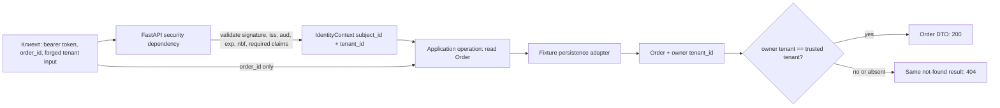

# Граница доверенного контекста и доступа к Order

Orders service получает валидный token tenant A и запрос `GET /orders/{order_id}` с `order_id=order-b`, принадлежащим tenant B. Если handler считает успешную проверку подписи разрешением на любой Order, атакующему достаточно подставить чужой идентификатор. Это нарушение проверки доступа на уровне объекта (`broken object-level authorization`, BOLA): endpoint доступен законному пользователю, но конкретный объект — нет.

## Три разных решения в одном request

**Authentication** проверяет credential и превращает внешние claims в сведения, которым сервис решил доверять. **Доверенный identity context** — маленький неизменяемый объект `IdentityContext(subject_id, tenant_id)`, созданный только после проверки token. **Object authorization** сравнивает этот context с отношением конкретного ресурса: `order.tenant_id == context.tenant_id`.

Эти решения нельзя склеивать. JWT подписан, но его payload не зашифрован; подпись сама по себе не доказывает ожидаемые issuer, audience, срок действия или наличие нужного tenant claim. Даже полностью валидный token не устанавливает отношение к `order-b`.

Закреплённый validator принимает только fixture public key и `RS256`, требует `iss`, `sub`, `aud`, `exp`, `nbf`, `tenant_id`, проверяет `issuer=https://issuer.test.local`, `audience=orders-api`, не предоставляет допуск рассинхронизации часов (`leeway=0`) и требует непустые строки `sub`/`tenant_id`. Разрешённый algorithm задаётся конфигурацией verifier, а не полем `alg` недоверенного token. Любая ошибка завершает flow до application operation.

## Где проходит доверие и enforcement

Вопрос схемы: в какой момент недоверенные bytes становятся контекстом и где нужно проверить отношение Order к tenant, чтобы router или второй adapter не обошёл правило?



Схема намеренно не показывает issuance, key discovery и database isolation: они вне S05. Практический вывод — delivery adapter владеет преобразованием credential в context, а application operation владеет правилом доступа до создания DTO. Persistence может сузить lookup по tenant, но это defence in depth, а не скрытая замена application-visible решения.

Передача исходного claims dictionary вниз опасна: следующий слой может случайно выбрать `tenant_id` из query или использовать непроверенное поле. Явный `IdentityContext` с двумя полями сужает полномочия и делает тест наблюдаемым: application test не должен уметь создать «полудоверенный» context через обычный HTTP path.

## Один внешний контракт отказа

Отсутствующий или невалидный bearer credential возвращает:

```http
HTTP/1.1 401 Unauthorized
WWW-Authenticate: Bearer
Content-Type: application/problem+json

{"type":"https://orders.example/problems/authentication-required","title":"Authentication required","status":401}
```

Для предъявленного, но невалидного token challenge дополнительно содержит `error="invalid_token"`. Body не объясняет, сломана ли подпись, audience или срок: такая деталь помогает атакующему и не нужна клиентскому переходу «получить новый credential».

Чужой и отсутствующий Order возвращают один и тот же ответ:

```http
HTTP/1.1 404 Not Found
Cache-Control: no-store
Content-Type: application/problem+json

{"type":"https://orders.example/problems/order-not-found","title":"Order not found","status":404}
```

RFC 9110 разрешает использовать `404`, когда сервер не хочет раскрывать существование запрещённого ресурса. Это локальное продуктово-security решение, а не универсальное требование HTTP. Его сила возникает из полного равенства status, headers и body для `order-b` и `order-missing`; текст «forbidden order-b» разрушил бы модель.

## Что именно проверять

Минимальный deterministic store содержит `order-a/tenant-a` и `order-b/tenant-b`. Для token `subject-a/tenant-a` нужны наблюдения на двух границах:

| Population | Недоверенный вход | Context после validation | Wire result | Audit decision |
|---|---|---|---|---|
| allowed | `order-a` | `subject-a`, `tenant-a` | `200`, только поля `order-a` | `allow`, `allowed` |
| unauthenticated | без token или invalid token | отсутствует | `401` + Bearer challenge | `authentication_failure` |
| cross-tenant | `order-b` | `subject-a`, `tenant-a` | закреплённый `404` без Order fields | `deny`, `tenant_mismatch` |
| forged-context | `order-b`, `X-Tenant-ID: tenant-b`, `?tenant_id=tenant-b` | всё ещё `subject-a`, `tenant-a` | тот же `404` | `deny`, `tenant_mismatch` |
| missing-object | `order-missing` | `subject-a`, `tenant-a` | byte-equivalent `404` | `deny`, `not_found` |

Component test доказывает правило и propagation без HTTP-шумов. Собранный ASGI/HTTP test доказывает dependency wiring, challenge, media type и disclosure boundary. Нужны обе точки: router unit test с подменённым context может остаться зелёным, когда реальный dependency доверяет `X-Tenant-ID`.

## Audit без второго leakage channel

После authorization decision записываются `event=authorization_decision`, `request_id`, `subject_id`, trusted `tenant_id`, `action=orders.read`, `resource_type=order`, запрошенный `resource_id`, `decision`, укрупнённая внутренняя причина (`coarse reason`) и `http_status`. Authentication failure не имеет trusted subject/tenant и получает отдельную минимальную запись.

Нельзя писать Authorization header, token, полный claims dump, ключи, credentials, response body или Order fields. Логирование token превращает диагностическую систему в хранилище bearer credentials: любой читатель логов сможет использовать их как предъявитель.

## Типичные обходы и диагностика

- **Проверка только в router.** Второй route, background adapter или прямой вызов operation минует правило. Симптом: component test application operation разрешает `order-b`.
- **Tenant из request.** Header кажется удобным для multitenancy, но клиент меняет его. Симптом: forged-context test внезапно возвращает `200`.
- **Сначала DTO, потом проверка.** Error mapper или debug log уже увидел чужие поля. Проверяйте, что DTO создаётся только после allow.
- **Фильтр storage как единственная защита.** Ошибка query или новый adapter снимает фильтр, а application считает `Order` уже разрешённым. Сохраните явный application invariant.
- **Разные `404`.** Различающиеся body, headers или cache behavior создают канал различения существования (`existence oracle`). Сравнивайте весь response contract.
- **Fail open при `tenant_id=None`.** Пропущенный context не означает global access; отсутствие явного совпадения обязано давать deny.

## Самопроверка

Почему валидный `RS256` token с правильными `iss` и `aud` ещё не разрешает `order-b`?

<details>
<summary>Ответ и объяснение</summary>

Validation подтверждает происхождение и применимость claims, а не отношение субъекта к ресурсу. Разрешение появляется только после сравнения trusted `tenant_id` с owner tenant конкретного Order. Иначе любой пользователь endpoint получает все объекты, ID которых смог угадать или найти.

</details>

Почему недостаточно проверять `X-Tenant-ID == order.tenant_id`?

<details>
<summary>Ответ и объяснение</summary>

Оба значения в таком сравнении доступны клиенту прямо или косвенно: header он задаёт сам, object ID выбирает сам. Источник tenant должен находиться за validation boundary; request tenant может служить только недоверенным селектором и не повышает полномочия.

</details>

Где сильный дизайн сравнивает cross-tenant и missing cases?

<details>
<summary>Ответ и объяснение</summary>

Внутри application tests причины должны различаться, чтобы доказать правило и audit. На внешней HTTP-границе status, media type, безопасные headers и body должны совпасть, потому что выбранный контракт скрывает существование чужого Order. Эти проверки отвечают на разные вопросы.

</details>

## Локальный словарь

- **Credential** — предъявляемое доказательство; здесь bearer JWT, который даёт доступ любому предъявителю до истечения срока.
- **Claim** — утверждение issuer внутри JWT; доверенным оно становится не от факта декодирования, а после полной validation.
- **Trusted context** — минимальный server-created объект с проверенными `subject_id` и `tenant_id`.
- **Object authorization** — решение, разрешено ли действие над конкретным ресурсом, а не над endpoint вообще.
- **Deny by default** — доступ отсутствует, пока явное правило не дало allow; неполный context и неизвестное отношение не открывают доступ.
- **Existence leakage** — различие ответов, по которому клиент узнаёт, существует ли недоступный ему объект.
- **Coarse reason / укрупнённая причина** — намеренно недетальная внутренняя категория решения, достаточная для диагностики и не раскрывающая криптографические детали или данные чужого объекта.
- **Existence oracle / канал различения существования** — наблюдаемое различие ответов, по которому caller может угадать, существует ли недоступный ему объект.
- **Leeway / допуск рассинхронизации часов** — допустимое отклонение времени при проверке `exp` и `nbf`; `leeway=0` означает, что закреплённый лабораторный validator такого допуска не предоставляет.

## Источники и актуальность

Проверено 2026-08-26: [RFC 7519](https://www.rfc-editor.org/rfc/rfc7519.html), [RFC 8725](https://www.rfc-editor.org/rfc/rfc8725.html), [RFC 6750](https://www.rfc-editor.org/rfc/rfc6750.html), [RFC 9110](https://www.rfc-editor.org/rfc/rfc9110.html), [RFC 9457](https://www.rfc-editor.org/rfc/rfc9457.html), [PyJWT API](https://pyjwt.readthedocs.io/en/stable/api.html), [FastAPI OAuth2/JWT](https://fastapi.tiangolo.com/tutorial/security/oauth2-jwt/), [OWASP BOLA](https://owasp.org/API-Security/editions/2023/en/0xa1-broken-object-level-authorization/), [OWASP Authorization](https://cheatsheetseries.owasp.org/cheatsheets/Authorization_Cheat_Sheet.html) и [OWASP Logging](https://cheatsheetseries.owasp.org/cheatsheets/Logging_Cheat_Sheet.html).

Starlette 1.6.0 новее закреплённой 1.3.1. Выводы опираются на HTTP contract и проверки собранного приложения, а не на undocumented internals; при upgrade нужно повторить весь evidence envelope.
