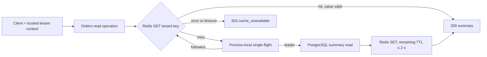

# Tenant-scoped Orders summary cache

Orders service отвечает на `GET /orders/summary`. Без cache каждый запрос агрегирует PostgreSQL; после очистки Redis десятки одновременных запросов одного tenant повторяют одно чтение и создают stampede. Опасно и обратное: слишком широкий key может вернуть tenant A сводку tenant B, а неограниченная свежесть — скрыть подтверждённую запись.

Этот маршрут учит интегрировать application cache для одного read path: построить key из доверенного tenant context, задать наблюдаемую свежесть, объединить одновременные misses внутри одного process и заранее выбрать поведение при invalidation race и отказе Redis.

## Закреплённая модель

Версии закреплены как воспроизводимый baseline, согласованный с M1.8.11, а не как заявление о latest stable.

- PostgreSQL 18.6 — авторитетный источник; Redis 8.4.5 хранит только производную сводку.
- Один Uvicorn worker и один asyncio event loop. Объединение запросов (`request coalescing`) действует только внутри этого process.
- Key — `orders-summary:v1:{trusted_tenant_id}`; tenant из query/header не участвует.
- Value содержит `schema_version`, `tenant_id`, `data_version`, `open_orders`, `total_cents`, `source_updated_at`, `generated_at`.
- Cache-aside использует TTL 2 с. После подтверждённой записи старая `data_version` допустима не дольше 2.25 с; затем следующий успешный ответ обязан быть новым.
- Возраст потенциально старого snapshot отсчитывается от начала SQL statement. Перед `SET` сервис уменьшает TTL на уже прошедшее время, пропускает fill при нулевом остатке и ограничивает саму Redis-команду 250 мс; отсюда верхняя граница 2,25 с после commit.
- Write path делает database commit, затем `DEL` key. Late fill старой версии после `DEL` допустим только внутри freshness bound.
- Redis budget — 250 мс на каждую команду, автоматические retry отключены. Ошибка `GET` до PostgreSQL даёт `503 cache_unavailable` и ноль source reads; ошибка `SET` после чтения даёт тот же внешний ответ, но source read уже произошёл и fill отсутствует.
- HTTP response имеет `Cache-Control: no-store`: HTTP caching не смешивается с application caching.

Полная запись решений, первичных источников и двух локальных прогонов находится в [Gate 0](../../../../../governance/work-packages/M1.8.13-application-caching-s15-slice.md#gate-0--b3-cache-store-и-применимая-b5-coordination-readiness). Первый прогон с pool 16 и timeout 50 мс отвергнут: часть корректного burst получила ложные `503`. Подтверждающий прогон использует pool 64 и timeout 250 мс.

## Где возникает выигрыш и где остаётся риск

Схема отвечает на вопрос, какой компонент владеет истиной, а какой лишь сокращает повторную работу.

Схема намеренно не показывает несколько workers: у них нет общей process-local координации. Практический вывод — при успешном fill один burst в этом worker создаёт не более одного source read на key, но два workers могут создать два чтения. Если `SET` падает, эта граница не действует: последовательные владельцы могут выполнить до `N` чтений. Это не distributed guarantee.

В подписи схемы владелец текущей загрузки (`leader`) читает PostgreSQL и заполняет cache, а ожидающие запросы (`followers`) после его завершения повторяют `GET`.

## Маршрут

1. [Brief: cache-aside, freshness и coalescing](learn/cache-aside-freshness-coalescing.md) — связать key, TTL, late-fill race, failure contract и измерения.
2. [Interview: concurrent miss и stale summary](interview/concurrent-miss-stale-order-summary.md) — пройти от заданного L2 pattern к самостоятельной L3 consistency/failure boundary.
3. [Kata: остановить stampede](kata/stop-orders-cache-stampede.md) — исправить один concurrent-miss defect без готового scaffold или решения.
4. [Project specification](project-spec/resilient-orders-summary-cache.md) — самостоятельно собрать проверяемые подтверждения hit, miss, race, isolation, outage и recovery.

Полезный принятый контекст: [commit и failure windows S07](../transactional-orders-operation/learn/transaction-boundary-failure-windows.md), [ограничение усиления нагрузки в bounded concurrency pool](../runtime-concurrency-lifecycle/learn/bounded-concurrency-pool-saturation.md) (контекст S13) и [trusted tenant context S05](../tenant-scoped-orders-authorization/learn/trusted-context-object-authorization-boundary.md). Эти материалы не получают нового coverage.

## Границы

Slice не обещает zero-stale reads, cross-worker coalescing, linearizability, exactly-once invalidation или production capacity. Здесь нет Redis migration, distributed lock/lease, write-through/write-behind, multi-region cache, HTTP/CDN tutorial или Cache L4 evidence. Переход к нескольким workers либо требование read-your-writes требует нового решения, а не снятия этой оговорки.

## Быстрая самопроверка

Почему Redis hit ещё не доказывает корректный ответ?

Ответ и объяснение

Нужно проверить tenant и freshness contract. Значение другого tenant нарушает isolation, а значение старше разрешённого окна нарушает freshness даже при технически успешном `GET`. Hit — наблюдение cache, не доказательство бизнес-инварианта.

## Локальный словарь

- **Source of truth** — PostgreSQL, где подтверждённая версия Orders является авторитетной.
- **Cache-aside** — read operation сначала проверяет cache, а на miss читает source и заполняет cache.
- **Coalescing / single-flight** — объединение одновременных misses одного key в одну source-загрузку внутри одного process.
- **Late fill** — запись старого snapshot в cache после того, как более новая database transaction уже committed и invalidation прошла.
- **Freshness bound** — наблюдаемая верхняя граница времени, в течение которого после commit допустима старая версия.
