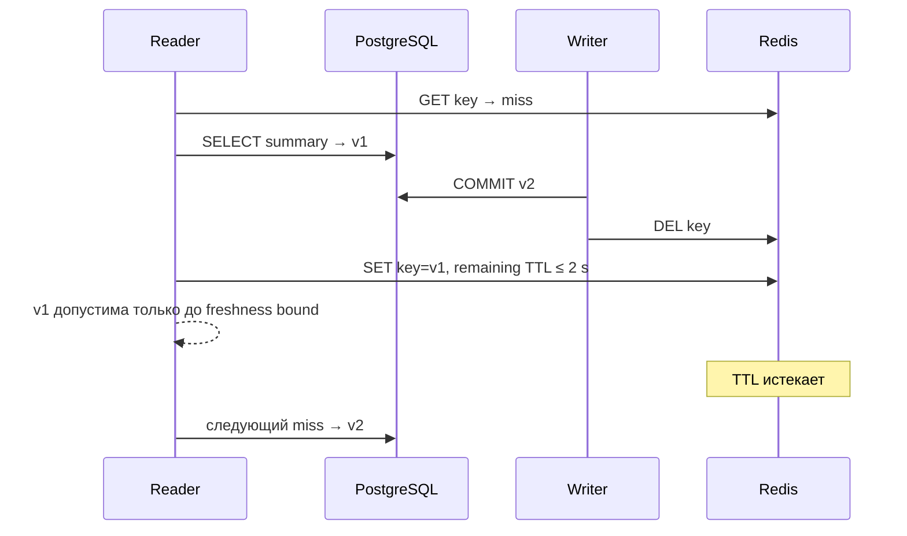

# Cache-aside, freshness и объединение одновременных misses

Orders service вычисляет tenant-scoped сводку из PostgreSQL. Один запрос недорог, но после истечения TTL 32 одновременных запроса видят пустой Redis и каждый повторяет тот же SELECT. Получается лавина при промахе (`cache stampede`): cache должен снижать работу, а в момент очистки сам синхронизирует нагрузку на source of truth.

Исправление не сводится к mutex. Инженеру нужно одновременно ответить на четыре вопроса: какой key безопасен для tenant, сколько может жить старая версия, что произойдёт между commit и invalidation и можно ли обращаться к PostgreSQL, когда Redis недоступен.

## Две системы, две обязанности

PostgreSQL хранит авторитетную `data_version`. Redis string — производный JSON, который можно удалить без потери бизнес-факта. Cache-aside означает:

1. read operation делает `GET` tenant key;
2. hit возвращает проверенное значение;
3. miss выбирает одного владельца загрузки;
4. владелец читает PostgreSQL и выполняет `SET` с остаточным TTL не больше 2 с;
5. ожидающие requests повторно проверяют cache и используют заполненное значение.

Запись в Redis не атомарна с database read или write. `SET ... EX` атомарно связывает value и expiration внутри Redis, но не превращает две системы в одну transaction. Поэтому correctness задают не названием pattern, а наблюдаемыми инвариантами.

## Tenant-safe key — часть authorization boundary

Key `orders-summary:v1:{trusted_tenant_id}` строится из `IdentityContext`, созданного после проверки credential. `?tenant_id=tenant-b` и `X-Tenant-ID` остаются недоверенными селекторами и не меняют key. Версия `v1` отделяет несовместимые value schemas.

Value повторяет `tenant_id`. Это не замена безопасному key, а проверка целостности: если tenant внутри JSON не совпадает с trusted context, значение удаляется и не возвращается. Затем обычный miss path загружает правильный tenant. Если удаление или повторное чтение Redis не укладывается в budget, endpoint даёт контролируемый `503`, а не рискует раскрытием.

Слабая модель «UUID заказа глобально уникален, значит tenant не нужен» переносит security-инвариант в скрытое допущение генератора ID. Key обязан выражать scope явно.

## Freshness — это договор о версии, не только TTL

TTL 2 с ограничивает жизнь Redis key. Однако клиенту важен не внутренний таймер, а результат после подтверждённой записи. В этом slice принят invariant:

> После database commit старая `data_version` может встречаться не дольше 2.25 с; затем следующий успешный response обязан содержать новую version.

Точка отсчёта потенциально устаревшего snapshot — начало SQL statement: в PostgreSQL `READ COMMITTED` именно statement видит снимок данных на этот момент. Перед отправкой `SET` владелец вычисляет `remaining_ttl = max(0, 2 секунды − elapsed_since_statement_start)`. При нулевом остатке он пропускает fill и возвращает `503 summary_source_unavailable`; полный TTL после позднего чтения ставить нельзя. Сам `SET` с остаточным TTL должен завершиться внутри отдельного Redis command budget 250 мс.

Арифметика худшего случая проста: старый statement мог начаться непосредственно перед commit. Тогда cached v1 истечёт не позже `statement_start + 2 секунды + 250 мс`, а это не позже `commit + 2,25 секунды`. Окно важно из-за late fill: reader мог получить v1 до commit, writer затем committed v2 и удалил key, а reader записал v1 уже после `DEL`. Delete-after-commit не исключает race, но остаточный TTL ограничивает его последствия. Это не обещание zero-stale или read-your-writes.

Вопрос схемы: почему правильный порядок commit → delete всё равно допускает старый ответ?

Схема намеренно не обещает read-your-writes. Практический вывод: invalidation ordering нужно тестировать с управляемой паузой после SELECT, а не надеяться, что редкий race «почти невозможен».

Если продукт требует, чтобы writer немедленно читал собственную v2, этот pattern не подходит без нового механизма: versioned keys, write-side cache update, token/epoch либо обход cache для определённого workflow. Это изменение Gate 0, а не мелкая настройка TTL.

## Coalescing ограничивает amplification только в названной topology

После первого miss service создаёт или находит process-local coordination state для key. Владелец входит в критическую секцию и повторяет `GET`: другой task мог заполнить cache, пока он ждал. Только повторный miss разрешает source read. Ожидающие requests затем читают тот же value.

`asyncio.Lock` синхронизирует tasks одного event loop, но не память разных worker processes. При двух workers один общий burst может создать до двух source reads — по одному на worker. Поэтому формулировка «на key всегда один read» ложна. Честная формулировка для normal path: «при успешном fill — не более одного source read на 32-request cold burst в одном закреплённом process».

Нужно также определить cleanup coordination state. Завершённый key не должен навсегда оставаться в registry. Корректное использование `async with lock` освобождает lock при обычном выходе, исключении и отмене; оно эквивалентно `acquire` с `release` в `finally`. Следующий waiter может стать владельцем, но не должен получить зависший Future. Конкретная структура принадлежит реализации, а tests проверяют отсутствие stuck waiters и повторяемость следующего burst.

## Почему outage выбран fail-closed

Популярный cache fallback — при Redis error читать PostgreSQL. Для единичного запроса это повышает доступность, но при полном outage каждый request становится miss и может создать неограниченный fan-out. Distributed coalescing в этом slice не доказан, а process-local fallback всё равно умножается на workers.

Поэтому закреплённый контракт fail-closed:

- redis-py 8.0.1 настроен с явно отключёнными автоматическими повторами: `Retry(NoBackoff(), 0)` или наблюдаемо эквивалентной конфигурацией;
- каждая Redis-команда ограничена внешним budget 250 мс, например task-level timeout;
- initial или repeated `GET` error до source read возвращает `503 cache_unavailable` и `Retry-After: 1`; PostgreSQL не вызывается, `source_read=0`;
- `SET` error после source read возвращает тот же внешний ответ и не создаёт fill, но `source_read≥1`; если `SET` продолжает падать, последовательные владельцы burst могут дать до `N` source reads, поэтому это уже не single-flight до одного чтения;
- после восстановления Redis следующий cold burst снова даёт один source read и корректные `200`.

Это осознанный availability trade-off. Для другого продукта можно выбрать bounded fail-open, например отдельный admission limit и короткий локальный fallback cache, но это новый failure envelope. Нельзя просто добавить `except RedisError: read_db()` и сохранить прежнюю amplification claim.

Ошибка `DEL` после database commit имеет другую семантику: commit уже нельзя отменить. Write result остаётся успешным, увеличивается `cache_invalidation_error_total`; пока Redis недоступен reads получают `503`, а после восстановления прежний key живёт не дольше оставшегося TTL.

## Условия и границы измерения (`measurement envelope`)

Локальная проверка использует заранее подготовленные тестовые данные (`fixtures`) двух tenant и один process. `tenant-a` начинается с v1 `(open_orders=3, total_cents=12500)`, после write становится v2 `(4, 15000)`; `tenant-b` имеет отличное значение. Каждая строка ниже задаёт группу однотипных прогонов (`population`), к которой относится порог.

| Population | Наблюдение и порог |
|---|---|
| 1 cold miss | корректный `200`, `source_read=1` |
| 20 warm hits | все корректны, дополнительных source reads `0` |
| Пять bursts × 32 concurrent misses | каждый burst: 100% корректных `200`, `source_read≤1` на key |
| tenant-a и tenant-b одновременно | разные keys/values, cross-tenant leakage `0` |
| Forced late fill | v1 допустима сразу после commit, v2 обязательна не позже 2250 мс |
| 32 requests при контролируемом отказе cache adapter до `GET` | 32 `503`, source reads `0`, population завершается ≤350 мс |
| 32-request recovery burst | 32 корректных `200`, `source_read≤1`, ≤150 мс |

Подтверждающий прогон наблюдал burst 90.93–103.90 мс, race 2049.22 мс, контролируемый outage 290.44 мс и recovery 106.01 мс. Fault injection выполняется в точке подмены cache adapter до `GET`, поэтому correctness-проверка не зависит от времени остановки Docker или сетевого timeout. Реальное выключение Redis/Docker полезно как дополнительная диагностика, но для него не заявляется переносимый wall-clock threshold. Это лабораторные thresholds выбранного host/topology, не production benchmark. Learn проверяет correctness burst и не вводит project-порог `≤150 мс` для него.

Status code недостаточен. Нужны одновременно response tenant/version и counters `cache_hit`, `cache_miss`, `cache_error`, `source_read` на key, `fallback_503`, `cache_invalidation_error`. Низкое число reads при неправильной version так же неприемлемо, как правильные responses при 32 source reads.

## Частые ошибки и диагностика

- **Один key на весь endpoint.** Симптом — одинаковый cached tenant в двух fixtures. Исправляется trust-aware key, а не фильтрацией body после утечки.
- **Lock без повторного GET.** Waiters последовательно выполняют новые source reads. Смотрите source counter, а не только отсутствие параллелизма.
- **Process-local lock назван distributed.** Запустите два workers: amplification удвоится.
- **`DEL` до commit.** Concurrent reader может заполнить cache из старого committed state, а rollback оставит лишнюю invalidation без смысла. Принятый порядок — после commit.
- **TTL назван «строгой консистентностью».** TTL ограничивает возраст, но допускает stale window и не связывает Redis с database transaction.
- **Fail-open без admission.** При outage PostgreSQL получает поток request-for-request. Failure population должна считать source reads.
- **HTTP cache смешан с Redis.** Внешний response имеет `Cache-Control: no-store`; Redis TTL не является HTTP `max-age`.

## Самопроверка

### Почему double-check внутри coordination section обязателен?

Ответ и объяснение

Пока task ждал, прежний владелец мог уже заполнить Redis. Без повторного `GET` каждый waiter по очереди прочитает PostgreSQL, и lock лишь сериализует stampede. Double-check превращает последующие tasks в hits.

### Что именно доказывает TTL 2 с?

Ответ и объяснение

Только ограничение жизни конкретного cached value в Redis. В сочетании с bounded fill window он даёт принятый максимум 2.25 с после commit для late fill. TTL не доказывает linearizability, немедленный read-your-writes или согласованность нескольких caches.

### Почему при Redis outage не выбран прямой PostgreSQL fallback?

Ответ и объяснение

Без отдельных проверяемых подтверждений admission/coordination каждый request превратится в source read и восстановит stampede именно во время отказа. Fail-closed ограничивает нагрузку нулём source reads ценой доступности. Другой выбор допустим только с новыми измеримыми условиями отказа.

### Когда B5 coordination readiness станет применима?

Ответ и объяснение

Когда claim выйдет за один process/instance или механизм начнёт зависеть от Redis lease, distributed lock либо другой внешней coordination semantics. Тогда нужны первичный источник, failure model и эксперимент между workers; текущий one-process result этого не доказывает.

## Словарь

| Термин | Значение в этом slice |
|---|---|
| Cache-aside | Read pattern: cache lookup, source load на miss, последующий fill |
| Freshness invariant | Допустимая версия/возраст ответа и наблюдаемое поведение после commit |
| Stampede | Одновременное повторение одной source-загрузки многими requests |
| Coalescing / single-flight | Сведение misses одного key к одному владельцу загрузки в заданной topology |
| Late fill | Запись старого snapshot после commit и invalidation новой версии |
| Fail-closed | Контролируемый отказ без source fallback при недоступном cache |
| Measurement point | Точка измерения: от входа read operation до application outcome в одном process |

## Первичные источники и связанный контекст

- [Redis `SET`](https://redis.io/docs/latest/commands/set/)
- [Redis `TTL`](https://redis.io/docs/latest/commands/ttl/)
- [Redis `DEL`](https://redis.io/docs/latest/commands/del/)
- [Redis persistence](https://redis.io/docs/latest/operate/oss_and_stack/management/persistence/)
- [redis-py asynchronous operations, pool и timeouts](https://redis.io/docs/latest/develop/clients/redis-py/async/)
- [redis-py error handling](https://redis.io/docs/latest/develop/clients/redis-py/error-handling/)
- [Python 3.14 `asyncio.Lock`](https://docs.python.org/3.14/library/asyncio-sync.html#lock)
- [FastAPI workers and process memory](https://fastapi.tiangolo.com/deployment/concepts/#replication-processes-and-memory)
- [PostgreSQL 18 transaction visibility](https://www.postgresql.org/docs/18/transaction-iso.html#XACT-READ-COMMITTED)
- [RFC 9110: `503` и `Retry-After`](https://www.rfc-editor.org/rfc/rfc9110.html#name-503-service-unavailable)
- [RFC 9111: HTTP caching](https://www.rfc-editor.org/rfc/rfc9111.html)
- [RFC 9457: `application/problem+json` и extension member `code`](https://www.rfc-editor.org/rfc/rfc9457.html)
- [S07: commit и failure windows](../../transactional-orders-operation/learn/transaction-boundary-failure-windows.md)
- [S13: bounded amplification](../../runtime-concurrency-lifecycle/learn/bounded-concurrency-pool-saturation.md)
- [S05: trusted tenant context](../../tenant-scoped-orders-authorization/learn/trusted-context-object-authorization-boundary.md)

Версии и ссылки проверены 2026-09-01. Результаты относятся к Gate 0 этого slice.
