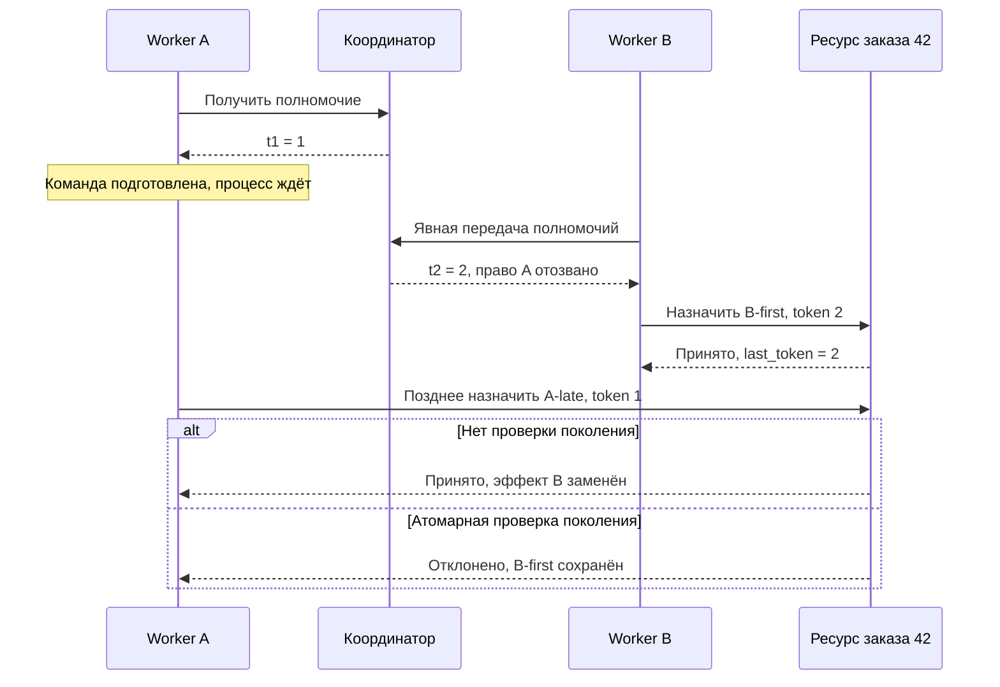

# Почему новый владелец не останавливает старую команду

Orders назначает заказ 42 исполнителю. Процесс A получил право работы, подготовил назначение и завис. Пока он не отвечал, координатор передал работу B. B сохранил назначение, но проснувшийся A отправил старую команду и заменил его результат. Для оператора это потерянное решение нового владельца, даже если оба процесса успешно выполнили свои локальные транзакции.

Бизнес-инвариант формулируется до выбора технологии: **после передачи полномочий устаревший владелец не может заменить или отменить эффект нового владельца**. Нужна проверка там, где принимается изменение назначения. Сообщение «теперь лидер B» само по себе такой проверкой не является.

## Три разных решения

Полномочие (`authority`) отвечает, кому координатор разрешил работать. Поколение полномочия (`epoch`, далее token) позволяет отличить новое право от старого. Отсечение устаревшей команды (`fencing`) выполняет ресурс: он сравнивает token команды с сохранённым поколением в момент изменения состояния.

Координатор может выдать A ограниченное сроком полномочие (`lease`). Истечение срока изменяет решение координатора; оно не стирает подготовленную команду A. Пауза процесса не равна окончательной остановке. Даже отсутствие сигнала жизнеспособности (`heartbeat`) говорит о ненаблюдаемости A, а не о невозможности его будущего действия. Повторная проверка lease в A тоже оставляет окно: A может замереть сразу после проверки.

В лаборатории право отзывается явно, без часов: A получает 1, затем координатор увеличивает поколение до 2 и отдаёт его B. У ресурса свой сохранённый порог `last_token`. Пока эти решения находятся у разных участников, нельзя считать их одной атомарной операцией.

## Где проходит запрещённое действие

Схема отвечает на вопрос: почему исправление должно находиться у ресурса, даже если новый владелец уже выбран?

Здесь намеренно опущены потеря ответов, перезапуск, автоматическое истечение lease и повторные команды. Отдельно не показано окно до первого обращения B: ресурс ещё не видел 2 и может принять 1. Следовательно, порог по последнему принятому поколению защищает уже созданный эффект B. Для запрета **всех** команд A сразу после передачи нужен дополнительный договор установки поколения у ресурса и определения момента завершения передачи.

## Порядок событий без глобальных часов

В наблюдаемом следе получение t1 предшествует подготовке A по локальному порядку A. Отправка команды предшествует её получению ресурсом. Harness — управляющая оснастка опыта — получает подтверждение B и только потом разрешает A продолжить. Это причинные рёбра: подтверждение B → команда продолжения A → попытка A. Их можно объяснить, даже если часы B отстают от A на минуту.

Порядок token 1 < 2 задан сериализованной выдачей поколений **одного заказа**, а не сравнением времени. Из него нельзя вывести порядок всех событий системы. Если A пишет диагностический лог, пока B выполняет локальный расчёт, и между этими событиями нет сообщений или общего упорядочивающего действия, их взаимный порядок в модели неизвестен: это конкурентная пара. Последовательность сбора логов не добавляет причинного ребра.

Для L2-модели выпишите события, локальные рёбра и пары send/receive, затем добавьте только подтверждённые связи между участниками. Для L3-выбора сравните частичный причинный порядок с полным порядком команд одного ресурса. Последний облегчает решение «какое поколение новее», но требует общей точки координации и может остановить выдачу при её потере. Полный глобальный порядок всех заказов для данного инварианта избыточен. При пропавшем подтверждении нельзя дорисовывать ребро «B уже записал»: нужна запись результата у ресурса либо вывод «неизвестно».

Основание различия причинного и полного порядка — [работа Лэмпорта Time, Clocks and the Ordering of Events in a Distributed System](https://www.microsoft.com/en-us/research/publication/time-clocks-ordering-events-distributed-system/). Выбор достаточного порядка для заказа и его цена здесь являются выводом из нашего договора.

## Что делает ресурс

Ресурс принимает token не меньше сохранённого и вместе с эффектом сохраняет новый порог. Сравнение и изменение должны быть одним атомарным решением. Если прочитать порог, отпустить защиту, а потом записать назначение, B может вклиниться между действиями и A всё равно перезапишет его.

В проверенном опыте два отдельных PostgreSQL 18.6 отвечают за выдачу и эффект, workers вызывают psql 18.6. Ресурс использует один условный UPDATE; в READ COMMITTED PostgreSQL повторно проверяет условие на обновлённой строке при конкурирующей записи. Это свойство конкретного примитива, а не обещание безопасности произвольной последовательности SQL. Ресурс не обращается обратно к координатору на каждой записи.

Одинаковый token разрешает несколько корректных операций B. Поэтому fencing не устраняет повтор той же бизнес-операции, перестановку команд одного поколения или потерянное подтверждение. Отклонённая A-late не создаёт эффекта и не требует его бизнес-компенсации. Уже выполненное внешнее действие, например отправленный платёж, нельзя отменить отказом последующей SQL-записи: проверка должна охватывать фактическую границу эффекта.

## Цена безопасности и условия продолжения

Отсутствие запрещённого эффекта — свойство безопасности (`safety`). Возможность завершать корректные операции — продолжение работы (`progress`). Недоступный ресурс может сохранить safety простым отказом всем, но это не доказательство progress. При потере координатора нельзя выдавать новые поколения; известный ресурсом B может продолжать по локальному договору, однако автоматическое продление или бессрочное право из этого не следуют. В лаборатории автоматического срока вообще нет.

Сравните два варианта authority. Сохранённый порог у ресурса не требует доступности координатора на каждой команде, но узнаёт о новом поколении только при его предъявлении. Проверка текущего владельца через координатор требует дополнительной связи; без атомарной привязки ответа к эффекту снова возникает окно устаревания. При разделении связи корректное решение может остановить работу до установки нового порога, заплатив доступностью за более сильный договор передачи.

Для ограниченного обсуждения лидерства возьмём **заданную абстрактную модель**, не реализованную в опыте: три участника согласования, решение требует большинства подтверждений — 2 из 3 (`quorum` в этой модели); участники могут падать и терять связь, но не подделывают сообщения, сохраняют обещания протокола. Сторона с одним участником не подтверждает новое решение. Сторона с двумя продолжает только при выполнении условий выбранного протокола; арифметика большинства сама по себе не является протоколом. Подтверждение выбора B всё равно не подтверждает запись у отдельного ресурса. Это границы применимости заданной модели L1/L2, не реализация consensus и не leadership L3.

## Ошибки, края и диагностика

| Ошибочное решение | Почему ломается и что проверить |
|---|---|
| «Срок A истёк, значит A остановлен» | У процесса может остаться подготовленная команда; возобновить A после принятого B |
| Проверять token только в worker | Worker может быть устаревшим; искать решение и состояние именно у ресурса |
| Использовать timestamp как поколение | Часы могут расходиться; требовать упорядоченную выдачу authority |
| Разделить сравнение и эффект | Между ними вклинивается новый владелец; проверять атомарный примитив |
| Разрешить обход защищённого пути | Прямой writer отменяет гарантию; отдельно ограничить доступ к эффекту |
| Сбросить поколения после восстановления | Старый большой token снова выглядит новым; восстановить согласованный договор поколений, не обнулять порог |

При неизвестном исходе старой записи ищите resource audit и подтверждённое состояние. Одного сообщения «команда отправлена» недостаточно. Не теряйте token при промежуточном вызове и не смешивайте поколения разных заказов. Модель предполагает доверенную выдачу: произвольное число от worker не доказывает полномочие.

## Что действительно наблюдал автор

[Gate 0](../../../../../../governance/work-packages/M2.3-stale-authority-fencing-slice.md#gate-0-record) использовал один заказ, максимум два процесса и чистое состояние каждого прогона (trial). Контрольные (control), дефектные (defect) и исправленные (fixed) прогоны наблюдались отдельно: 10 control приняли A; 10 defect приняли A после B и нарушили инвариант; 10 fixed приняли B, отклонили A, сохранили B-first/2 и приняли B-next/2. Следующая корректная операция после отказа (`recovery`) здесь — B-next. SQL ожидался до 30 секунд, ответ worker до 35; наблюдение шло до чтения состояния после recovery, все 30 trials заняли 45.257 секунды. Порог для fixed — ноль принятых старых команд в этих 10 историях, не статистическая production-гарантия.

Пауза была ожиданием команды в A, отзыв явным. Partition, crash, неизвестный commit, одновременные записи, обход доступа и восстановление сохранённых поколений не проверялись. SQL-защита выполнена у ресурса, но workers доверенные и технически могут обойти её. Лаборатория не доказывает защищённость такого доступа.

## Самопроверка

Почему повторное чтение lease непосредственно перед записью не заменяет fencing?

Ответ и объяснение

A может остановиться после чтения и продолжить после смены владельца. Последнее знание A тогда корректно для прошлого момента. Проверка и эффект должны образовывать одно решение ресурса, иначе остаётся окно между ними.

Можно ли по `B selected` и более позднему timestamp A доказать нарушение?

Ответ и объяснение

Нет. Нужны выдача t2, принятый эффект B и последующее решение ресурса по t1. Выбор лидера не равен эффекту, а часы не доказывают причинность. При неполном следе сохраняйте несколько допустимых историй и назовите недостающее наблюдение.

Почему отказ A не доказывает ни доступность, ни идемпотентность?

Ответ и объяснение

Ресурс мог отказаться от всех команд; отдельная B-next показывает лишь ограниченное восстановление. Повтор с token 2 может снова создать эффект: token различает владельцев, а не бизнес-намерения. Для обоих более сильных обещаний нужны отдельные договоры и наблюдения.

Дополнительный вопрос: какой ценой запретить A ещё до первого эффекта B?

Ориентир рассуждения

Нужно определить передачу как завершённую только после установки нового порога у ресурса либо совместить проверку актуальной authority с эффектом. При недоступности этой границы передача может остановиться. Сравнивать следует гарантии и возможность продолжения; простое удалённое чтение coordinator перед записью окна не устраняет.

## Словарь и источники

Authority — право действовать; token/epoch — его поколение; lease — полномочие со сроком; fencing — отсечение старой команды ресурсом; effect boundary — место принятия изменения; partial order — причинный порядок, в котором некоторые пары не сравнимы; quorum — большинство подтверждений в заданной здесь модели; safety/progress — сохранение запрета/возможность продолжения; recovery — следующая корректная операция после отказа, здесь B-next.

Проверено 2026-09-17: [PostgreSQL 18, READ COMMITTED](https://www.postgresql.org/docs/18/transaction-iso.html#XACT-READ-COMMITTED), [UPDATE](https://www.postgresql.org/docs/18/sql-update.html). Это источники свойств SQL-примитива; модель authority и выводы о границах — инженерный разбор заданного договора. [PostgreSQL 18.6](https://www.postgresql.org/support/versioning/) актуален; Python опыта 3.14.0 старее [stable 3.14.7](https://www.python.org/downloads/), служит только оснасткой и не является production-рекомендацией. [Маршрут](../README.md) связывает текст с заданиями и границами B2/B3/B6/B7.
